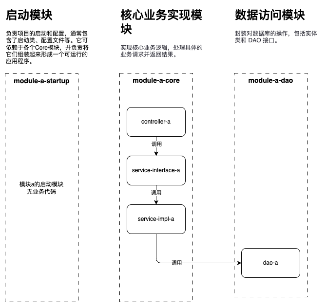
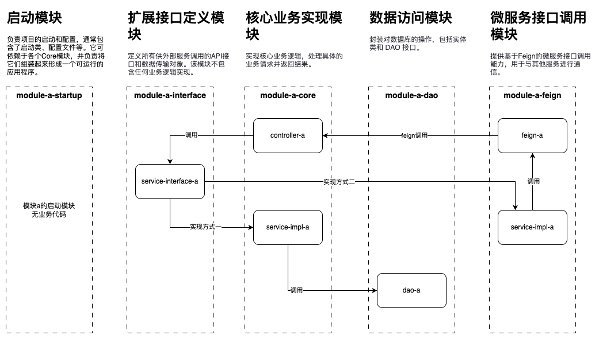
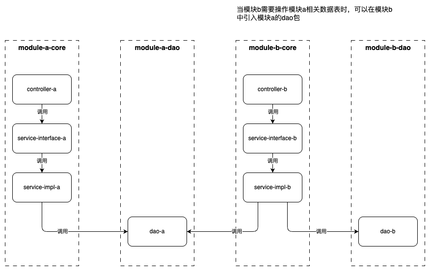
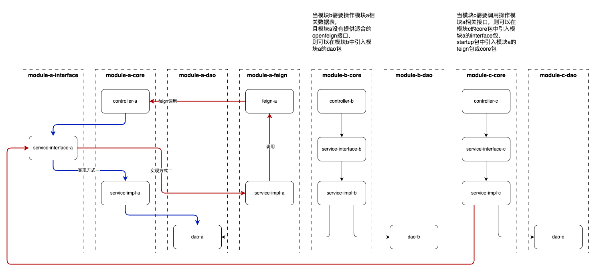
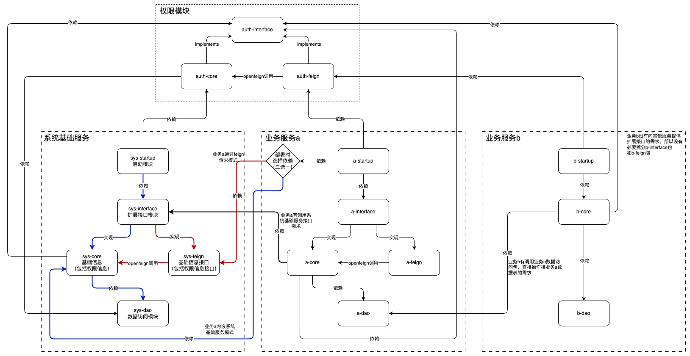

# 服务端口分配

| 服务          | 端口/执行器端口 | 作用                                     |
| ------------- | --------------- | ---------------------------------------- |
| mall-web-pc   | 30000           | 前端服务                                 |
| mall-gateway  | 30001           | 网关服务                                 |
| mall-file     | 30003           | 文件服务                                 |
| mall-sys      | 30004           | 基础信息管理(包括身份认证与访问授权服务) |
| mall-serial   | 30008           | 流水号生成服务（可选则是否独立部署）     |
| mall-oms      | 30006           | 订单管理模块                             |
| mall-pms      | 30005/20005     | 商品库存管理模块                         |
| xxl-job-admin | 30009           | 分布式任务调度中心                       |


## 模块分层设计

### 模块不存在扩展接口分层设计



### 模块存在扩展接口分层设计




## 模块间调用设计

### 不存在扩展接口的模块间调用设计



### 存在扩展接口的模块间调用设计

模块c通过openfeign调用模块a的扩展接口




## 模块服务设计




## 模块拆分目录与模块依赖

```markdown
project-root/
    │
  	├── auth/
  			├── auth-interface/        					← 接口定义（供外部调用）
        ├── auth-core/
		        ├── auth-interface(依赖)
		        └── sys-dao(依赖)
    		│
		    └── auth-feign/
		        ├── auth-interface(依赖)
		        └── sys-feign(依赖)
    │
  	├── sys/
        ├── sys-interface/        					← 接口定义（供外部调用）
        ├── sys-dao/              					← 数据访问层（DAO + Entity）
        ├── sys-core/             					← 核心业务逻辑
						├── sys-interface(依赖)
						├── sys-dao(依赖)
		        └── auth-interface
    		│
        ├── sys-feign/            					← 微服务 Feign 调用模块
		        └── sys-interface(依赖)
    		│
        └── sys-startup/          					← 启动模块（Spring Boot 入口，依赖配置管理）
		        ├── sys-core(依赖)
						└── auth-core(依赖)
    │
  	├── module-a/
        ├── module-a-interface/        			← 接口定义（供外部调用）
        ├── module-a-dao/              			← 数据访问层（DAO + Entity）
        ├── module-a-core/             			← 核心业务逻辑
						├── module-a-interface(依赖)
						├── module-a-dao(依赖)
						├── sys-interface(依赖)
						└── auth-interface(依赖)
    		│
        ├── module-a-feign/            			← 微服务 Feign 调用模块
						├── module-a-interface(依赖)
						└── sys-interface(依赖)
    		│	
        └── module-a-startup/          			← 启动模块（Spring Boot 入口，依赖配置管理）
		        ├── module-a-core(依赖)
		        ├── sys-core或sys-feign(依赖)
						└── auth-core或auth-feign(依赖)	← 如果选择auth-feign，则必须选sys-feign
    │
    ├── module-b/
				├── module-b-dao/              			← 数据访问层（DAO + Entity）
        ├── module-b-core/             			← 核心业务逻辑
		        ├── module-b-dao(依赖)
		        ├── module-a-dao(依赖)
						└── auth-interface(依赖)
    		│	
        └── module-b-startup/          			← 启动模块（Spring Boot 入口，依赖配置管理）
		        ├── module-b-core(依赖)
						└── auth-core或auth-feign(依赖)	← 如果选择auth-feign，则必须选sys-feign
```


示意图


## 权限设计


![mall-sys[系统表]-20241116164804](images/mall-sys[系统表]-20241116164804.png)


# 日志采集架构设计

FileBeat+Logstash+Elasticsearch+Kibanan

FileBeat采集日志

Logstash处理日志

Elasticsearch存储日志

Kibanan展示日志


# 服务器分配

nginx
/usr/local/nginx/conf

## 43 (10.0.20.10)

2核2G（剩余2G）

| 服务        | 主/从    | 端口  | 占用内存 | 是否部署 |
| ----------- | -------- | ----- | -------- | -------- |
| Redis-6.2.9 | master-1 | 6379  |          |          |
| Redis-6.2.9 | slave-3  | 6378  |          |          |
| MySQL-8     | master   | 13306 |          |          |

## 8

2核2G（剩余2G）

| 服务            | 主/从  | 端口  | 占用内存 | 是否部署 |
| --------------- | ------ | ----- | -------- | -------- |
| MySQL-8         | slave  | 13306 | 500M     | 是       |
| Elasticsearch-7 | master | 9200  |          |          |

## 京东云

2核4G（剩余4G）

| 服务            | 主/从 | 端口  | 占用内存 | 是否部署 |
| --------------- | ----- | ----- | -------- | -------- |
| Elasticsearch-7 | slave | 9200  |          |          |
| RabbitMQ-3.10.0 | slave | 15672 |          |          |
|                 |       |       |          |          |

## 移动云

2核2G（剩余2G）

| 服务            | 主/从 | 端口  | 占用内存 | 是否部署 |
| --------------- | ----- | ----- | -------- | -------- |
| Elasticsearch-7 | slave | 9200  |          |          |
| RabbitMQ-3.10.0 | slave | 15672 |          |          |
|                 |       |       |          |          |

