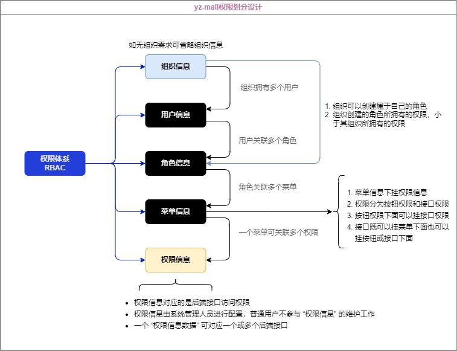

# 服务端口分配

| 服务             | 端口    | 作用          |
|----------------|-------|-------------|
| yz-mall-web-pc | 30000 | 前端服务        |
| yz-gateway     | 30001 | 网关服务        |
| yz-mall-auth   | 30002 | 身份认证与访问授权服务 |
| yz-file-start  | 30003 | 文件服务        |
| yz-unqid       | 30008 | 流水号生成       |
| yz-mall-sys    | 30004 | 基础信息模块      |
| yz-mall-oms    | 30006 | 订单管理模块      |
| yz-mall-pms    | 30005 | 商品库存管理模块    |


# 服务器分配

## 159 (10.0.12.16)
4核8G（剩余7G）

| 服务            | 主/从      | 端口    | 占用内存 | 是否部署 |
| --------------- |----------|-------| -------- | -------- |
| Redis-6.2.9    | master-3 | 8001  |          |          |
| Redis-6.2.9    | slave-2  | 8002  |          |          |
| Nacos-2.2.0     | master   | 8848  |          | 是       |
| Seata-1.6.1     | master   | 7091  |          |          |
| RabbitMQ-3.10.0 | master   | 15672 |          | 是       |


nginx
/usr/local/nginx/conf


## 119 (10.0.20.12)
4核4G（剩余2G）

| 服务            | 主/从    | 端口  | 占用内存 | 是否部署     |
| --------------- | -------- | ----- | -------- | ------------ |
| Redis-6.2.9    | master-2 | 6379 |          |              |
| Redis-6.2.9    | slave-1  | 6378 |          |              |
| MySQL-8         | master   | 13306 | 1.5g     | 是           |
| RabbitMQ-3.10.0 | slave    | 15672 |          | 是（未启动） |

## 43 (10.0.20.10)
2核2G（剩余2G）

| 服务            | 主/从      | 端口    | 占用内存 | 是否部署 |
| --------------- |----------|-------| -------- | -------- |
| Redis-6.2.9    | master-1 | 6379 |          |          |
| Redis-6.2.9    | slave-3  | 6378 |          |          |
| MySQL-8         | slave    | 13306 |      |           |

## 8
2核2G（剩余2G）

| 服务            | 主/从    | 端口    | 占用内存 | 是否部署 |
| --------------- | -------- |-------| -------- | -------- |
| MySQL-8         | slave    | 13306 | 500M     | 是       |
| Elasticsearch-7 | master   | 9200  |          |          |

## 京东云

2核4G（剩余4G）

| 服务            | 主/从 | 端口  | 占用内存 | 是否部署 |
| --------------- | ----- | ----- | -------- | -------- |
| Elasticsearch-7 | slave | 9200  |          |          |
| RabbitMQ-3.10.0 | slave | 15672 |          |          |
|                 |       |       |          |          |

## 移动云

2核2G（剩余2G）

| 服务            | 主/从 | 端口  | 占用内存 | 是否部署 |
| --------------- | ----- | ----- | -------- | -------- |
| Elasticsearch-7 | slave | 9200  |          |          |
| RabbitMQ-3.10.0 | slave | 15672 |          |          |
|                 |       |       |          |          |


## 中间件信息

### redis集群

```shell
[root@VM-20-10-centos redis-6.2.9]# src/redis-cli -a foobared --cluster create --cluster-replicas 1 10.0.20.10:6379 10.0.20.10:6378 10.0.20.12:6379 10.0.20.12:6378 10.0.12.16:6379 10.0.12.16:6378
Warning: Using a password with '-a' or '-u' option on the command line interface may not be safe.
>>> Performing hash slots allocation on 6 nodes...
Master[0] -> Slots 0 - 5460
Master[1] -> Slots 5461 - 10922
Master[2] -> Slots 10923 - 16383
Adding replica 10.0.20.12:6378 to 10.0.20.10:6379
Adding replica 10.0.12.16:6378 to 10.0.20.12:6379
Adding replica 10.0.20.10:6378 to 10.0.12.16:6379
M: 0c64870e7c802bf7814b0daf884785d473a10767 10.0.20.10:6379
   slots:[0-5460] (5461 slots) master
S: 91d4eb697e2e4b26c18b8f69a2c481fe9299df88 10.0.20.10:6378
   replicates d7711c2a1f22b275c595ec6f4a9d9141cb6bbf3b
M: ef31e32281a9e67fa5118eb619cdf469b02d3934 10.0.20.12:6379
   slots:[5461-10922] (5462 slots) master
S: 5dcc21a67e6e2d792d9018c5df10274816d744a3 10.0.20.12:6378
   replicates 0c64870e7c802bf7814b0daf884785d473a10767
M: d7711c2a1f22b275c595ec6f4a9d9141cb6bbf3b 10.0.12.16:6379
   slots:[10923-16383] (5461 slots) master
S: 12bb6bd6e4b63e0ed8cafa224fcc79ca1570426c 10.0.12.16:6378
   replicates ef31e32281a9e67fa5118eb619cdf469b02d3934
Can I set the above configuration? (type 'yes' to accept): yes
>>> Nodes configuration updated
>>> Assign a different config epoch to each node
>>> Sending CLUSTER MEET messages to join the cluster
Waiting for the cluster to join
.
>>> Performing Cluster Check (using node 10.0.20.10:6379)
M: 0c64870e7c802bf7814b0daf884785d473a10767 10.0.20.10:6379
   slots:[0-5460] (5461 slots) master
   1 additional replica(s)
S: 5dcc21a67e6e2d792d9018c5df10274816d744a3 10.0.20.12:6378
   slots: (0 slots) slave
   replicates 0c64870e7c802bf7814b0daf884785d473a10767
S: 12bb6bd6e4b63e0ed8cafa224fcc79ca1570426c 10.0.12.16:6378
   slots: (0 slots) slave
   replicates ef31e32281a9e67fa5118eb619cdf469b02d3934
M: d7711c2a1f22b275c595ec6f4a9d9141cb6bbf3b 10.0.12.16:6379
   slots:[10923-16383] (5461 slots) master
   1 additional replica(s)
M: ef31e32281a9e67fa5118eb619cdf469b02d3934 10.0.20.12:6379
   slots:[5461-10922] (5462 slots) master
   1 additional replica(s)
S: 91d4eb697e2e4b26c18b8f69a2c481fe9299df88 10.0.20.10:6378
   slots: (0 slots) slave
   replicates d7711c2a1f22b275c595ec6f4a9d9141cb6bbf3b
[OK] All nodes agree about slots configuration.
>>> Check for open slots...
>>> Check slots coverage...
[OK] All 16384 slots covered.

```


docker 切换阿里云镜像
https://blog.csdn.net/Suyiixx/article/details/129891688

docker 安装redis

1. 拉取redis镜像
   ```shell
    docker pull redis:latest
   ```

2. 查看本地镜像
   ```shell
    docker images
   ```

3. 运行容器
    ```shell
    docker run -itd --name redis-dev -p 6379:6379 redis --requirepass "foobared"
    ```

4. 查看运行中的容器
    ```shell
    docker ps
    ```

5. 进入容器空间操作
    ```shell
    docker exec -it redis-dev /bin/bash
    ```

6. 关闭运行中的容器

   先使用命令 `docker ps` 查看处于运行中的容器

   ```shell
   yunze@yunzedeMacBook-Pro ~ % docker ps
   CONTAINER ID   IMAGE     COMMAND                   CREATED        STATUS        PORTS                    NAMES
   039e8dbc0fed   redis     "docker-entrypoint.s…"   40 hours ago   Up 40 hours   0.0.0.0:6379->6379/tcp   redis-dev
   ```

   然后根据运行中容器的 `CONTAINER ID` 去关闭容器

   ```shell
   yunze@yunzedeMacBook-Pro ~ % docker stop 039e8dbc0fed
   039e8dbc0fed
   ```
   
7. 删除容器

   ```shell
   docker rm 039e8dbc0fed # (容器ID，CONTAINER ID)
   ```
   
8. 删除镜像

   ```shell
   docker rmi [IMAGE ID]
   ```
9. 运行rabbitmq镜像

   ```shell
   docker run -d --name=rabbitmq -v /usr/local/docker/rabbitmq:/var/lib/rabbitmq -p 15672:15672 -p 5672:5672 -e RABBITMQ_DEFAULT_USER=admin -e RABBITMQ_DEFAULT_PASS=admin rabbitmq:management
   ```
   

提交测试


## 权限设计



![mall-sys[系统表]-20241116164804](images/mall-sys[系统表]-20241116164804.png)