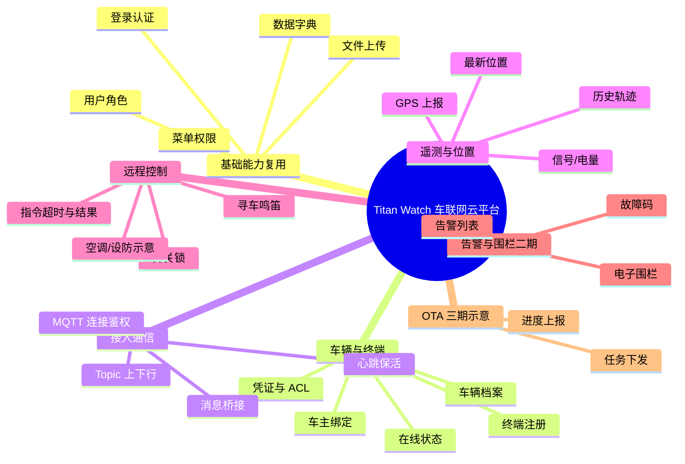
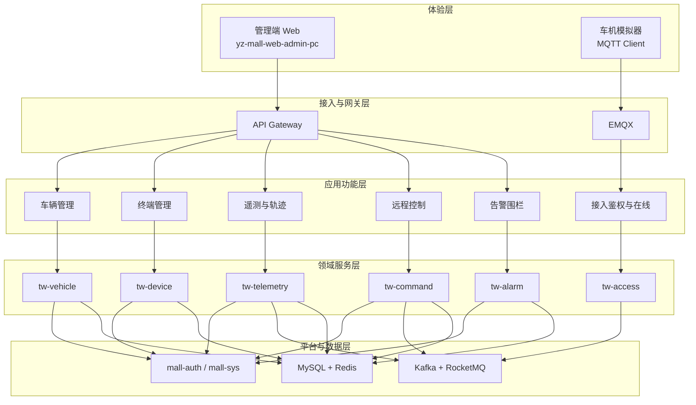
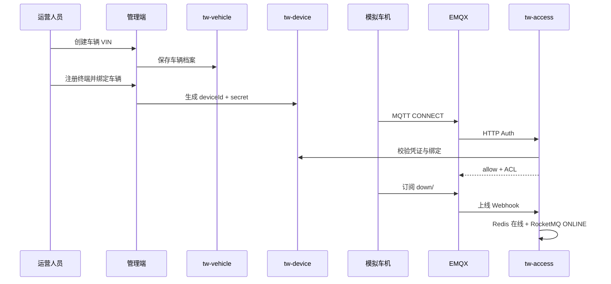
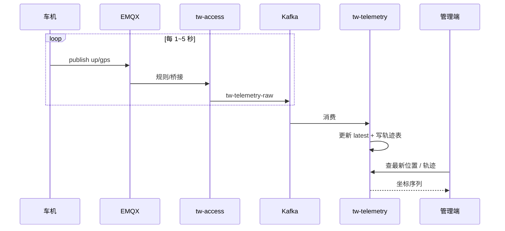
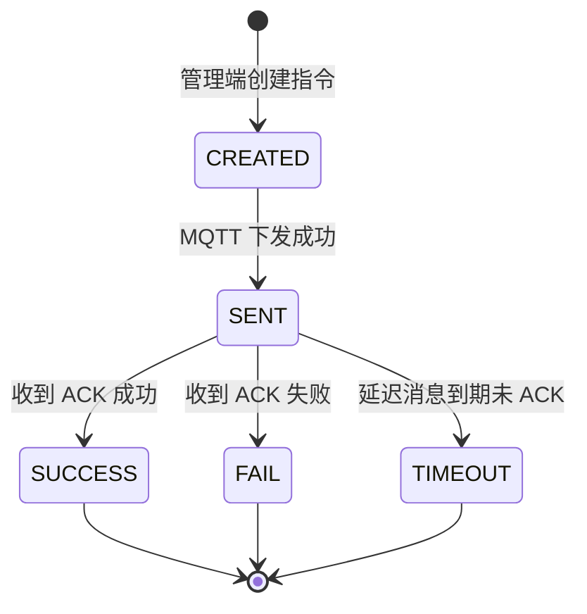
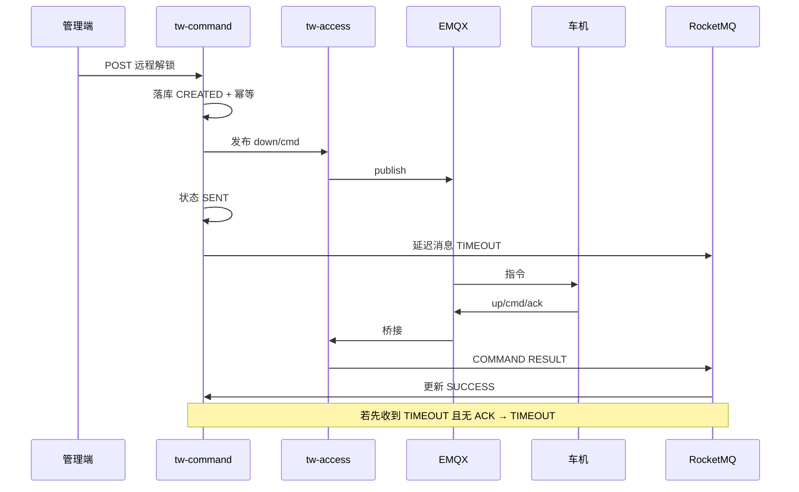

# Titan Watch 车联网云平台 — 功能模块规划

> 配套：[系统架构设计.md](./系统架构设计.md) · [开发优先级.md](./开发优先级.md)

---

## 一、功能全景（功能架构图）



### 1.1 分层功能架构



---

## 二、能力复用（不重复造轮子）

| 功能 | 来源 | TSP 用法 |
|------|------|----------|
| 登录 / 登出 / Token | mall-auth + 管理端登录页 | 运营人员登录 |
| 用户 / 角色 / 菜单 / 权限 | mall-sys + 管理端系统管理 | 新增「车联网」菜单与按钮权限 |
| 数据字典 | mall-sys | 车型、指令类型、告警类型等枚举 |
| 文件服务 | mall-file | 车辆图片、OTA 包（后期） |
| 流水号 | mall-serial | 指令单号 `CMD...` |
| 统一响应 / 基类 | mall-base | `Result` / `ApiController` |

**管理端菜单建议**（挂在现有 PC 后台）：

```
车联网
├── 车辆管理
├── 终端管理
├── 实时监控（最新位置 / 在线）
├── 轨迹查询
├── 远程控制
└── 告警中心（二期）
```

---

## 三、业务模块详细规划

### 3.1 车辆管理（tw-vehicle）

| 功能点 | 说明 | 优先级 |
|--------|------|--------|
| 车辆建档 | VIN、车型、颜色、车牌、启用状态 | P0 |
| 车辆查询 | 分页、按 VIN/车牌/在线状态筛 | P0 |
| 车主绑定 | 绑定系统用户（复用 sys 用户） | P0 |
| 车主授权 | 车主授权其他用户使用车辆（可带能力范围） | P0 |
| 解绑 / 过户示意 | 简单状态流转；过户撤销全部授权 | P1 |
| 车辆详情 | 档案 + 绑定终端 + 最新位置摘要 | P0 |

**关键字段建议**：`vin`（唯一）、`model_code`、`plate_no`、`status`、`owner_user_id`

### 3.2 终端管理（tw-device）

| 功能点 | 说明 | 优先级 |
|--------|------|--------|
| 终端注册 | deviceId、密钥生成、状态 | P0 |
| 终端-车辆绑定 | 一车一终端（验证阶段） | P0 |
| 凭证重置 | 重置 MQTT 密码，踢掉旧连接 | P0 |
| 禁用终端 | 拒绝鉴权 | P0 |
| 证书管理 | 仅文档预留，可不实现 | P2 |

### 3.3 接入与在线（tw-access）

| 功能点 | 说明 | 优先级 |
|--------|------|--------|
| EMQX HTTP 鉴权 | CONNECT 时校验设备 | P0 |
| ACL 元数据 | 仅本 VIN Topic | P0 |
| 上下线 Webhook | 写 Redis + 发 RocketMQ | P0 |
| 上行桥接 | GPS → Kafka；ACK/事件 → RocketMQ | P0 |
| 下行代理 | 业务服务调用发布 MQTT | P0 |
| 心跳刷新 | 更新最后在线时间 | P0 |

### 3.4 遥测与轨迹（tw-telemetry）

| 功能点 | 说明 | 优先级 |
|--------|------|--------|
| 消费 Kafka 原始点 | 解析、校验、去噪（简单即可） | P0 |
| 最新位置 | 写 Redis + `tw_gps_latest` | P0 |
| 轨迹落库 | 分表或单表限量 | P0 |
| 轨迹查询 API | 按 VIN + 时间范围 | P0 |
| 信号/电量 | 扩展字段或独立消息 | P1 |
| 地图展示 | 管理端高德/ Leaflet 折线 | P0（演示必需） |

### 3.5 远程控制（tw-command）

| 功能点 | 说明 | 优先级 |
|--------|------|--------|
| 下发指令 | 解锁/上锁/寻车/闪灯（枚举可配置） | P0 |
| 指令状态机 | CREATED→SENT→SUCCESS/FAIL/TIMEOUT | P0 |
| 幂等 | 同一 bizId 不重复下发 | P0 |
| 超时 | RocketMQ 延迟消息 | P0 |
| 指令列表 / 详情 | 管理端可查 | P0 |
| 车主 App 下控 | 可选，权限校验到绑定关系 | P1 |

**指令类型（字典）示例**：`DOOR_UNLOCK`、`DOOR_LOCK`、`FIND_CAR`、`FLASH_LIGHT`、`AC_START`（示意）

### 3.6 告警与围栏（tw-alarm，二期）

| 功能点 | 说明 | 优先级 |
|--------|------|--------|
| 电子围栏配置 | 圆/多边形 | P1 |
| 进出围栏告警 | 基于位置流判定 | P1 |
| 故障码上报 | 事件 Topic | P1 |
| 告警列表与确认 | 管理端 | P1 |

### 3.7 OTA（三期示意）

| 功能点 | 说明 | 优先级 |
|--------|------|--------|
| 固件版本与包管理 | 文件走 mall-file | P2 |
| 升级任务下发 | MQTT config Topic | P2 |
| 进度/结果上报 | 任务状态机 | P2 |

---

## 四、角色与权限（功能视角）

| 角色 | 能力 | 实现方式 |
|------|------|----------|
| 平台管理员 | 全部菜单 | 现有超级管理员 |
| 运营人员 | 车辆/终端/监控/指令 | 菜单 + `@SaCheckPermission` |
| 只读监控 | 看位置与轨迹，不能下控 | 按钮权限拆分 |
| 车主（可选） | 仅自己的车 | 绑定表 + 数据权限过滤 |

---

## 五、核心业务流程

### 5.1 车辆接入（从建档到在线）



### 5.2 位置上报与轨迹查询



### 5.3 远程控车





---

## 六、模块 ↔ 服务 ↔ 前端映射

| 功能模块 | 后端服务 | 管理端页面 | 依赖中间件 |
|----------|----------|------------|------------|
| 车辆管理 | tw-vehicle | 车辆列表/详情/绑定 | MySQL |
| 终端管理 | tw-device | 终端列表/重置密钥 | MySQL、Redis |
| 接入在线 | tw-access | （无独立页，监控页展示在线） | EMQX、Redis、Kafka、RocketMQ |
| 实时监控 | tw-telemetry + access | 监控大屏/车辆地图 | Redis |
| 轨迹查询 | tw-telemetry | 轨迹回放 | MySQL、Kafka |
| 远程控制 | tw-command | 下控按钮 + 指令记录 | EMQX、RocketMQ、Redis |
| 告警 | tw-alarm | 告警列表 | RocketMQ、MySQL |
| 登录权限等 | mall-auth / mall-sys | 现有系统管理 | 已有 |

---

## 七、演示脚本（验收故事）

一条完整 Demo 故事线（面试/简历可写）：

1. 管理员登录后台（复用现有登录）  
2. 创建车辆、注册终端、绑定  
3. 启动 MQTT 模拟器上线 → 列表显示「在线」  
4. 模拟器持续上报 GPS → 地图上看到最新点与轨迹  
5. 点击「解锁」→ 指令 SENT → 模拟器回 ACK → 显示成功  
6. 断开模拟器 → 显示离线  

对应开发顺序见 [开发优先级.md](./开发优先级.md)。
