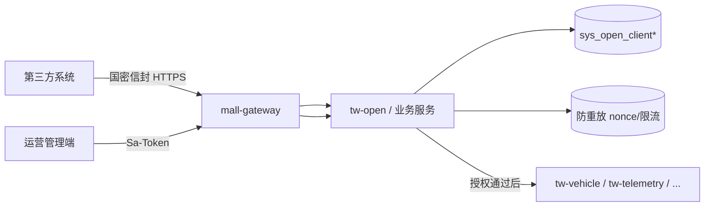
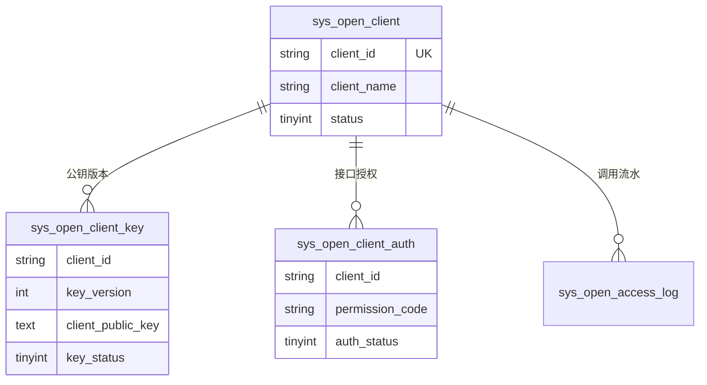
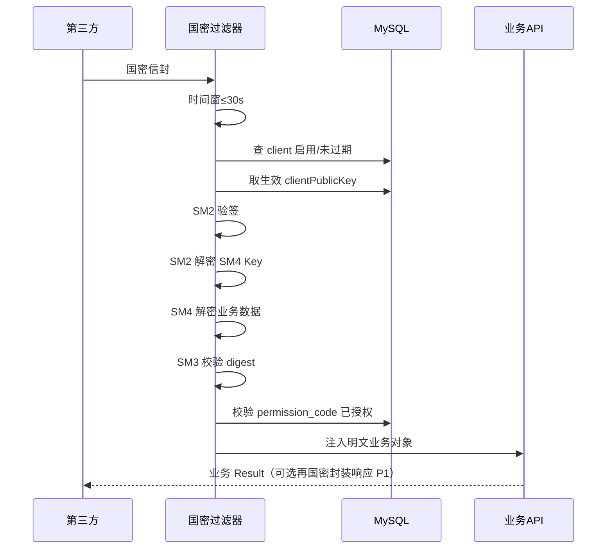

# 功能模块设计-第三方访问授权管理

> **产品名称**：Titan Watch（泰坦守望）车联网云平台  
> **文档类型**：功能模块设计文档  
> **所属域**：开放接入 / `tw-open`（可与 `mall-sys` 同进程或独立服务）  
> **优先级**：P1（开放给合作方/车机云外系统调 API 时启用；P0 可先完成表结构与后台备案）  
> **依据**：[API接口加密认证](https://blog.gaohan.asia/article/z712x92h/)（SM2 + SM4 + SM3）· [功能模块规划.md](./功能模块规划.md) · [系统架构设计.md](./系统架构设计.md) · [功能模块设计-车辆档案.md](./功能模块设计-车辆档案.md)  
> **关联前端**：`yz-mall-web-admin-pc` → 菜单「Titan Watch / 开放平台」或「系统管理 / 第三方授权」

---

## 1. 功能实现目标

### 1.1 目标说明

为车企对外开放（经销商、保险、车队、内部子系统等）提供**可运营的第三方客户端备案与访问授权**：在服务端登记 `clientId`、客户端 SM2 公钥、可调用的 API 范围与状态；调用侧按国密组合（SM2 身份签名 + SM4 业务加密 + SM3 完整性）上送，网关/业务侧验签解密后再进入业务逻辑。

本设计将博客中的「配置文件写死 client 公钥」升级为**后台可管理的授权资产**，并补齐权限范围、启停、审计等运营能力。

| 编号 | 目标 | 验收要点 |
|------|------|----------|
| G1 | 第三方应用备案 | 创建应用、生成 `clientId`、维护名称/联系人/备注、启停 |
| G2 | 密钥备案 | 登记客户端 SM2 公钥；可选平台代生成密钥对（私钥仅创建时回显一次） |
| G3 | 访问范围授权 | 按 API 权限码 / 资源 scope 授权；未授权接口拒绝 |
| G4 | 国密调用闭环 | 请求包按文章协议组装；服务端校验时间窗、备案、验签、解密、摘要一致性 |
| G5 | 运营可查 | 分页查询客户端；查看授权范围；可选调用流水（P1） |
| G6 | 安全底线 | 服务端 SM2 私钥仅环境变量/配置中心；禁止入库明文私钥；禁用客户端立即失效 |

### 1.2 密码学职责（对齐原文）

| 算法 | 职责 |
|------|------|
| **SM2** | 非对称：客户端私钥签名证明身份；服务端公钥加密 SM4 会话密钥；服务端私钥解密会话密钥；用备案的客户端公钥验签 |
| **SM4** | 对称：加密业务 JSON，防明文泄露（含 `encryptedData` + `iv`） |
| **SM3** | 摘要：对业务明文做 digest，防篡改；与签名字段联动 |

**密钥持有关系**：

| 主体 | 持有 | 公开/备案 |
|------|------|-----------|
| 平台（服务端） | `serverPrivateKey` | 向第三方下发 `serverPublicKey` |
| 第三方客户端 | `clientPrivateKey` | 在平台备案 `clientPublicKey`（按 `clientId`） |

### 1.3 非目标

- 完整 OAuth2 / OIDC 授权码模式（本方案是国密「应用级 API 加密通道」，不是用户登录态）
- 替换管理端 Sa-Token 登录（人机后台仍走现有 auth）
- HSM 硬件托管（文档预留，验证阶段软件密钥即可）
- 车机 MQTT 鉴权（仍由 `tw-device` / `tw-access` 负责）

### 1.4 服务与分层归属

| 项 | 约定 |
|----|------|
| 服务建议 | `tw-open`（端口建议 `30105`）；验证阶段可并入 `mall-sys` |
| 包名 | `com.yz.mall.sys`（管理并入 mall-sys） |
| 类前缀 | `SysOpenClient` / `SysOpenClientAuth` / `SysOpenCrypto` |
| 统一响应 | 业务成功后仍可用 `Result`；**加密通道入参**用统一信封 `SysOpenEnvelope` |
| 人机鉴权 | 管理接口：Gateway + Sa-Token + `@SaCheckPermission("api:sys:open:*")` |
| 机机鉴权 | 开放接口：国密验签解密过滤器 / AOP（`@SysOpenCrypto`），不依赖 Sa-Token 登录 |

### 1.5 与上下游关系



| 通道 | 说明 |
|------|------|
| 管理通道 | 运营维护第三方备案与授权范围 |
| 开放通道 | `/open/tw/**` 等前缀；先过国密过滤器，再进业务 Controller |

---

## 2. 涉及角色与权限范围

### 2.1 角色（管理端）

| 角色 | 能力 |
|------|------|
| 平台管理员 | 全部开放平台管理 |
| 运营人员 | 备案客户端、配授权、启停、重置密钥元数据 |
| 只读监控 | 仅查看客户端列表/详情（不可看完整公钥轮换操作，可选） |
| 车主 / 授权用户 | 无开放平台管理权限 |

### 2.2 管理功能权限矩阵

| 功能点 | 权限码 | 管理员 | 运营 | 只读 |
|--------|--------|:------:|:----:|:----:|
| 客户端分页 | `api:sys:open:client:page` | ✅ | ✅ | ✅ |
| 客户端详情 | `api:sys:open:client:detail` | ✅ | ✅ | ✅ |
| 新建客户端 | `api:sys:open:client:add` | ✅ | ✅ | ❌ |
| 编辑客户端 | `api:sys:open:client:edit` | ✅ | ✅ | ❌ |
| 启停客户端 | `api:sys:open:client:status` | ✅ | ✅ | ❌ |
| 删除客户端 | `api:sys:open:client:delete` | ✅ | ✅ | ❌ |
| 登记/轮换公钥 | `api:sys:open:client:key` | ✅ | ✅ | ❌ |
| 配置 API 授权 | `api:sys:open:client:auth` | ✅ | ✅ | ❌ |
| 下载服务端公钥 | `api:sys:open:server-public-key` | ✅ | ✅ | ✅ |
| 调用流水查询（P1） | `api:sys:open:log:page` | ✅ | ✅ | ✅ |

### 2.3 第三方（机机）访问范围

授权粒度建议两级（P0 用权限码即可）：

| 粒度 | 示例 | 说明 |
|------|------|------|
| API 权限码 | `open:tw:vehicle:query` | 与开放 Controller 注解一致 |
| 资源 Scope（P1） | `vehicle:read` / `telemetry:latest` / `command:send` | 可映射多接口 |

**数据范围（可选 P1）**：客户端可绑定「仅某组织/车队 VIN 列表」；P0 先做**接口级授权**，数据范围复用业务侧校验或全量（演示环境）。

---

## 3. 数据表设计

### 3.1 设计说明

- `sys_open_client`：第三方应用主数据。  
- `sys_open_client_key`：客户端 SM2 公钥版本（支持轮换，当前生效一条）。  
- `sys_open_client_auth`：客户端 ↔ API 权限码。  
- `sys_open_access_log`（P1）：调用审计。  
- 字段约定：`create_id` / `update_id` / `create_time` / `update_time` / `invalid`。  
- **禁止**存储客户端 SM2 私钥、服务端私钥；服务端密钥仅配置中心/环境变量。

### 3.2 表：`sys_open_client`（第三方客户端）

```sql
CREATE TABLE `sys_open_client` (
  `id` bigint NOT NULL COMMENT '主键标识',
  `client_id` varchar(64) NOT NULL COMMENT '客户端标识，对外唯一',
  `client_name` varchar(128) NOT NULL COMMENT '应用名称',
  `contact_name` varchar(64) DEFAULT NULL COMMENT '联系人',
  `contact_phone` varchar(32) DEFAULT NULL COMMENT '联系电话',
  `status` tinyint NOT NULL DEFAULT 1 COMMENT '状态：0禁用 1启用',
  `expire_time` datetime DEFAULT NULL COMMENT '授权到期时间，空表示长期',
  `ip_whitelist` varchar(512) DEFAULT NULL COMMENT 'IP白名单，逗号分隔，空不限制',
  `rate_limit_qps` int DEFAULT NULL COMMENT '可选QPS上限',
  `remark` varchar(255) DEFAULT NULL COMMENT '备注',
  `create_id` bigint DEFAULT NULL COMMENT '创建人用户ID',
  `update_id` bigint DEFAULT NULL COMMENT '更新人用户ID',
  `create_time` datetime DEFAULT CURRENT_TIMESTAMP COMMENT '创建时间',
  `update_time` datetime DEFAULT CURRENT_TIMESTAMP ON UPDATE CURRENT_TIMESTAMP COMMENT '更新时间',
  `invalid` bigint NOT NULL DEFAULT 0 COMMENT '数据是否有效：0数据有效',
  PRIMARY KEY (`id`),
  UNIQUE KEY `uk_client_id_invalid` (`client_id`, `invalid`),
  KEY `idx_status` (`status`)
) ENGINE=InnoDB DEFAULT CHARSET=utf8mb4 COMMENT='第三方开放客户端';
```

### 3.3 表：`sys_open_client_key`（客户端公钥）

```sql
CREATE TABLE `sys_open_client_key` (
  `id` bigint NOT NULL COMMENT '主键标识',
  `client_id` varchar(64) NOT NULL COMMENT '客户端标识',
  `key_version` int NOT NULL DEFAULT 1 COMMENT '密钥版本号',
  `client_public_key` text NOT NULL COMMENT '客户端SM2公钥Base64/PEM',
  `key_status` tinyint NOT NULL DEFAULT 1 COMMENT '状态：0停用 1当前生效',
  `effect_time` datetime NOT NULL COMMENT '生效时间',
  `expire_time` datetime DEFAULT NULL COMMENT '失效时间',
  `remark` varchar(255) DEFAULT NULL COMMENT '备注',
  `create_id` bigint DEFAULT NULL COMMENT '创建人用户ID',
  `update_id` bigint DEFAULT NULL COMMENT '更新人用户ID',
  `create_time` datetime DEFAULT CURRENT_TIMESTAMP COMMENT '创建时间',
  `update_time` datetime DEFAULT CURRENT_TIMESTAMP ON UPDATE CURRENT_TIMESTAMP COMMENT '更新时间',
  `invalid` bigint NOT NULL DEFAULT 0 COMMENT '数据是否有效：0数据有效',
  PRIMARY KEY (`id`),
  KEY `idx_client_status` (`client_id`, `key_status`),
  UNIQUE KEY `uk_client_version_invalid` (`client_id`, `key_version`, `invalid`)
) ENGINE=InnoDB DEFAULT CHARSET=utf8mb4 COMMENT='第三方客户端SM2公钥';
```

**约束**：同一 `client_id` 同时最多一条 `key_status=1`。轮换时旧密钥置停用并设 `expire_time`（可保留短重叠窗口 P1）。

### 3.4 表：`sys_open_client_auth`（接口授权）

```sql
CREATE TABLE `sys_open_client_auth` (
  `id` bigint NOT NULL COMMENT '主键标识',
  `client_id` varchar(64) NOT NULL COMMENT '客户端标识',
  `permission_code` varchar(128) NOT NULL COMMENT '开放API权限码，如open:tw:vehicle:query',
  `auth_status` tinyint NOT NULL DEFAULT 1 COMMENT '授权状态：0撤销 1有效',
  `grant_time` datetime NOT NULL COMMENT '授权时间',
  `expire_time` datetime DEFAULT NULL COMMENT '过期时间，空长期',
  `remark` varchar(255) DEFAULT NULL COMMENT '备注',
  `create_id` bigint DEFAULT NULL COMMENT '创建人用户ID',
  `update_id` bigint DEFAULT NULL COMMENT '更新人用户ID',
  `create_time` datetime DEFAULT CURRENT_TIMESTAMP COMMENT '创建时间',
  `update_time` datetime DEFAULT CURRENT_TIMESTAMP ON UPDATE CURRENT_TIMESTAMP COMMENT '更新时间',
  `invalid` bigint NOT NULL DEFAULT 0 COMMENT '数据是否有效：0数据有效',
  PRIMARY KEY (`id`),
  UNIQUE KEY `uk_client_perm_invalid` (`client_id`, `permission_code`, `invalid`),
  KEY `idx_client_status` (`client_id`, `auth_status`)
) ENGINE=InnoDB DEFAULT CHARSET=utf8mb4 COMMENT='第三方客户端接口授权';
```

### 3.5 表：`sys_open_access_log`（调用流水，P1）

```sql
CREATE TABLE `sys_open_access_log` (
  `id` bigint NOT NULL COMMENT '主键标识',
  `client_id` varchar(64) NOT NULL COMMENT '客户端标识',
  `permission_code` varchar(128) DEFAULT NULL COMMENT '命中权限码',
  `request_path` varchar(255) NOT NULL COMMENT '请求路径',
  `success` tinyint NOT NULL COMMENT '是否成功：0失败 1成功',
  `fail_reason` varchar(128) DEFAULT NULL COMMENT '失败原因码',
  `cost_ms` int DEFAULT NULL COMMENT '耗时毫秒',
  `client_ip` varchar(64) DEFAULT NULL COMMENT '客户端IP',
  `create_time` datetime DEFAULT CURRENT_TIMESTAMP COMMENT '创建时间',
  `invalid` bigint NOT NULL DEFAULT 0 COMMENT '数据是否有效：0数据有效',
  PRIMARY KEY (`id`),
  KEY `idx_client_ctime` (`client_id`, `create_time`)
) ENGINE=InnoDB DEFAULT CHARSET=utf8mb4 COMMENT='第三方开放调用流水';
```

> 可不建 `update_id`（纯追加日志）。高并发时可改写 ClickHouse；P0/P1 先 MySQL。

### 3.6 ER



---

## 4. 开放调用协议（机机）

### 4.1 请求信封（对齐原文）

第三方 POST 到开放接口时，Body 为：

```json
{
  "clientId": "备案标识",
  "timestamp": 1735689600000,
  "encryptedData": "SM4加密后的业务数据Base64",
  "iv": "SM4 IV Base64",
  "encryptedKey": "SM2加密后的SM4密钥Base64",
  "digest": "业务明文SM3摘要Hex/Base64",
  "signature": "SM2签名Base64"
}
```

业务明文（解密后）为各 API 自己的 JSON（如查车条件）。

**签名原文**（与原文一致）：

```text
clientId + ":" + timestamp + ":" + digest
```

使用客户端 SM2 私钥签名；服务端用备案公钥验签。

### 4.2 服务端校验顺序



失败任一环：直接拒绝（统一业务码，不回显密钥细节）。

### 4.3 防重放

| 手段 | 约定 |
|------|------|
| 时间窗 | `|now - timestamp| ≤ 30s`（可配置） |
| 可选 nonce | P1：`clientId:timestamp:digest` 写入 Redis TTL 60s，重复拒绝 |
| IP 白名单 | `ip_whitelist` 非空则校验 |

### 4.4 与配置文件方案差异

| 原文博客 | 本设计 |
|----------|--------|
| `sm.client.{clientId}=公钥` 写 properties | 入库 `sys_open_client_key`，后台维护 |
| 无接口级授权 | `sys_open_client_auth` |
| 无启停/过期 | `status` / `expire_time` |
| 注解 + 切面解密 | 保留；公钥加载改为查库 + 本地缓存 |

---

## 5. 管理端接口设计

> 前缀：`/sys/open/**`（需登录）

### 5.1 客户端 CRUD

| 方法 | 路径 | 说明 |
|------|------|------|
| POST | `/sys/open/client/page` | 分页：名称、clientId、status |
| GET | `/sys/open/client/{id}` | 详情（含当前公钥摘要、授权列表） |
| POST | `/sys/open/client` | 新建：生成 `clientId`（UUID 去横线或 snowflake 串） |
| PUT | `/sys/open/client` | 编辑名称/联系人/白名单/QPS/备注；**不可改** clientId |
| PUT | `/sys/open/client/status` | 启停 |
| DELETE | `/sys/open/client/{id}` | 逻辑删；级联逻辑失效 key/auth |

### 5.2 密钥

| 方法 | 路径 | 说明 |
|------|------|------|
| POST | `/sys/open/client/key/upload` | 入参：`clientId`、`clientPublicKey`；旧 key 停用 |
| POST | `/sys/open/client/key/generate` | 平台生成 SM2 密钥对：公钥入库，**响应中一次性返回私钥**（仅此次） |
| GET | `/sys/open/server-public-key` | 返回平台 `serverPublicKey` 供第三方加密 SM4 Key |

### 5.3 授权

| 方法 | 路径 | 说明 |
|------|------|------|
| POST | `/sys/open/client/auth/grant` | 批量授予 `permissionCodes[]` |
| POST | `/sys/open/client/auth/revoke` | 撤销指定权限码 |
| GET | `/sys/open/client/{clientId}/auth/list` | 有效授权列表 |
| GET | `/sys/open/permission/options` | 系统预置可授权开放 API 清单 |

**预置开放权限码示例（Titan Watch）**：

| permission_code | 说明 |
|-----------------|------|
| `open:tw:vehicle:query` | 查询车辆档案摘要 |
| `open:tw:telemetry:latest` | 查询最新位置 |
| `open:tw:telemetry:track` | 查询轨迹 |
| `open:tw:command:send` | 远程指令（慎开，需严审） |

### 5.4 开放业务接口示例

- 路径前缀建议：`/open/tw/vehicle/query`  
- 注解：`@SysOpenCrypto` + `@SysOpenPermission("open:tw:vehicle:query")`  
- Controller 方法入参：解密后的业务 DTO（切面从信封注入），而非原始信封字段。

---

## 6. 核心实现组件（对齐原文案例结构）

| 组件 | 职责 |
|------|------|
| `SMProperties` / `SysOpenCryptoProperties` | 服务端公私钥；**不再**用 Map 硬编码全部 client |
| `SysOpenClientService` | 查客户端、公钥、授权；带 Caffeine/Redis 缓存 |
| `SMUtil` / `TwSmCryptoService` | SM2/SM3/SM4 工具（BouncyCastle） |
| `@SysOpenCrypto` | 标记需国密解密的接口 |
| `@SysOpenPermission` | 标记所需 permission_code |
| `SysOpenCryptoAspect` / Filter | 时间窗 → 备案 → 验签 → 解密 → 摘要 → 授权 |
| `SysOpenEnvelope` | 对应原文 `BaseParams` |
| `SysOpenEnvelopeDto<T>` | 对应原文 `SmParamsDto<T>`，切面填充 `data` |

**缓存 Key**：

| Key | 用途 |
|-----|------|
| `sys:open:client:{clientId}` | 客户端状态摘要 TTL 5min |
| `sys:open:client:pub:{clientId}` | 当前公钥 |
| `sys:open:client:auth:{clientId}` | 权限码集合 |
| `sys:open:replay:{hash}` | 防重放（P1） |

启停、换钥、改授权时主动删缓存。

---

## 7. 异常与业务码建议

| 场景 | 提示（对外可模糊） |
|------|-------------------|
| 时间戳超时 | 请求已过期 |
| clientId 未备案/禁用/过期 | 客户端无效 |
| 验签失败 | 签名校验失败 |
| SM4 解密失败 | 数据解密失败 |
| digest 不一致 | 数据完整性校验失败 |
| 未授权 API | 无权访问该接口 |
| IP 不在白名单 | 来源非法 |
| 触发限流 | 请求过于频繁 |

审计日志记录细因；对外避免区分「无客户端」与「公钥错误」过度细节（防探测，P1 可统一文案）。

---

## 8. 安全与合规要点

1. 服务端私钥：Nacos/`SERVER_SM2_PRIVATE_KEY` 环境变量，禁止进 Git。  
2. 生成密钥对接口：仅授权运营；私钥响应禁止写日志。  
3. 传输：开放 API **必须 HTTPS**。  
4. 国密组合满足国产化叙述（对齐原文「合规性」章节）；验证项目不做等保测评。  
5. 高危权限（如远程控车）默认不授，需双人审批流程可后续加。

---

## 9. 管理端页面要点

| 页面 | 能力 |
|------|------|
| 客户端列表 | 筛选、启停、进入详情 |
| 客户端详情 | 基本信息、当前公钥指纹、授权勾选、换钥、下载服务端公钥 |
| 新建向导 | 填名称 → 生成 clientId → 上传或生成密钥 → 勾选 API |
| 调用流水（P1） | 按 clientId/时间查成功失败 |

---

## 10. 测试用例

| 编号 | 场景 | 期望 |
|------|------|------|
| T1 | 新建客户端并上传公钥 | 可查询详情 |
| T2 | 合法国密请求已授权接口 | 业务成功 |
| T3 | timestamp 超时 | 拒绝 |
| T4 | 错误签名 | 拒绝 |
| T5 | 篡改 encryptedData | digest 失败拒绝 |
| T6 | 未授权 permission | 拒绝 |
| T7 | 禁用 client 后请求 | 拒绝 |
| T8 | 换钥后旧签 | 拒绝；新签成功 |
| T9 | 管理端无权限新建 | 403 |
| T10 | 生成密钥对 | 仅响应一次含私钥；库中仅公钥 |

---

## 11. 交付清单

- [ ] DDL：见 [`docs/sql/sys_open.sql`](../sql/sys_open.sql)（`sys_open_client` / `sys_open_client_key` / `sys_open_client_auth` / `sys_open_access_log`）
- [ ] 国密工具类与验签解密切面（参考博客实现，公钥改为读库）
- [ ] 管理 API + 权限码 + 菜单「开放平台」
- [ ] 至少 1 个开放业务演示接口（如车辆摘要查询）
- [ ] 服务端公私钥配置到 Nacos；文档说明第三方接入步骤
- [ ] 第三方联调 Demo（可用单测/脚本模拟客户端）

---

## 12. 第三方接入手册（对外摘要）

1. 向平台申请开通，获得 `clientId`、`serverPublicKey`。  
2. 自备或平台代生成 SM2 密钥对；将 **公钥** 交给平台备案。  
3. 按 §4.1 组装信封调用 `/open/tw/**`。  
4. 业务字段以各接口文档为准（位于加密前明文 JSON）。  

算法细节与示例代码见：[API接口加密认证](https://blog.gaohan.asia/article/z712x92h/)。

---

*本文把博客中的国密 API 认证方案产品化为「可运营的第三方访问授权管理」，与 Titan Watch 开放查询/控车等场景衔接。*
