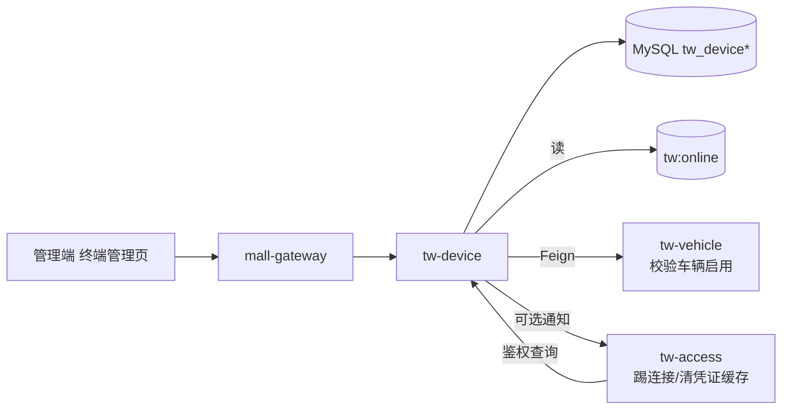
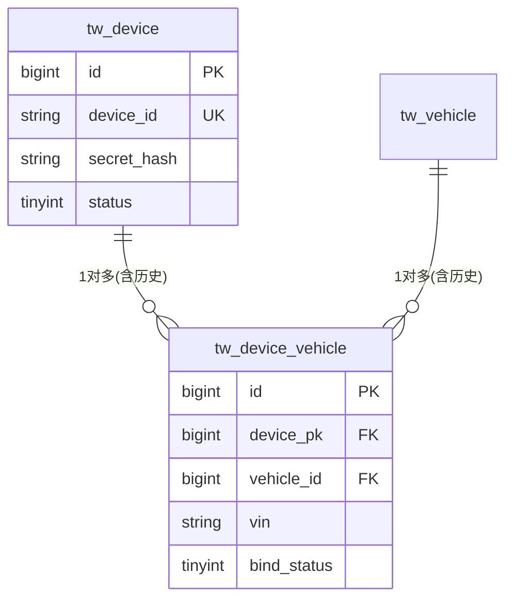
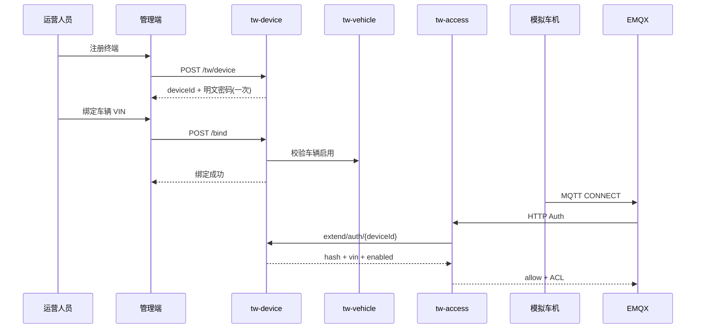
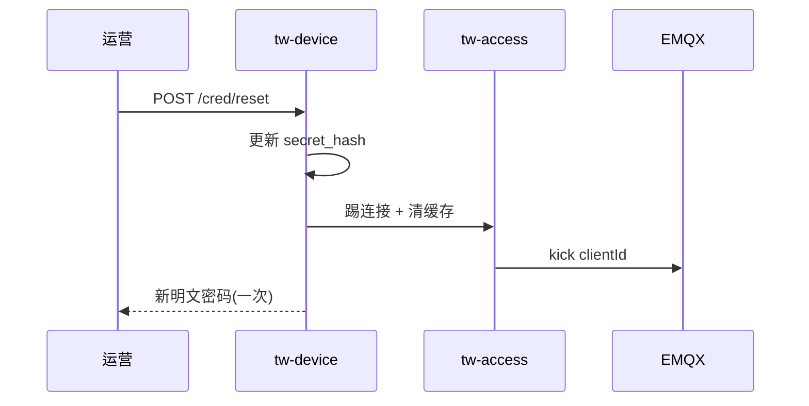

# 功能模块设计-终端管理

> **产品名称**：Titan Watch（泰坦守望）车联网云平台  
> **文档类型**：功能模块设计文档  
> **所属域**：车辆与终端 / `tw-device`  
> **优先级**：P0  
> **依据**：[功能模块规划.md](./功能模块规划.md) §3.2 · [功能模块设计-车辆档案.md](./功能模块设计-车辆档案.md) · [系统架构设计.md](./系统架构设计.md) §4～§8 · [开发优先级.md](./开发优先级.md) Step 1～2  
> **关联前端**：`yz-mall-web-admin-pc` → 菜单「Titan Watch / 终端管理」

---

## 1. 功能实现目标

### 1.1 目标说明

作为新能源车企车联网（TSP）侧的**车载终端（T-Box / 模拟终端）数字身份与凭证中心**，完成终端注册、与车辆绑定、MQTT 接入凭证管理及启停管控。本模块是「车机能连上云」的前置条件：`tw-access` 鉴权、ACL、上下线均依赖本模块提供的终端有效性与绑定 VIN。

| 编号 | 目标 | 验收要点 |
|------|------|----------|
| G1 | 终端注册 | 生成唯一 `device_id`（客户端标识）与 MQTT 密钥；密钥**明文仅创建/重置时返回一次**，库内只存摘要 |
| G2 | 终端查询 | 分页按 deviceId / 状态 / 绑定 VIN / 在线状态筛选；详情含绑定车辆摘要 |
| G3 | 终端-车辆绑定 | 验证阶段**一车一终端、一终端一车**；绑定前校验车辆存在且启用（Feign `tw-vehicle`） |
| G4 | 解绑 | 解除当前有效绑定，保留历史；解绑后鉴权应失败或仅允许未绑车策略（本项目约定：**未绑车不可 CONNECT**） |
| G5 | 凭证重置 | 重新生成密钥，旧连接应被踢下线（通知 `tw-access` / EMQX）；新密钥明文返回一次 |
| G6 | 启用/禁用 | 禁用后 EMQX HTTP Auth 拒绝；启用后恢复 |
| G7 | 供接入域查询 | 提供 Extend/Feign：按 clientId/deviceId 查凭证摘要、绑定 VIN、状态（供鉴权与 ACL） |
| G8 | 证书管理（P2 预留） | 仅预留表字段/接口占位，P0 不实现 X.509 签发 |

### 1.2 非目标（本模块不做）

- EMQX CONNECT 鉴权、Webhook、Topic 桥接（`tw-access`）
- 车辆建档、车主/授权（`tw-vehicle`）
- 在线状态写入（`tw-access` → Redis）；本模块列表/详情**只读**在线
- GPS / 指令业务（`tw-telemetry` / `tw-command`）
- 真实国密证书、一机一密产线灌装、安全芯片对接（验证项目不做）

### 1.3 服务与分层归属

| 项 | 约定 |
|----|------|
| 服务名 | `tw-device`（建议端口 `30102`，以架构文档为准） |
| 分层 | `interface` / `dao` / `core` / `feign` / `startup`（对齐 yz-mall 五层） |
| 包名 | `com.yz.mall.tw.device` |
| 类前缀 | `TwDevice` / `TwDeviceVehicle` |
| 统一响应 | `Result` / `ResultTable` + `ApiController` |
| 鉴权 | Gateway 登录校验 + `@SaCheckPermission("api:tw:device:*")` |

### 1.4 与上下游关系



**边界约定**：

| 能力 | 负责方 |
|------|--------|
| 终端主数据、密钥摘要、启停 | `tw-device` |
| 终端↔车辆绑定关系 | `tw_device_vehicle`（本模块） |
| CONNECT 时校验密钥与状态 | `tw-access` 调本模块 Extend |
| Topic ACL（仅本 VIN） | `tw-access` 根据绑定 VIN 组装 |
| 踢旧 MQTT 连接 | `tw-access`（本模块重置/禁用后调用或发 RocketMQ 事件） |

---

## 2. 涉及角色与权限范围

### 2.1 角色定义

| 角色编码（建议） | 角色名称 | 说明 |
|------------------|----------|------|
| `SUPER_ADMIN` | 平台管理员 | 全部终端能力 |
| `TW_OPERATOR` | 运营人员 | 注册、绑定、重置密钥、启停、查询；日常主角色 |
| `TW_MONITOR` | 只读监控 | 仅列表/详情（密钥字段永不返回）；不可改配置 |
| `TW_OWNER` / `TW_AUTH_USER` | 车主 / 授权用户 | **P0 管理端不开放**终端运维；车主侧仅通过车辆详情看「已绑终端号」摘要（由 vehicle 聚合 device） |

> 终端凭证属于车企侧安全资产，验证阶段仅运营/管理员可操作；车主 App 查看终端号可走车辆详情 Feign，不暴露密钥。

### 2.2 功能点 × 角色权限矩阵

| 功能点 | 权限码（建议） | 平台管理员 | 运营人员 | 只读监控 | 车主/授权 |
|--------|----------------|:----------:|:--------:|:--------:|:---------:|
| 终端分页查询 | `api:tw:device:page` | ✅ | ✅ | ✅ | ❌ |
| 终端详情 | `api:tw:device:detail` | ✅ | ✅ | ✅ | ❌ |
| 终端注册 | `api:tw:device:add` | ✅ | ✅ | ❌ | ❌ |
| 编辑终端（备注等） | `api:tw:device:edit` | ✅ | ✅ | ❌ | ❌ |
| 启用/禁用 | `api:tw:device:status` | ✅ | ✅ | ❌ | ❌ |
| 逻辑删除 | `api:tw:device:delete` | ✅ | ✅（可收紧） | ❌ | ❌ |
| 绑定车辆 | `api:tw:device:bind` | ✅ | ✅ | ❌ | ❌ |
| 解绑车辆 | `api:tw:device:unbind` | ✅ | ✅ | ❌ | ❌ |
| 重置凭证 | `api:tw:device:cred:reset` | ✅ | ✅ | ❌ | ❌ |
| 证书占位（P2） | `api:tw:device:cert:*` | ✅ | ✅ | ❌ | ❌ |

### 2.3 数据权限范围

| 角色 | 数据范围 |
|------|----------|
| 平台管理员 / 运营 / 只读监控 | 全部有效终端（`invalid = 0`） |
| 车主 / 授权用户 | 不直接访问本模块 API；车辆详情中的终端摘要由 `tw-vehicle` Feign 本模块只读接口获取 |

### 2.4 菜单建议

```
Titan Watch
└── 终端管理
    ├── 终端列表（page）
    ├── 注册（add）
    ├── 编辑（edit）
    ├── 启用/禁用（status）
    ├── 删除（delete）
    ├── 绑定车辆（bind）
    ├── 解绑车辆（unbind）
    └── 重置凭证（cred:reset）
```

---

## 3. 数据表设计

### 3.1 设计说明

- **主表** `tw_device`：终端档案与 MQTT 凭证摘要；业务唯一键 `device_id`。
- **绑定表** `tw_device_vehicle`：终端与车辆绑定及历史；验证阶段同时最多一条有效绑定，且一车仅允许一个有效终端。
- 字段约定：`create_id` / `update_id`（创建人/更新人用户ID）；基础字段 `id` / `create_time` / `update_time` / `invalid`。
- **密钥安全**：`secret_hash` 存摘要（如 BCrypt 或 HMAC-SHA256 + 盐）；`secret_salt` 可选；明文永不落库、不写日志。
- 在线状态不落本表，读 Redis `tw:online:{vin}`（有绑定时）或后续扩展 `tw:online:device:{deviceId}`。

**关系示意（验证阶段）**：

```
车辆 1 ── 1 有效终端（tw_device_vehicle.bind_status=1）
终端 1 ── 1 有效车辆
```

### 3.2 表：`tw_device`（终端档案）

**职责**：终端主数据与接入凭证。  
**主查询**：按 deviceId、状态分页；鉴权按 deviceId 精确查。  
**约束**：有效数据 `device_id` 唯一。

```sql
CREATE TABLE `tw_device` (
  `id` bigint NOT NULL COMMENT '主键标识',
  `device_id` varchar(64) NOT NULL COMMENT '终端客户端ID，MQTT clientId/业务唯一键',
  `device_name` varchar(64) DEFAULT NULL COMMENT '终端名称/备注名',
  `device_type` varchar(32) DEFAULT NULL COMMENT '终端类型编码（字典 tw_device_type）',
  `secret_hash` varchar(128) NOT NULL COMMENT 'MQTT密码摘要，不明文存储',
  `secret_salt` varchar(64) DEFAULT NULL COMMENT '摘要盐值（算法需要时）',
  `secret_algo` varchar(32) NOT NULL DEFAULT 'BCRYPT' COMMENT '摘要算法：BCRYPT/HMAC_SHA256等',
  `status` tinyint NOT NULL DEFAULT 1 COMMENT '状态：0禁用 1启用',
  `firmware_version` varchar(64) DEFAULT NULL COMMENT '固件版本（示意，OTA用）',
  `cert_sn` varchar(128) DEFAULT NULL COMMENT '证书序列号（P2预留）',
  `cert_expire_time` datetime DEFAULT NULL COMMENT '证书过期时间（P2预留）',
  `last_cred_reset_time` datetime DEFAULT NULL COMMENT '最近一次凭证重置时间',
  `remark` varchar(255) DEFAULT NULL COMMENT '备注',
  `create_id` bigint DEFAULT NULL COMMENT '创建人用户ID',
  `update_id` bigint DEFAULT NULL COMMENT '更新人用户ID',
  `create_time` datetime DEFAULT CURRENT_TIMESTAMP COMMENT '创建时间',
  `update_time` datetime DEFAULT CURRENT_TIMESTAMP ON UPDATE CURRENT_TIMESTAMP COMMENT '更新时间',
  `invalid` bigint NOT NULL DEFAULT 0 COMMENT '数据是否有效：0数据有效',
  PRIMARY KEY (`id`),
  UNIQUE KEY `uk_device_id_invalid` (`device_id`, `invalid`),
  KEY `idx_status_ctime` (`status`, `create_time`)
) ENGINE=InnoDB DEFAULT CHARSET=utf8mb4 COMMENT='终端档案';
```

**索引说明**：

| 索引 | 原因 |
|------|------|
| `uk_device_id_invalid` | 有效 deviceId 唯一；逻辑删除时 `invalid` 置为行 `id` |
| `idx_status_ctime` | 按启用状态过滤并按创建时间排序 |

### 3.3 表：`tw_device_vehicle`（终端-车辆绑定）

**职责**：终端与车辆绑定关系及历史。  
**主查询**：按 `device_id` / `vehicle_id` / `vin` 查当前有效绑定。  
**约束**：同一终端、同一车辆各自同时最多一条 `bind_status=1`。

```sql
CREATE TABLE `tw_device_vehicle` (
  `id` bigint NOT NULL COMMENT '主键标识',
  `device_pk` bigint NOT NULL COMMENT '终端主键，关联tw_device.id',
  `device_id` varchar(64) NOT NULL COMMENT '终端客户端ID冗余',
  `vehicle_id` bigint NOT NULL COMMENT '车辆ID，关联tw_vehicle.id',
  `vin` varchar(32) NOT NULL COMMENT 'VIN冗余，供鉴权ACL与排查',
  `bind_status` tinyint NOT NULL DEFAULT 1 COMMENT '绑定状态：0已解绑 1绑定中',
  `bind_time` datetime NOT NULL COMMENT '绑定时间',
  `unbind_time` datetime DEFAULT NULL COMMENT '解绑时间',
  `remark` varchar(255) DEFAULT NULL COMMENT '备注',
  `create_id` bigint DEFAULT NULL COMMENT '创建人用户ID',
  `update_id` bigint DEFAULT NULL COMMENT '更新人用户ID',
  `create_time` datetime DEFAULT CURRENT_TIMESTAMP COMMENT '创建时间',
  `update_time` datetime DEFAULT CURRENT_TIMESTAMP ON UPDATE CURRENT_TIMESTAMP COMMENT '更新时间',
  `invalid` bigint NOT NULL DEFAULT 0 COMMENT '数据是否有效：0数据有效',
  PRIMARY KEY (`id`),
  KEY `idx_device_status` (`device_pk`, `bind_status`),
  KEY `idx_vehicle_status` (`vehicle_id`, `bind_status`),
  KEY `idx_device_id_status` (`device_id`, `bind_status`),
  KEY `idx_vin_status` (`vin`, `bind_status`)
) ENGINE=InnoDB DEFAULT CHARSET=utf8mb4 COMMENT='终端车辆绑定';
```

**业务约束（应用层保证）**：

1. 绑定前：终端 `status=1`、`invalid=0`；车辆 Feign 校验存在且 `status=1`。
2. 终端已有有效绑定 → 拒绝（须先解绑）。
3. 车辆已有其他有效终端绑定 → 拒绝（验证阶段一车一终端）。
4. 解绑：当前行 `bind_status=0`，写 `unbind_time`；并通知 access 清缓存/踢连接。
5. 车辆停用后：禁止**新**绑定；已绑定是否踢下线由运营禁用终端或 access 策略决定（推荐：车辆停用事件可选联动，P0 可仅文档约定）。

### 3.4 字典建议（mall-sys）

| 字典类型 | 编码示例 | 用途 |
|----------|----------|------|
| `tw_device_type` | `TBOX` / `SIMULATOR` | 终端类型 |
| `tw_device_status` | `0`禁用 / `1`启用 | 状态展示 |

### 3.5 ER 关系（本模块）



---

## 4. 接口设计

> 统一前缀：经网关 `/tw/device/**` → `tw-device`。  
> 统一响应：`Result<T>` / `ResultTable<T>`。  
> **安全**：除「注册 / 重置凭证」响应外，任何列表/详情/日志**禁止**返回明文密钥或可逆密文。

### 4.1 分页查询终端

- **方法 / 路径**：`POST /tw/device/page`
- **权限**：`api:tw:device:page`

**入参** `TwDeviceQueryDto`：

| 字段 | 类型 | 必填 | 说明 |
|------|------|------|------|
| `page` / `size` | long | 是 | 分页 |
| `deviceId` | string | 否 | 精确或右模糊 |
| `status` | integer | 否 | 0禁用 / 1启用 |
| `vin` | string | 否 | 按当前绑定 VIN 筛 |
| `vehicleId` | long | 否 | 按当前绑定车辆筛 |
| `onlineStatus` | integer | 否 | 0离线 / 1在线（有绑 VIN 时读 Redis） |
| `deviceType` | string | 否 | 类型 |

**出参** `ResultTable<TwDevicePageVo>`：

| 字段 | 类型 | 说明 |
|------|------|------|
| `items[].id` | long | 主键 |
| `items[].deviceId` | string | 终端号 |
| `items[].deviceName` | string | 名称 |
| `items[].deviceType` | string | 类型 |
| `items[].status` | integer | 启用状态 |
| `items[].vin` | string | 当前绑定 VIN，可空 |
| `items[].vehicleId` | long | 当前绑定车辆ID，可空 |
| `items[].plateNo` | string | 车牌（可选聚合） |
| `items[].online` | boolean | 是否在线 |
| `items[].lastOnlineTime` | datetime | 最后在线，可空 |
| `items[].createTime` | datetime | 注册时间 |

### 4.2 终端详情

- **方法 / 路径**：`GET /tw/device/{id}`
- **权限**：`api:tw:device:detail`

**出参** `Result<TwDeviceDetailVo>`：档案字段（无密钥）+ 当前绑定信息 + 在线摘要 + `lastCredResetTime` + 固件/证书占位字段。

### 4.3 注册终端

- **方法 / 路径**：`POST /tw/device`
- **权限**：`api:tw:device:add`

**入参** `TwDeviceAddDto`：

| 字段 | 类型 | 必填 | 说明 |
|------|------|------|------|
| `deviceId` | string | 否 | 不传则服务端生成（如 `TW`+雪花/流水号）；传则校验唯一 |
| `deviceName` | string | 否 | 名称 |
| `deviceType` | string | 否 | 默认 `SIMULATOR` |
| `remark` | string | 否 | 备注 |
| `status` | integer | 否 | 默认 1 |

**出参** `Result<TwDeviceCreateVo>`：

| 字段 | 类型 | 说明 |
|------|------|------|
| `id` | long | 主键 |
| `deviceId` | string | 终端号 |
| `mqttUsername` | string | 建议等于 deviceId |
| `mqttPassword` | string | **明文密钥，仅此响应返回一次** |
| `hint` | string | 提示：请立即保存，系统不再明文展示 |

**生成规则建议**：

- `deviceId`：`TW` + 数字/字母，长度 ≤ 64，满足 MQTT clientId 规范。
- 明文密码：随机 16～32 位；再算 `secret_hash` 入库。

### 4.4 编辑终端

- **方法 / 路径**：`PUT /tw/device`
- **权限**：`api:tw:device:edit`

**入参**：`id` + 可改 `deviceName` / `deviceType` / `remark` / `firmwareVersion`。  
**不可改**：`deviceId`（避免与已部署车机、ACL 缓存不一致）。

**出参** `Result<Boolean>`。

### 4.5 启用 / 禁用

- **方法 / 路径**：`PUT /tw/device/status`
- **权限**：`api:tw:device:status`

**入参**：`id` + `status`（0/1）。

**副作用**：禁用成功后调用 `tw-access` 踢连接并删除 `tw:device:cred:{deviceId}` 缓存。

**出参** `Result<Boolean>`。

### 4.6 逻辑删除

- **方法 / 路径**：`DELETE /tw/device/{id}`
- **权限**：`api:tw:device:delete`

**约束**：存在有效车辆绑定时拒绝，须先解绑。

**出参** `Result<Boolean>`。

### 4.7 绑定车辆

- **方法 / 路径**：`POST /tw/device/bind`
- **权限**：`api:tw:device:bind`

**入参** `TwDeviceBindDto`：

| 字段 | 类型 | 必填 | 说明 |
|------|------|------|------|
| `deviceId` 或 `id` | string/long | 是 | 终端标识（二选一，文档固定一种优先规则） |
| `vehicleId` | long | 否 | 与 vin 二选一 |
| `vin` | string | 否 | 与 vehicleId 二选一 |
| `remark` | string | 否 | 备注 |

**处理**：Feign 校验车辆启用 → 校验双边无有效绑定 → insert `tw_device_vehicle` → 清鉴权缓存。

**出参** `Result<Long>`：绑定记录 ID。

### 4.8 解绑车辆

- **方法 / 路径**：`POST /tw/device/unbind`
- **权限**：`api:tw:device:unbind`

**入参**：`deviceId`/`id` 或 `vehicleId`/`vin`（能唯一定位当前有效绑定即可）+ 可选 `remark`。

**副作用**：更新绑定状态；踢 MQTT；清 `tw:device:cred:*`。

**出参** `Result<Boolean>`。

### 4.9 重置凭证

- **方法 / 路径**：`POST /tw/device/cred/reset`
- **权限**：`api:tw:device:cred:reset`

**入参**：`id` 或 `deviceId`。

**出参** `Result<TwDeviceCredResetVo>`：`deviceId` + **新** `mqttPassword`（仅一次）+ `resetTime`。

**处理**：更新 `secret_hash` / `last_cred_reset_time` → 踢旧连接 → 清缓存。

### 4.10 跨服务扩展接口（Feign，供 access / vehicle）

| 接口 | 说明 |
|------|------|
| `GET /extend/tw/device/auth/{deviceId}` | 鉴权用：返回是否启用、`secretHash`/`algo`、当前绑定 `vin`/`vehicleId`；无绑定则标记不可连接 |
| `GET /extend/tw/device/by-vin/{vin}` | 车辆详情聚合：当前有效绑定终端摘要（无密钥） |
| `GET /extend/tw/device/{deviceId}/bound-vin` | 快速取绑定 VIN（ACL） |
| `POST /extend/tw/device/verify` | 可选：入参 deviceId+明文密码，出参是否匹配（若 access 不想自己做哈希比对） |

**鉴权出参建议** `TwDeviceAuthVo`：

| 字段 | 类型 | 说明 |
|------|------|------|
| `deviceId` | string | 终端号 |
| `enabled` | boolean | status=1 且 invalid=0 |
| `bound` | boolean | 是否有有效车辆绑定 |
| `vin` | string | 绑定 VIN |
| `vehicleId` | long | 车辆ID |
| `secretHash` | string | 摘要 |
| `secretAlgo` | string | 算法 |
| `secretSalt` | string | 盐，可空 |

> `tw-access` HTTP Auth 伪代码：查 auth → 未启用/未绑定拒绝 → 校验密码 → 按 `vin` 下发 ACL（仅 `tw/{vin}/#` 上下行）。

---

## 5. 核心流程

### 5.1 注册 → 绑定 → 可上线



### 5.2 重置凭证踢旧连接



---

## 6. 异常与业务码建议

| 场景 | 提示文案 |
|------|----------|
| deviceId 已存在 | 终端号已注册 |
| 终端不存在 | 终端不存在 |
| 终端已禁用仍绑定 | 终端已禁用，无法绑定 |
| 车辆不存在/未启用 | 车辆不存在或未启用 |
| 终端已绑定车辆 | 请先解绑当前车辆 |
| 车辆已绑定其他终端 | 该车辆已绑定终端（一车一终端） |
| 存在有效绑定不可删 | 请先解绑车辆 |
| 重置/注册成功但前端未保存密码 | 提示仅展示一次（产品文案） |

---

## 7. 实现要点与依赖

| 依赖 | 用法 |
|------|------|
| `tw-vehicle` Feign | 绑定前 `exists-enabled` / by-vin |
| `tw-access` Feign 或 MQ | 踢连接、清 `tw:device:cred:{deviceId}` |
| Redis | 读在线；凭证缓存由 access 维护，TTL 短（如 60s） |
| 字典 | `tw_device_type` |

**密钥算法**：P0 推荐 Spring `BCryptPasswordEncoder`；access 校验时用 `matches(raw, hash)`。若 access 与 device 分服务且不想传 raw 到 device，则 device 提供 `verify` 扩展接口（注意限流防爆破）。

**审计**：`create_id` / `update_id` = `StpUtil.getLoginIdAsLong()`。

**缓存失效**：绑定、解绑、禁用、重置后必须失效 `tw:device:cred:{deviceId}`。

---

## 8. 管理端页面要点（摘要）

| 页面 | 能力 |
|------|------|
| 终端列表 | 筛 deviceId/VIN/状态/在线；操作：详情、绑定、解绑、重置、启停 |
| 注册弹窗 | 提交后**弹窗展示明文密码 + 一键复制**，关闭后不可再查 |
| 绑定弹窗 | 选车辆（VIN/车牌搜索，调 vehicle page） |
| 详情 | 无密钥；展示绑定车辆、最近重置时间、在线状态 |
| 重置确认 | 二次确认「将踢掉在线连接」 |

---

## 9. 测试用例清单（开发自测）

| 编号 | 场景 | 期望 |
|------|------|------|
| T1 | 注册终端 | 返回 deviceId+明文密码；库中仅 hash |
| T2 | 重复 deviceId | 失败 |
| T3 | 绑定启用车辆 | 成功；详情可见 VIN |
| T4 | 绑未启用车辆 | 失败 |
| T5 | 一车绑第二台终端 | 失败 |
| T6 | 一终端绑第二辆车 | 失败 |
| T7 | 解绑后再绑 | 历史保留，新绑定生效 |
| T8 | 禁用后鉴权 | access 拒绝 |
| T9 | 重置凭证 | 旧密码失败、新密码成功；旧连接断开 |
| T10 | 列表/详情无明文密钥 | 字段不存在或恒为空 |
| T11 | 有绑定删除终端 | 拒绝 |
| T12 | 只读角色调 reset | 无权限 |
| T13 | extend/auth 供 access | 返回正确 vin/hash/enabled |

---

## 10. 与车辆档案模块的协作清单

| 约定 | 说明 |
|------|------|
| 车辆详情终端摘要 | `tw-vehicle` Feign `by-vin` / 按 vehicleId 查绑定终端（无密钥） |
| 绑终端前 | 本模块校验车辆启用（车辆设计 §10 已约定反向） |
| 车辆停用 | 禁止新绑定；已在线是否踢线下由联调策略决定 |
| 车辆删除 | 须无有效终端绑定（或先解绑） |

---

## 11. 交付清单

- [ ] DDL：`tw_device`、`tw_device_vehicle`
- [ ] `tw-device` 五层模块 + 管理 API + Extend API
- [ ] 菜单与权限码录入
- [ ] 字典 `tw_device_type` 预置（含 `SIMULATOR`）
- [ ] 管理端：列表 / 注册（一次密钥展示）/ 绑定 / 重置
- [ ] 与 `tw-access` 联调：Auth 查凭证、重置踢线
- [ ] 与 `tw-vehicle` 联调：绑车校验、详情终端摘要
- [ ] P2：证书字段与接口仅占位注释

---

## 12. 证书管理（P2 预留，不实现）

| 项 | 说明 |
|----|------|
| 目标 | 终端 X.509 / 国密证书签发、吊销、轮换 |
| 表现 | `cert_sn` / `cert_expire_time` 已预留；后续可增 `tw_device_cert` 表 |
| P0 | 管理端不展示证书操作按钮 |

---

*本文为 Titan Watch「终端管理」功能模块详细设计；EMQX 鉴权与桥接见后续「接入与在线」模块设计。*
