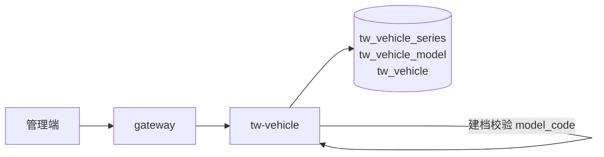
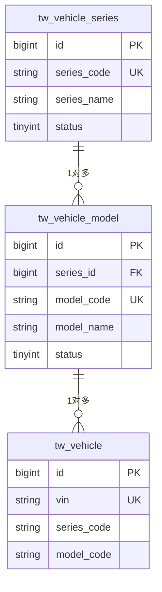
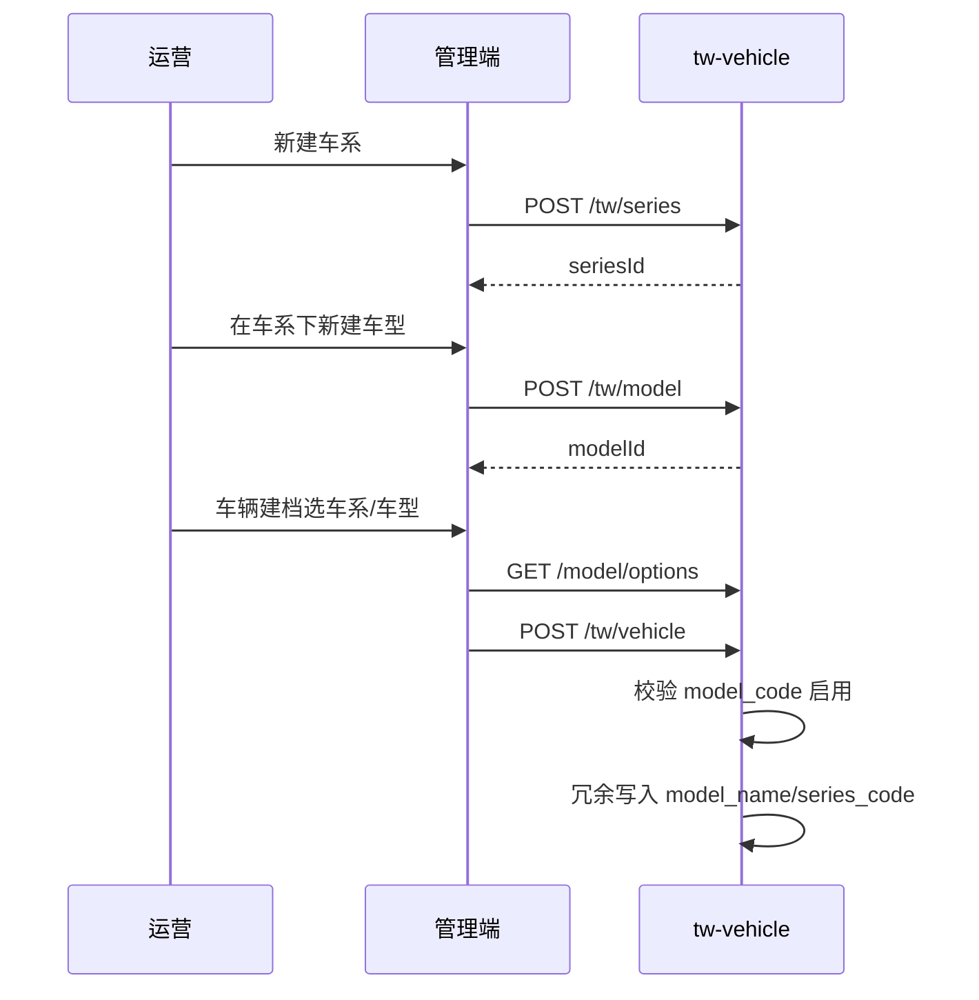
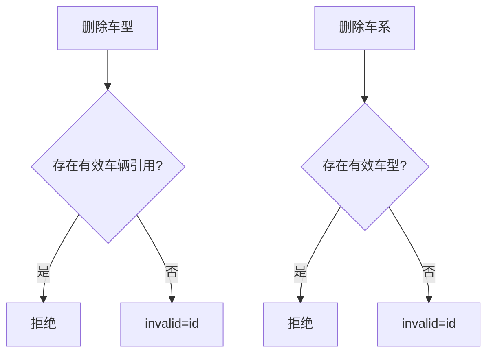

# 功能模块设计-车系车型管理

> **产品名称**：Titan Watch（泰坦守望）车联网云平台  
> **文档类型**：功能模块设计文档  
> **所属域**：车辆与终端 / `tw-vehicle`（主数据子域）  
> **优先级**：P0（与车辆建档配套；可先于或并行于车辆档案落地）  
> **依据**：[功能模块设计-车辆档案.md](./功能模块设计-车辆档案.md) · [功能模块规划.md](./功能模块规划.md) §3.1 · [系统架构设计.md](./系统架构设计.md)  
> **关联前端**：`yz-mall-web-admin-pc` → 菜单「Titan Watch / 车系管理」「车型管理」

---

## 1. 功能实现目标

### 1.1 目标说明

新能源车企侧需要可运营的**产品主数据**：先维护「车系」，再在车系下维护「车型」。车辆建档时不再依赖扁平数据字典 `tw_vehicle_model`，改为引用本模块的车型编码，保证下拉、校验、展示与后续 OTA/配置扩展一致。

| 编号 | 目标 | 验收要点 |
|------|------|----------|
| G1 | 车系管理 | 新增/编辑/启停/逻辑删除；编码唯一；支持分页与树/列表展示 |
| G2 | 车型管理 | 归属某一车系；新增/编辑/启停/逻辑删除；车型编码全局唯一 |
| G3 | 级联查询 | 按车系拉启用中的车型列表（供车辆建档下拉） |
| G4 | 被引用保护 | 车型被有效车辆引用时禁止删除；车系下存在有效车型时禁止删除（或仅允许停用） |
| G5 | 与车辆档案衔接 | `tw_vehicle.model_code` 对应本模块 `tw_vehicle_model.model_code`；建档时强校验车型存在且启用 |

### 1.2 概念说明（车企语境）

| 概念 | 说明 | 示例 |
|------|------|------|
| **车系** Series | 产品线 / 系列，偏「家族」 | 汉、宋 PLUS、Model Y 系列 |
| **车型** Model | 系列下的具体销售/技术规格型号 | 汉 EV 605KM 尊贵型、Model Y 长续航全轮驱动 |

```
车系 1 ── N 车型 1 ── N 车辆（tw_vehicle）
```

### 1.3 非目标

- 选装包 / 配置 BOM / 价格体系（可后续扩展表）
- 国标公告号全量合规库对接
- 替代 mall-sys 通用字典能力（本域主数据专用；指令类型等仍用字典）

### 1.4 服务与分层归属

与车辆档案同属 `tw-vehicle` 服务，共用进程与五层模块，类前缀区分。

| 项 | 约定 |
|----|------|
| 服务名 | `tw-vehicle` |
| 包名 | `com.yz.mall.tw.vehicle` |
| 类前缀 | `TwVehicleSeries` / `TwVehicleModel` |
| 统一响应 | `Result` / `ResultTable` + `ApiController` |
| 鉴权 | `@SaCheckPermission("api:tw:series:*"` / `"api:tw:model:*")` |

### 1.5 与上下游关系



| 调用方 | 用法 |
|--------|------|
| 车辆档案新建/编辑 | 校验 `model_code` 存在且 `status=1`；回填 `model_name`、可选 `series_code` |
| 管理端下拉 | `GET` 启用车系列表 → 再按 series 拉车型 |
| 其他域（可选） | Feign：按 `model_code` 查摘要 |

### 1.6 相对原「字典车型」的变更

| 项 | 原（车辆档案初稿） | 现 |
|----|-------------------|-----|
| 车型来源 | 字典 `tw_vehicle_model` | 表 `tw_vehicle_model` |
| 车系 | 无 | 表 `tw_vehicle_series` |
| 车辆表 | `model_code` + 冗余 `model_name` | 保留；建议增加 `series_code` 冗余（可选）便于列表筛 |

> 实施时：车辆档案文档中「字典校验」改为「调用车型主数据校验」；字典 `tw_vehicle_model` 可废弃或仅作迁移种子数据。

---

## 2. 涉及角色与权限范围

### 2.1 角色

| 角色 | 说明 |
|------|------|
| 平台管理员 | 全部 |
| 运营人员 | 车系/车型 CRUD、启停 |
| 只读监控 / 车主 / 授权用户 | 无管理权限；建档页若开放给非运营，仅可读启用中的下拉（一般建档仅运营） |

### 2.2 功能点 × 权限矩阵

| 功能点 | 权限码 | 管理员 | 运营 | 只读/车主 |
|--------|--------|:------:|:----:|:---------:|
| 车系分页 | `api:tw:series:page` | ✅ | ✅ | ❌ |
| 车系详情 | `api:tw:series:detail` | ✅ | ✅ | ❌ |
| 车系新增 | `api:tw:series:add` | ✅ | ✅ | ❌ |
| 车系编辑 | `api:tw:series:edit` | ✅ | ✅ | ❌ |
| 车系启停 | `api:tw:series:status` | ✅ | ✅ | ❌ |
| 车系删除 | `api:tw:series:delete` | ✅ | ✅ | ❌ |
| 启用车系列表（下拉） | `api:tw:series:options` | ✅ | ✅ | ✅（若需） |
| 车型分页 | `api:tw:model:page` | ✅ | ✅ | ❌ |
| 车型详情 | `api:tw:model:detail` | ✅ | ✅ | ❌ |
| 车型新增 | `api:tw:model:add` | ✅ | ✅ | ❌ |
| 车型编辑 | `api:tw:model:edit` | ✅ | ✅ | ❌ |
| 车型启停 | `api:tw:model:status` | ✅ | ✅ | ❌ |
| 车型删除 | `api:tw:model:delete` | ✅ | ✅ | ❌ |
| 按车系车型下拉 | `api:tw:model:options` | ✅ | ✅ | ✅（建档用） |

### 2.3 数据权限

主数据为**平台级**，不分车主数据范围；全量由运营维护。

### 2.4 菜单建议

```
Titan Watch
├── 车系管理
├── 车型管理
└── 车辆管理（建档时选择车系→车型）
```

---

## 3. 数据表设计

### 3.1 设计说明

- `tw_vehicle_series`：车系主数据。
- `tw_vehicle_model`：车型主数据，外键逻辑关联 `series_id` / `series_code`。
- 基础字段：`id`、`create_time`、`update_time`、`invalid`；操作人用 `create_id` / `update_id`。
- 逻辑删除：`invalid` 置为当前行 `id`（与车辆档案一致），查询 `invalid=0`。

### 3.2 表：`tw_vehicle_series`（车系）

```sql
CREATE TABLE `tw_vehicle_series` (
  `id` bigint NOT NULL COMMENT '主键标识',
  `series_code` varchar(64) NOT NULL COMMENT '车系编码，业务唯一',
  `series_name` varchar(64) NOT NULL COMMENT '车系名称',
  `brand_name` varchar(64) DEFAULT NULL COMMENT '品牌名称（展示用）',
  `cover_file_id` bigint DEFAULT NULL COMMENT '车系封面图文件ID',
  `sort_no` int NOT NULL DEFAULT 0 COMMENT '排序号，越小越靠前',
  `status` tinyint NOT NULL DEFAULT 1 COMMENT '启用状态：0停用 1启用',
  `remark` varchar(255) DEFAULT NULL COMMENT '备注',
  `create_id` bigint DEFAULT NULL COMMENT '创建人用户ID',
  `update_id` bigint DEFAULT NULL COMMENT '更新人用户ID',
  `create_time` datetime DEFAULT CURRENT_TIMESTAMP COMMENT '创建时间',
  `update_time` datetime DEFAULT CURRENT_TIMESTAMP ON UPDATE CURRENT_TIMESTAMP COMMENT '更新时间',
  `invalid` bigint NOT NULL DEFAULT 0 COMMENT '数据是否有效：0数据有效',
  PRIMARY KEY (`id`),
  UNIQUE KEY `uk_series_code_invalid` (`series_code`, `invalid`),
  KEY `idx_status_sort` (`status`, `sort_no`)
) ENGINE=InnoDB DEFAULT CHARSET=utf8mb4 COMMENT='车辆车系';
```

### 3.3 表：`tw_vehicle_model`（车型）

```sql
CREATE TABLE `tw_vehicle_model` (
  `id` bigint NOT NULL COMMENT '主键标识',
  `series_id` bigint NOT NULL COMMENT '车系ID，关联tw_vehicle_series.id',
  `series_code` varchar(64) NOT NULL COMMENT '车系编码冗余',
  `model_code` varchar(64) NOT NULL COMMENT '车型编码，业务唯一，供tw_vehicle引用',
  `model_name` varchar(64) NOT NULL COMMENT '车型名称',
  `energy_type` tinyint DEFAULT NULL COMMENT '能源类型：1纯电 2插混 3增程 4燃油(预留) 9其他',
  `drive_type` tinyint DEFAULT NULL COMMENT '驱动：1两驱 2四驱 9其他',
  `seat_count` tinyint DEFAULT NULL COMMENT '座位数',
  `battery_kwh` decimal(8,2) DEFAULT NULL COMMENT '电池容量kWh',
  `range_km` int DEFAULT NULL COMMENT '工况续航km（展示用）',
  `cover_file_id` bigint DEFAULT NULL COMMENT '车型封面图文件ID',
  `sort_no` int NOT NULL DEFAULT 0 COMMENT '同车系内排序号',
  `status` tinyint NOT NULL DEFAULT 1 COMMENT '启用状态：0停用 1启用',
  `remark` varchar(255) DEFAULT NULL COMMENT '备注',
  `create_id` bigint DEFAULT NULL COMMENT '创建人用户ID',
  `update_id` bigint DEFAULT NULL COMMENT '更新人用户ID',
  `create_time` datetime DEFAULT CURRENT_TIMESTAMP COMMENT '创建时间',
  `update_time` datetime DEFAULT CURRENT_TIMESTAMP ON UPDATE CURRENT_TIMESTAMP COMMENT '更新时间',
  `invalid` bigint NOT NULL DEFAULT 0 COMMENT '数据是否有效：0数据有效',
  PRIMARY KEY (`id`),
  UNIQUE KEY `uk_model_code_invalid` (`model_code`, `invalid`),
  KEY `idx_series_status` (`series_id`, `status`, `sort_no`),
  KEY `idx_series_code` (`series_code`)
) ENGINE=InnoDB DEFAULT CHARSET=utf8mb4 COMMENT='车辆车型';
```

### 3.4 车辆档案表衔接（建议增量）

在 `tw_vehicle` 上建议增加（若尚未加）：

```sql
ALTER TABLE `tw_vehicle`
  ADD COLUMN `series_code` varchar(64) DEFAULT NULL COMMENT '车系编码冗余' AFTER `vin`,
  ADD KEY `idx_model_code` (`model_code`),
  ADD KEY `idx_series_code` (`series_code`);
```

- `model_code`：必填，引用 `tw_vehicle_model.model_code`。  
- `model_name` / `series_code`：建档/改车型时冗余写入，列表免联表。  
- **COMMENT 调整**：`model_code` 注释由「字典 tw_vehicle_model」改为「车型编码，关联 tw_vehicle_model.model_code」。

### 3.5 业务约束

1. `series_code`、`model_code` 建议大写字母/数字/下划线，长度 2～64。  
2. 新增车型时车系必须存在且建议 `status=1`（允许对停用车系下挂历史车型视产品定，P0：**仅允许挂到启用车系**）。  
3. 停用车系：不级联停用车型（避免误伤）；但「按车系 options」不再返回该车系；已挂车辆不受影响。  
4. 停用车型：禁止新车建档引用；已建档车辆仍可展示冗余名称。  
5. 删除车系：其下 `invalid=0` 的车型数 > 0 则拒绝。  
6. 删除车型：`tw_vehicle` 中存在 `invalid=0` 且 `model_code=` 该编码则拒绝。  
7. `model_code` **创建后不可改**（与 VIN 类似，避免历史车辆引用漂移）；名称、续航等可改。

### 3.6 ER



---

## 4. 接口设计

> 网关前缀建议：`/tw/series/**`、`/tw/model/**` → `tw-vehicle`。

### 4.1 车系分页

- `POST /tw/series/page`
- 权限：`api:tw:series:page`

**入参**：`page`、`size`、`seriesCode`、`seriesName`（模糊）、`status`、`brandName`。

**出参** `ResultTable`：`id`、`seriesCode`、`seriesName`、`brandName`、`sortNo`、`status`、`modelCount`（有效车型数）、`createTime`。

### 4.2 车系详情 / 新增 / 编辑 / 启停 / 删除

| 方法 | 路径 | 权限 | 说明 |
|------|------|------|------|
| GET | `/tw/series/{id}` | `detail` | 详情 |
| POST | `/tw/series` | `add` | 入参：`seriesCode`*、`seriesName`*、`brandName`、`coverFileId`、`sortNo`、`remark`、`status` |
| PUT | `/tw/series` | `edit` | 入参含 `id`；**不可改** `seriesCode` |
| PUT | `/tw/series/status` | `status` | `id` + `status` |
| DELETE | `/tw/series/{id}` | `delete` | 逻辑删；有车型则失败 |

**出参**：新增返回 `Result<Long>`；其余 `Result<Boolean>` 或详情 VO。

### 4.3 启用车系列表（下拉）

- `GET /tw/series/options`
- 权限：`api:tw:series:options`
- 出参：`[{ id, seriesCode, seriesName }]`，仅 `status=1` 且 `invalid=0`，按 `sortNo`。

### 4.4 车型分页

- `POST /tw/model/page`
- 权限：`api:tw:model:page`

**入参**：`page`、`size`、`seriesId` / `seriesCode`、`modelCode`、`modelName`、`status`、`energyType`。

**出参**：车型字段 + `seriesName`。

### 4.5 车型详情 / 新增 / 编辑 / 启停 / 删除

| 方法 | 路径 | 权限 | 说明 |
|------|------|------|------|
| GET | `/tw/model/{id}` | `detail` | 详情含车系名称 |
| POST | `/tw/model` | `add` | `seriesId`*（或 seriesCode）、`modelCode`*、`modelName`*、能源/驱动/续航等 |
| PUT | `/tw/model` | `edit` | **不可改** `modelCode`、不可跨车系调整（P0）；改归属列为 P1 |
| PUT | `/tw/model/status` | `status` | 启停 |
| DELETE | `/tw/model/{id}` | `delete` | 被车辆引用则失败 |

### 4.6 按车系车型下拉（建档核心）

- `GET /tw/model/options?seriesId=` 或 `?seriesCode=`
- 权限：`api:tw:model:options`
- 出参：`[{ id, modelCode, modelName, energyType, rangeKm }]`，仅启用车型。

### 4.7 Extend（供车辆模块内部或 Feign）

| 接口 | 说明 |
|------|------|
| `GET /extend/tw/model/by-code/{modelCode}` | 返回启用车型摘要：`modelCode`、`modelName`、`seriesCode`、`seriesName`、`status` |
| `GET /extend/tw/model/exists-enabled?modelCode=` | 是否存在且启用 |

车辆 `add`/`edit` 在同进程可直接调 Service，不必走 HTTP；跨服务时用 Feign。

---

## 5. 核心流程

### 5.1 维护车系 → 车型 → 建档



### 5.2 删除保护



---

## 6. 异常与业务码建议

| 场景 | 提示 |
|------|------|
| 车系/车型编码已存在 | 编码已存在 |
| 车系不存在或已停用 | 车系不可用 |
| 车型不存在或已停用（建档） | 请选择有效车型 |
| 修改编码 | 编码不允许修改 |
| 删除车系仍有车型 | 请先删除或迁移下属车型 |
| 删除车型仍有车辆 | 车型已被车辆引用，无法删除 |
| 编码格式非法 | 编码仅支持字母数字下划线 |

---

## 7. 实现要点

| 项 | 约定 |
|----|------|
| 同服务 | 与车辆档案同模块，避免 Feign 循环；`TwVehicleService` 注入 `TwVehicleModelService` |
| 缓存（可选 P1） | Redis `tw:model:enabled:{seriesCode}` 短 TTL；启停/变更时删除 |
| 审计 | `create_id` / `update_id` = 登录用户 |
| 演示数据 | 预置 1～2 个车系、每系 2～3 个车型，便于建档下拉 |
| 文件 | 封面走 mall-file |

---

## 8. 管理端页面要点

| 页面 | 能力 |
|------|------|
| 车系列表 | 筛选编码/名称/状态；新建、编辑、启停、删除 |
| 车型列表 | 先选车系筛选；展示能源/续航；CRUD、启停 |
| 车辆新建 | 先选车系 → 再选车型（联动 options）；提交带 `modelCode` |

---

## 9. 测试用例

| 编号 | 场景 | 期望 |
|------|------|------|
| T1 | 新建车系+车型 | 成功；编码唯一 |
| T2 | 重复 model_code | 失败 |
| T3 | options 仅返回启用数据 | 停用项不可见 |
| T4 | 建档引用启用车型 | 成功并冗余名称 |
| T5 | 建档引用停用车型 | 失败 |
| T6 | 有车辆时删车型 | 失败 |
| T7 | 有车型时删车系 | 失败 |
| T8 | 修改 model_code | 接口拒绝 |
| T9 | 无权限角色调 add | 403 |

---

## 10. 交付清单

- [ ] DDL：`tw_vehicle_series`、`tw_vehicle_model`；`tw_vehicle` 增加 `series_code`（若需要）
- [ ] 车系/车型 CRUD + options + Extend
- [ ] 车辆 add/edit 改为校验主数据车型
- [ ] 菜单与权限码
- [ ] 管理端：车系页、车型页、车辆建档联动下拉
- [ ] 演示种子数据
- [ ] 更新《功能模块设计-车辆档案》中字典表述为本文主数据

---

## 11. 与车辆档案文档对齐摘要

| 车辆档案字段 | 来源 |
|--------------|------|
| `model_code` | `tw_vehicle_model.model_code`（必填，启用） |
| `model_name` | 建档时从车型表冗余 |
| `series_code`（建议） | 从车型所属车系冗余 |

权限上：车系/车型管理仅运营；车主侧不可维护主数据。

---

*本文为 Titan Watch 产品主数据（车系/车型）设计；车辆实例见《功能模块设计-车辆档案》。*
