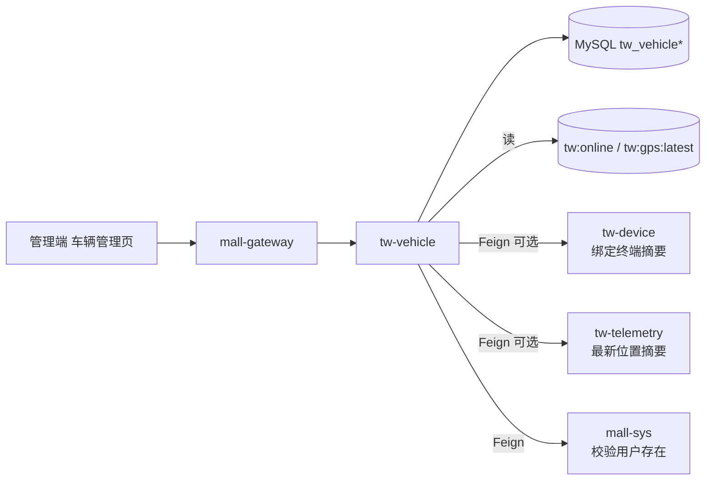
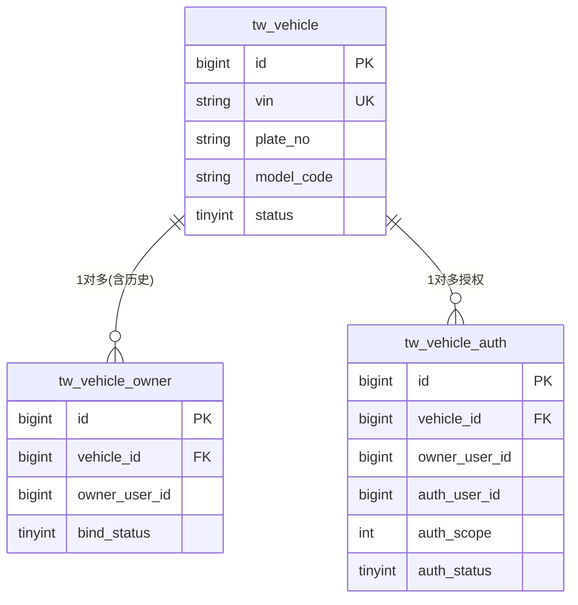
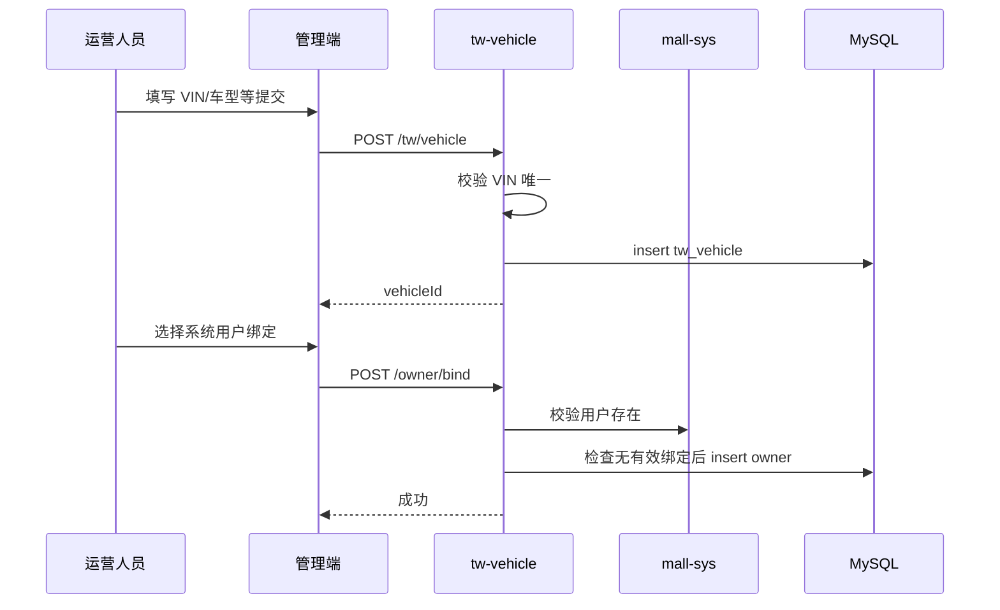
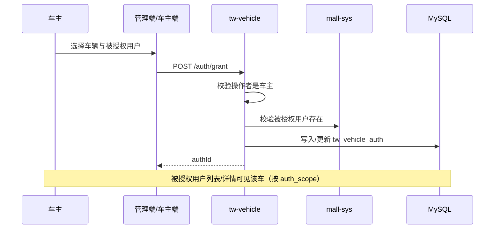
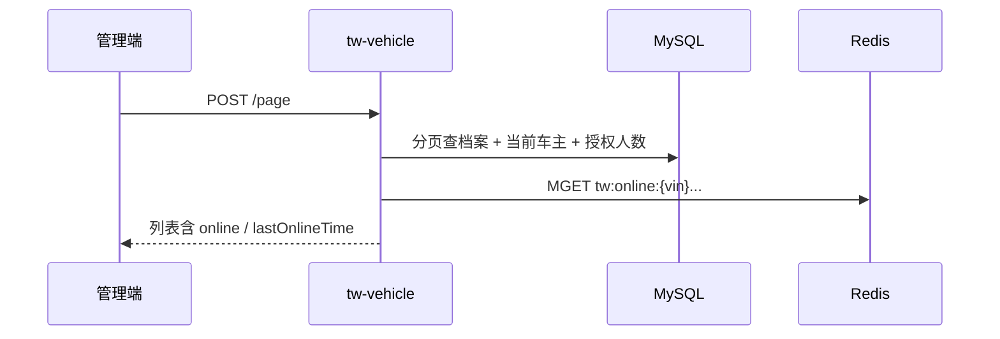

# 功能模块设计-车辆档案

> **产品名称**：Titan Watch（泰坦守望）车联网云平台  
> **文档类型**：功能模块设计文档  
> **所属域**：车辆与终端 / `tw-vehicle`  
> **优先级**：P0  
> **依据**：[功能模块规划.md](./功能模块规划.md) §3.1 · [系统架构设计.md](./系统架构设计.md) §7 · [开发优先级.md](./开发优先级.md) Step 1  
> **关联前端**：`yz-mall-web-admin-pc` → 菜单「Titan Watch / 车辆管理」

---

## 1. 功能实现目标

### 1.1 目标说明

在管理端完成车辆主数据的全生命周期管理，作为后续「终端绑定 → MQTT 上线 → 轨迹 / 远程控车」的业务锚点。本模块负责**车辆档案、车主绑定、车主授权用户**，不实现 MQTT 鉴权、轨迹入库、指令下发（分别由 `tw-device` / `tw-access` / `tw-telemetry` / `tw-command` 承担）。

| 编号 | 目标 | 验收要点 |
|------|------|----------|
| G1 | 车辆建档 | 录入 VIN、车型、颜色、车牌等；VIN 全局唯一（有效数据范围内） |
| G2 | 车辆维护 | 支持编辑非 VIN 字段、启用/停用；停用后不可再绑新终端（跨模块约定） |
| G3 | 车辆查询 | 分页列表；按 VIN / 车牌 / 启用状态 / 在线状态筛选 |
| G4 | 车辆详情 | 档案信息 + 当前车主 + 授权用户列表 + 绑定终端摘要 + 最新位置摘要（跨服务聚合，只读） |
| G5 | 车主绑定 | 运营绑定/解绑系统用户为车主（复用 `sys_user`）；一车同时仅一个有效车主 |
| G6 | 车主授权 | 车主可将车辆授权给其他系统用户；支持按能力范围授权、撤销；一车可有多名授权用户 |
| G7 | 过户示意（P1） | 解绑旧车主并绑定新车主；过户时**自动撤销**该车全部有效授权 |

### 1.2 非目标（本模块不做）

- 终端注册、MQTT 密钥生成、凭证重置（`tw-device`）
- 在线状态写入（由 `tw-access` Webhook / 心跳写 Redis；本模块仅**读取**展示）
- GPS 入库与轨迹回放（`tw-telemetry`）
- 远程控车（`tw-command`）

### 1.3 服务与分层归属

| 项 | 约定 |
|----|------|
| 服务名 | `tw-vehicle`（建议端口 `30103`，以架构文档为准） |
| 分层 | `interface` / `dao` / `core` / `feign` / `startup`（对齐 yz-mall 五层） |
| 包名 | `com.yz.mall.tw.vehicle` |
| 类前缀 | `TwVehicle` / `TwVehicleOwner` / `TwVehicleAuth` |
| 统一响应 | `Result` / `ResultTable` + `ApiController` |
| 鉴权 | Gateway 登录校验 + `@SaCheckPermission("api:tw:vehicle:*")` |

### 1.4 与上下游关系



---

## 2. 涉及角色与权限范围

### 2.1 角色定义

| 角色编码（建议） | 角色名称 | 说明 |
|------------------|----------|------|
| `SUPER_ADMIN` | 平台管理员 | 现有超级管理员，默认拥有全部权限 |
| `TW_OPERATOR` | 运营人员 | 车辆建档、维护、绑/解绑车主、查详情；可代管授权（可选） |
| `TW_MONITOR` | 只读监控 | 仅查看列表/详情/在线与位置摘要，不可改档、不可绑车主/授权 |
| `TW_OWNER` | 车主 | 查看**自己名下**车辆；可对名下车辆**授权/撤销**其他用户 |
| `TW_AUTH_USER` | 授权用户 | 查看（及按 `auth_scope` 使用）被授权车辆；**不可**再二次授权 |

> 角色通过 mall-sys 角色管理配置；权限通过菜单 + 按钮（API）权限码挂接。  
> 「车主 / 授权用户」与运营角色可并存于同一登录账号：数据范围由绑定/授权表决定，按钮权限由角色决定。

### 2.2 功能点 × 角色权限矩阵

| 功能点 | 权限码（建议） | 平台管理员 | 运营人员 | 只读监控 | 车主 | 授权用户 |
|--------|----------------|:----------:|:--------:|:--------:|:----:|:--------:|
| 车辆分页查询 | `api:tw:vehicle:page` | ✅ | ✅ | ✅ | ✅（名下+已授权） | ✅（已授权） |
| 车辆详情 | `api:tw:vehicle:detail` | ✅ | ✅ | ✅ | ✅ | ✅（按 scope） |
| 新建车辆 | `api:tw:vehicle:add` | ✅ | ✅ | ❌ | ❌ | ❌ |
| 编辑车辆 | `api:tw:vehicle:edit` | ✅ | ✅ | ❌ | ❌ | ❌ |
| 启用/停用 | `api:tw:vehicle:status` | ✅ | ✅ | ❌ | ❌ | ❌ |
| 删除（逻辑删） | `api:tw:vehicle:delete` | ✅ | ✅（可选收紧） | ❌ | ❌ | ❌ |
| 绑定车主 | `api:tw:vehicle:owner:bind` | ✅ | ✅ | ❌ | ❌ | ❌ |
| 解绑车主 | `api:tw:vehicle:owner:unbind` | ✅ | ✅ | ❌ | ❌ | ❌ |
| 过户 | `api:tw:vehicle:owner:transfer` | ✅ | ✅ | ❌ | ❌ | ❌ |
| 授权用户 | `api:tw:vehicle:auth:grant` | ✅ | ✅（代管，可选） | ❌ | ✅（仅名下车辆） | ❌ |
| 撤销授权 | `api:tw:vehicle:auth:revoke` | ✅ | ✅（代管，可选） | ❌ | ✅（仅名下车辆） | ❌ |
| 授权用户列表 | `api:tw:vehicle:auth:list` | ✅ | ✅ | ✅ | ✅（仅名下车辆） | ❌ |

### 2.3 数据权限范围

| 角色 / 身份 | 数据范围规则 |
|-------------|--------------|
| 平台管理员 / 运营人员 | 全部有效车辆（`invalid = 0`） |
| 只读监控 | 全部有效车辆（只读接口） |
| 车主 | `tw_vehicle_owner` 中 `owner_user_id = 当前用户` 且 `bind_status=1` 的车辆 |
| 授权用户 | `tw_vehicle_auth` 中 `auth_user_id = 当前用户` 且 `auth_status=1` 且未过期的车辆 |
| 合并规则 | 同一用户既是车主又是他车授权用户时，列表为**并集**；访问单车时取最高身份能力（车主 > 授权） |

**授权能力范围 `auth_scope`（位掩码，可组合）**：

| 位值 | 含义 | 说明 |
|------|------|------|
| `1` | 查看档案 | 列表、详情基础信息 |
| `2` | 查看位置/轨迹 | 读最新位置、轨迹查询（供 telemetry 校验） |
| `4` | 远程控车 | 供 `tw-command` 校验（本模块只存范围，不执行控车） |

> P0 演示可默认授权 `1|2`（查看+位置）；控车位留给指令模块联调。

### 2.4 菜单建议

```
Titan Watch
└── 车辆管理
    ├── 车辆列表（page）
    ├── 新建（add）
    ├── 编辑（edit）
    ├── 启用/停用（status）
    ├── 删除（delete）
    ├── 绑定车主（owner:bind）
    ├── 解绑车主（owner:unbind）
    ├── 过户（owner:transfer，P1）
    ├── 授权用户（auth:grant）
    ├── 撤销授权（auth:revoke）
    └── 授权列表（auth:list）
```

---

## 3. 数据表设计

### 3.1 设计说明

- **主表** `tw_vehicle`：车辆档案；业务唯一键为 `vin`（在 `invalid=0` 语义下唯一）。
- **车主表** `tw_vehicle_owner`：车辆与车主（sys 用户）关系；一车同时仅一个有效车主；保留解绑历史。
- **授权表** `tw_vehicle_auth`：车主（或运营代管）将车辆授权给其他用户；一车可有多名有效授权用户；保留撤销历史。
- 基础字段遵循 yz-mall 约定：`id` / `create_time` / `update_time` / `invalid`。
- 在线状态、最新 GPS **不落本表**，读 Redis / 遥测服务，避免写放大。
- 终端绑定关系在 `tw_device_vehicle`（设备域）；详情接口聚合查询，本模块可不冗余存 `device_id`（可选冗余 `bound_device_id` 作展示加速，P0 可不加）。

**关系示意**：

```
车辆 1 ── 1 有效车主（tw_vehicle_owner）
     └── N 有效授权用户（tw_vehicle_auth）
```

### 3.2 表：`tw_vehicle`（车辆档案）

**职责**：车辆主数据。  
**主查询**：按 VIN/车牌模糊或精确查；按状态分页；详情按 id/VIN。  
**约束**：有效数据 VIN 唯一；停用车辆仍可查询历史。

```sql
CREATE TABLE `tw_vehicle` (
  `id` bigint NOT NULL COMMENT '主键标识',
  `vin` varchar(32) NOT NULL COMMENT '车架号VIN，业务唯一键',
  `plate_no` varchar(16) DEFAULT NULL COMMENT '车牌号',
  `model_code` varchar(64) DEFAULT NULL COMMENT '车型编码，关联tw_vehicle_model.model_code',
  `model_name` varchar(64) DEFAULT NULL COMMENT '车型名称（冗余展示，可选）',
  `series_code` varchar(64) DEFAULT NULL COMMENT '车系编码冗余，关联tw_vehicle_series.series_code',
  `color` varchar(32) DEFAULT NULL COMMENT '车身颜色',
  `status` tinyint NOT NULL DEFAULT 1 COMMENT '启用状态：0停用 1启用',
  `remark` varchar(255) DEFAULT NULL COMMENT '备注',
  `cover_file_id` bigint DEFAULT NULL COMMENT '车辆封面图文件ID（mall-file）',
  `create_id` bigint DEFAULT NULL COMMENT '创建人用户ID',
  `update_id` bigint DEFAULT NULL COMMENT '更新人用户ID',
  `create_time` datetime DEFAULT CURRENT_TIMESTAMP COMMENT '创建时间',
  `update_time` datetime DEFAULT CURRENT_TIMESTAMP ON UPDATE CURRENT_TIMESTAMP COMMENT '更新时间',
  `invalid` bigint NOT NULL DEFAULT 0 COMMENT '数据是否有效：0数据有效',
  PRIMARY KEY (`id`),
  UNIQUE KEY `uk_vin_invalid` (`vin`, `invalid`),
  KEY `idx_plate_no` (`plate_no`),
  KEY `idx_model_code` (`model_code`),
  KEY `idx_series_code` (`series_code`),
  KEY `idx_status_ctime` (`status`, `create_time`)
) ENGINE=InnoDB DEFAULT CHARSET=utf8mb4 COMMENT='车辆档案';
```

**索引说明**：

| 索引 | 原因 |
|------|------|
| `uk_vin_invalid` | 保证有效 VIN 唯一；逻辑删除后可用新 `invalid=id` 策略或禁止重复建同 VIN（实现二选一，推荐：**禁止同 VIN 再建**，删除仅改 `invalid=id` 且唯一键改为仅 `vin` 时需评估——验证阶段可用 `(vin, invalid)`，删除时 `invalid` 置为主键 id） |
| `idx_plate_no` | 列表按车牌筛选 |
| `idx_status_ctime` | 按启用状态过滤并按创建时间排序 |

> **逻辑删除约定（推荐）**：删除时将 `invalid` 置为当前行 `id`（非 0），使 `uk_vin_invalid` 在删除后释放同 VIN 再建档能力；查询一律 `invalid = 0`。

### 3.3 表：`tw_vehicle_owner`（车主绑定）

**职责**：车辆与 sys 用户绑定及历史。  
**主查询**：按 `vehicle_id` 查当前有效绑定；按 `owner_user_id` 查名下车辆（车主数据权限）。  
**约束**：同一 `vehicle_id` 同时最多一条 `bind_status=1` 记录。

```sql
CREATE TABLE `tw_vehicle_owner` (
  `id` bigint NOT NULL COMMENT '主键标识',
  `vehicle_id` bigint NOT NULL COMMENT '车辆ID，关联tw_vehicle.id',
  `vin` varchar(32) NOT NULL COMMENT 'VIN冗余，便于按VIN排查',
  `owner_user_id` bigint NOT NULL COMMENT '车主用户ID，关联sys用户',
  `bind_status` tinyint NOT NULL DEFAULT 1 COMMENT '绑定状态：0已解绑 1绑定中',
  `bind_time` datetime NOT NULL COMMENT '绑定时间',
  `unbind_time` datetime DEFAULT NULL COMMENT '解绑时间',
  `bind_source` tinyint NOT NULL DEFAULT 1 COMMENT '来源：1运营绑定 2过户 3自助(预留)',
  `remark` varchar(255) DEFAULT NULL COMMENT '备注',
  `create_id` bigint DEFAULT NULL COMMENT '创建人用户ID',
  `update_id` bigint DEFAULT NULL COMMENT '更新人用户ID',
  `create_time` datetime DEFAULT CURRENT_TIMESTAMP COMMENT '创建时间',
  `update_time` datetime DEFAULT CURRENT_TIMESTAMP ON UPDATE CURRENT_TIMESTAMP COMMENT '更新时间',
  `invalid` bigint NOT NULL DEFAULT 0 COMMENT '数据是否有效：0数据有效',
  PRIMARY KEY (`id`),
  KEY `idx_vehicle_status` (`vehicle_id`, `bind_status`),
  KEY `idx_owner_status` (`owner_user_id`, `bind_status`),
  KEY `idx_vin` (`vin`)
) ENGINE=InnoDB DEFAULT CHARSET=utf8mb4 COMMENT='车辆车主绑定';
```

**业务约束（应用层保证）**：

1. 绑定前校验车辆存在且 `status=1`、`invalid=0`。
2. 绑定前校验 `owner_user_id` 在 sys 中存在且有效（Feign `ExtendSysUser*`）。
3. 若已有 `bind_status=1`，禁止再次绑定（须先解绑或走「过户」接口）。
4. 解绑：将当前有效行 `bind_status=0`，写 `unbind_time`；不过物理删。
5. **解绑车主或过户时**：同一事务内将该车所有 `tw_vehicle_auth.auth_status=1` 的记录置为撤销（`auth_status=0`，写 `revoke_time`）。

### 3.4 表：`tw_vehicle_auth`（车主授权用户）

**职责**：车主将车辆使用权授权给其他系统用户。  
**主查询**：按 `vehicle_id` 列有效授权；按 `auth_user_id` 查「我被授权的车」（数据权限）。  
**约束**：同一 `(vehicle_id, auth_user_id)` 同时最多一条 `auth_status=1`；授权对象不得为当前车主。

```sql
CREATE TABLE `tw_vehicle_auth` (
  `id` bigint NOT NULL COMMENT '主键标识',
  `vehicle_id` bigint NOT NULL COMMENT '车辆ID，关联tw_vehicle.id',
  `vin` varchar(32) NOT NULL COMMENT 'VIN冗余，便于按VIN排查',
  `owner_user_id` bigint NOT NULL COMMENT '授权时的车主用户ID',
  `auth_user_id` bigint NOT NULL COMMENT '被授权用户ID，关联sys用户',
  `auth_scope` int NOT NULL DEFAULT 3 COMMENT '授权范围位掩码：1查看 2位置轨迹 4远程控车，默认3=查看+位置',
  `auth_status` tinyint NOT NULL DEFAULT 1 COMMENT '授权状态：0已撤销 1有效',
  `grant_time` datetime NOT NULL COMMENT '授权时间',
  `expire_time` datetime DEFAULT NULL COMMENT '过期时间，空表示长期有效',
  `revoke_time` datetime DEFAULT NULL COMMENT '撤销时间',
  `remark` varchar(255) DEFAULT NULL COMMENT '备注',
  `create_id` bigint DEFAULT NULL COMMENT '创建人用户ID',
  `update_id` bigint DEFAULT NULL COMMENT '更新人用户ID',
  `create_time` datetime DEFAULT CURRENT_TIMESTAMP COMMENT '创建时间',
  `update_time` datetime DEFAULT CURRENT_TIMESTAMP ON UPDATE CURRENT_TIMESTAMP COMMENT '更新时间',
  `invalid` bigint NOT NULL DEFAULT 0 COMMENT '数据是否有效：0数据有效',
  PRIMARY KEY (`id`),
  KEY `idx_vehicle_status` (`vehicle_id`, `auth_status`),
  KEY `idx_auth_user_status` (`auth_user_id`, `auth_status`),
  KEY `idx_vin` (`vin`)
) ENGINE=InnoDB DEFAULT CHARSET=utf8mb4 COMMENT='车辆授权用户';
```

**业务约束（应用层保证）**：

1. 授权前车辆须启用且存在有效车主；操作者须为该车当前车主，或具备运营代管权限。
2. `auth_user_id` 须为有效 sys 用户，且 **≠** 当前 `owner_user_id`。
3. 若该用户已有有效授权：允许更新 `auth_scope` / `expire_time`（幂等更新，推荐）。
4. 建议上限：单车同时有效授权用户 ≤ 10（可配置），超出拒绝。
5. 查询有效授权时过滤：`auth_status=1` 且（`expire_time` 为空或 `expire_time > now()`）。
6. 授权用户**不可**再向他人二次授权。
7. 撤销：`auth_status=0`，写 `revoke_time`；保留历史行。

### 3.5 字典建议（mall-sys）

| 字典类型 | 编码示例 | 用途 |
|----------|----------|------|
| `tw_vehicle_status` | `0`停用 / `1`启用 | 状态展示（也可前端写死） |
| `tw_vehicle_color` | 可选 | 颜色枚举 |
| `tw_vehicle_auth_scope` | `1`/`2`/`4` | 授权能力说明（前端勾选） |

> 车系/车型已独立为表 `tw_vehicle_series` / `tw_vehicle_model`，不再使用字典 `tw_vehicle_model`。详见 [功能模块设计-车系车型管理.md](./功能模块设计-车系车型管理.md)。

### 3.6 ER 关系（本模块）



---

## 4. 接口设计

> 统一前缀建议：经网关 `/tw/vehicle/**` → `tw-vehicle`。  
> 统一响应：`Result<T>` / `ResultTable<T>`。  
> 除特别说明外，均需登录；方法级权限见 §2.2。

### 4.1 分页查询车辆

- **方法 / 路径**：`POST /tw/vehicle/page`
- **权限**：`api:tw:vehicle:page`

**入参** `TwVehicleQueryDto`：

| 字段 | 类型 | 必填 | 说明 |
|------|------|------|------|
| `page` | long | 是 | 页码，从 1 起 |
| `size` | long | 是 | 每页条数，建议默认 10，上限 100 |
| `vin` | string | 否 | VIN，精确或右模糊（实现选定一种并文档化） |
| `plateNo` | string | 否 | 车牌，模糊 |
| `status` | integer | 否 | 0停用 / 1启用 |
| `onlineStatus` | integer | 否 | 在线筛选：0离线 / 1在线（服务端读 Redis 过滤或二次过滤） |
| `ownerUserId` | long | 否 | 按当前有效车主筛（运营用） |
| `authUserId` | long | 否 | 按有效授权用户筛（运营用） |
| `myRelation` | integer | 否 | 端侧快捷筛：1我是车主 2我被授权（车主/授权端使用） |

**出参** `ResultTable<TwVehiclePageVo>`：

| 字段 | 类型 | 说明 |
|------|------|------|
| `total` | long | 总条数 |
| `items[].id` | long | 车辆ID |
| `items[].vin` | string | VIN |
| `items[].plateNo` | string | 车牌 |
| `items[].modelCode` | string | 车型编码 |
| `items[].modelName` | string | 车型名称 |
| `items[].color` | string | 颜色 |
| `items[].status` | integer | 启用状态 |
| `items[].ownerUserId` | long | 当前车主ID，可空 |
| `items[].ownerUsername` | string | 车主账号/昵称，可空 |
| `items[].authUserCount` | integer | 当前有效授权用户数 |
| `items[].myRelation` | integer | 当前登录用户与该车关系：0无 1车主 2授权用户（运营端可空） |
| `items[].online` | boolean | 是否在线 |
| `items[].lastOnlineTime` | datetime | 最后在线时间，可空 |
| `items[].createTime` | datetime | 建档时间 |

### 4.2 车辆详情

- **方法 / 路径**：`GET /tw/vehicle/{id}`
- **权限**：`api:tw:vehicle:detail`

**入参**：路径参数 `id`。

**出参** `Result<TwVehicleDetailVo>`：

| 字段 | 类型 | 说明 |
|------|------|------|
| `id` / `vin` / `plateNo` / `modelCode` / `modelName` / `color` / `status` / `remark` / `coverFileId` | — | 档案字段 |
| `createTime` / `updateTime` | datetime | 时间 |
| `owner` | object | 当前车主，可空 |
| `owner.userId` | long | 用户ID |
| `owner.username` | string | 账号 |
| `owner.nickname` | string | 昵称 |
| `owner.phone` | string | 手机（按 sys 脱敏策略） |
| `owner.bindTime` | datetime | 绑定时间 |
| `authUsers` | array | 当前有效授权用户列表（可空数组） |
| `authUsers[].authId` | long | 授权记录ID |
| `authUsers[].userId` | long | 被授权用户ID |
| `authUsers[].username` | string | 账号 |
| `authUsers[].nickname` | string | 昵称 |
| `authUsers[].authScope` | integer | 授权范围位掩码 |
| `authUsers[].grantTime` | datetime | 授权时间 |
| `authUsers[].expireTime` | datetime | 过期时间，可空 |
| `myRelation` | integer | 当前用户关系：0/1车主/2授权 |
| `myAuthScope` | integer | 若为授权用户，其有效 scope；车主可视为全部能力 |
| `device` | object | 绑定终端摘要，可空（Feign device） |
| `device.deviceId` | string | 终端号 |
| `device.status` | integer | 终端状态 |
| `location` | object | 最新位置摘要，可空 |
| `location.lng` / `lat` | decimal | 经纬度 |
| `location.speed` | decimal | 速度，可空 |
| `location.reportTime` | datetime | 上报时间 |
| `online` | boolean | 是否在线 |
| `lastOnlineTime` | datetime | 最后在线 |

### 4.3 新建车辆

- **方法 / 路径**：`POST /tw/vehicle`
- **权限**：`api:tw:vehicle:add`

**入参** `TwVehicleAddDto`：

| 字段 | 类型 | 必填 | 说明 |
|------|------|------|------|
| `vin` | string | 是 | 17 位为主（校验长度 11～20，字母数字）；唯一 |
| `plateNo` | string | 否 | 车牌 |
| `modelCode` | string | 是 | 车型编码（`tw_vehicle_model`，须启用） |
| `color` | string | 否 | 颜色 |
| `remark` | string | 否 | 备注 |
| `coverFileId` | long | 否 | 封面文件ID |
| `status` | integer | 否 | 默认 1 启用 |

**出参** `Result<Long>`：新建车辆主键 ID。

**校验**：VIN 格式与唯一；`modelCode` 须在车型主数据中存在且启用（见《功能模块设计-车系车型管理》）。

### 4.4 编辑车辆

- **方法 / 路径**：`PUT /tw/vehicle`
- **权限**：`api:tw:vehicle:edit`

**入参** `TwVehicleUpdateDto`：

| 字段 | 类型 | 必填 | 说明 |
|------|------|------|------|
| `id` | long | 是 | 车辆ID |
| `plateNo` | string | 否 | 车牌 |
| `modelCode` | string | 否 | 车型 |
| `color` | string | 否 | 颜色 |
| `remark` | string | 否 | 备注 |
| `coverFileId` | long | 否 | 封面 |

> **VIN 不允许修改**（避免与已绑定终端 / Topic ACL 不一致）。

**出参** `Result<Boolean>`。

### 4.5 启用 / 停用

- **方法 / 路径**：`PUT /tw/vehicle/status`
- **权限**：`api:tw:vehicle:status`

**入参**：

| 字段 | 类型 | 必填 | 说明 |
|------|------|------|------|
| `id` | long | 是 | 车辆ID |
| `status` | integer | 是 | 0停用 / 1启用 |

**出参** `Result<Boolean>`。

**约定**：停用后，`tw-device` 绑定新终端时应拒绝（跨服务校验 VIN/车辆 status）；已在线连接的踢下线由设备/接入域处理（可发事件，P0 可文档约定后续做）。

### 4.6 逻辑删除

- **方法 / 路径**：`DELETE /tw/vehicle/{id}`
- **权限**：`api:tw:vehicle:delete`

**约束**：存在有效车主绑定、有效授权或有效终端绑定时，拒绝删除并提示先解绑（或仅允许平台管理员强制删，P0 建议**禁止强删**）。

**出参** `Result<Boolean>`。

### 4.7 绑定车主

- **方法 / 路径**：`POST /tw/vehicle/owner/bind`
- **权限**：`api:tw:vehicle:owner:bind`

**入参** `TwVehicleOwnerBindDto`：

| 字段 | 类型 | 必填 | 说明 |
|------|------|------|------|
| `vehicleId` | long | 是 | 车辆ID |
| `ownerUserId` | long | 是 | 系统用户ID |
| `remark` | string | 否 | 备注 |

**出参** `Result<Long>`：绑定记录 ID。

### 4.8 解绑车主

- **方法 / 路径**：`POST /tw/vehicle/owner/unbind`
- **权限**：`api:tw:vehicle:owner:unbind`

**入参**：

| 字段 | 类型 | 必填 | 说明 |
|------|------|------|------|
| `vehicleId` | long | 是 | 车辆ID |
| `remark` | string | 否 | 解绑原因 |

**出参** `Result<Boolean>`。

### 4.9 过户（P1）

- **方法 / 路径**：`POST /tw/vehicle/owner/transfer`
- **权限**：`api:tw:vehicle:owner:transfer`

**入参**：

| 字段 | 类型 | 必填 | 说明 |
|------|------|------|------|
| `vehicleId` | long | 是 | 车辆ID |
| `newOwnerUserId` | long | 是 | 新车主用户ID |
| `remark` | string | 否 | 过户说明 |

**处理**：同一事务内：① 撤销该车全部有效授权；② 解绑旧车主（若有）；③ 新增新车主绑定，`bind_source=2`。

**出参** `Result<Long>`：新绑定记录 ID。

### 4.10 授权用户（车主授权）

- **方法 / 路径**：`POST /tw/vehicle/auth/grant`
- **权限**：`api:tw:vehicle:auth:grant`

**入参** `TwVehicleAuthGrantDto`：

| 字段 | 类型 | 必填 | 说明 |
|------|------|------|------|
| `vehicleId` | long | 是 | 车辆ID |
| `authUserId` | long | 是 | 被授权系统用户ID |
| `authScope` | integer | 否 | 位掩码，默认 `3`（查看+位置） |
| `expireTime` | datetime | 否 | 过期时间，空=长期 |
| `remark` | string | 否 | 备注 |

**出参** `Result<Long>`：授权记录 ID。

**校验摘要**：操作者是车主或运营；目标用户存在且非车主；未超授权人数上限。

### 4.11 撤销授权

- **方法 / 路径**：`POST /tw/vehicle/auth/revoke`
- **权限**：`api:tw:vehicle:auth:revoke`

**入参**：

| 字段 | 类型 | 必填 | 说明 |
|------|------|------|------|
| `vehicleId` | long | 是 | 车辆ID |
| `authUserId` | long | 是 | 被授权用户ID（与 authId 二选一） |
| `authId` | long | 否 | 授权记录ID（优先） |
| `remark` | string | 否 | 撤销原因 |

**出参** `Result<Boolean>`。

> 被授权用户可主动「退出授权」（调用本接口且 `authUserId=自己`），视为用户侧撤销。

### 4.12 授权用户列表

- **方法 / 路径**：`GET /tw/vehicle/{vehicleId}/auth/list`
- **权限**：`api:tw:vehicle:auth:list`

**入参**：路径 `vehicleId`；可选 Query `includeHistory=false`（默认仅有效）。

**出参** `Result<List<TwVehicleAuthVo>>`：

| 字段 | 类型 | 说明 |
|------|------|------|
| `id` | long | 授权记录ID |
| `authUserId` | long | 被授权用户ID |
| `username` / `nickname` | string | 用户信息 |
| `authScope` | integer | 范围 |
| `authStatus` | integer | 0撤销 / 1有效 |
| `grantTime` / `expireTime` / `revokeTime` | datetime | 时间字段 |

### 4.13 跨服务扩展接口（供其他域 Feign）

| 接口 | 说明 |
|------|------|
| `GET /extend/tw/vehicle/by-vin/{vin}` | 按 VIN 查有效车辆摘要（device/access 鉴权、绑定时用） |
| `GET /extend/tw/vehicle/{id}/exists-enabled` | 是否存在且启用 |
| `GET /extend/tw/vehicle/access/check` | 校验用户对车辆的访问能力：入参 `vehicleId`/`vin` + `userId` + 所需 `scope`；出参 `{allowed, relation, authScope}` |

返回字段建议（摘要接口）：`id`、`vin`、`plateNo`、`status`、`invalid`。

> `tw-command` / `tw-telemetry` 下控或查轨迹前，应调用 `access/check`，避免仅校验登录角色而忽略授权范围。

---

## 5. 核心流程

### 5.1 建档 → 绑车主



### 5.2 车主授权其他用户



### 5.3 列表含在线状态



---

## 6. 异常与业务码建议

| 场景 | HTTP/业务码建议 | 提示文案 |
|------|-----------------|----------|
| VIN 已存在 | 业务错误 | VIN 已建档 |
| VIN 格式非法 | 参数错误 | VIN 格式不正确 |
| 车辆不存在或已删除 | 业务错误 | 车辆不存在 |
| 车辆已停用仍绑车主 | 业务错误 | 车辆已停用，无法绑定车主 |
| 已有车主未解绑 | 业务错误 | 请先解绑当前车主或使用过户 |
| 用户不存在 | 业务错误 | 用户不存在 |
| 授权对象为车主本人 | 业务错误 | 不能授权给当前车主 |
| 授权人数超限 | 业务错误 | 授权用户数已达上限 |
| 非车主发起授权 | 权限错误 | 仅车主可授权 |
| 授权已失效/不存在 | 业务错误 | 授权记录不存在或已撤销 |
| 授权已过期 | 业务错误 | 授权已过期 |
| 存在终端绑定不可删 | 业务错误 | 请先解绑终端 |
| 车主/授权用户越权访问 | 权限错误 | 无权查看该车辆 |
| scope 不足 | 权限错误 | 无权执行该操作 |

---

## 7. 实现要点与依赖

| 依赖 | 用法 |
|------|------|
| mall-sys Feign | 校验/回填车主与授权用户信息 |
| Redis | 只读 `tw:online:{vin}`；可选读 `tw:gps:latest:{vin}` |
| tw-device Feign（可选） | 详情聚合终端摘要 |
| tw-telemetry Feign（可选） | 详情聚合最新位置；P0 也可只读 Redis |
| mall-file | 封面 `coverFileId` |
| 字典 | `tw_vehicle_auth_scope` 等；车型见车系车型主数据 |
| 车系/车型 | 同服务 `TwVehicleModelService` 校验 `model_code` |

**幂等**：新建按 VIN 唯一约束兜底；车主绑定对「已是同一车主且绑定中」推荐返回成功；授权对同一用户推荐更新 scope/过期时间。

**审计**：`create_id` / `update_id` 取 `StpUtil.getLoginIdAsLong()`。

**跨模块约定**：控车、轨迹等接口必须二次校验 `auth_scope`（调用 `extend/.../access/check`），不能仅依赖菜单权限。

---

## 8. 管理端页面要点（摘要）

| 页面 | 能力 |
|------|------|
| 车辆列表 | 筛选 VIN/车牌/状态/在线；操作：详情、编辑、启停、绑/解绑、授权、删除 |
| 新建/编辑抽屉 | VIN 新建可填、编辑禁用；**车系→车型联动下拉** |
| 详情页 | 档案卡片 + 车主信息 + **授权用户列表** + 终端摘要 + 地图点 |
| 绑定车主弹窗 | 用户搜索（调 sys 用户分页） |
| 授权弹窗 | 选择用户 + 勾选 auth_scope + 可选过期时间；车主端仅显示名下车辆 |

---

## 9. 测试用例清单（开发自测）

| 编号 | 场景 | 期望 |
|------|------|------|
| T1 | 新建合法 VIN | 成功返回 ID |
| T2 | 重复 VIN 新建 | 失败 |
| T3 | 编辑改车牌 | 成功；VIN 不变 |
| T4 | 停用后再启 | 状态翻转正确 |
| T5 | 绑车主 | 详情可见车主 |
| T6 | 重复绑定他人 | 失败 |
| T7 | 解绑后再绑 | 历史行保留，新行生效 |
| T8 | 过户 | 旧解绑新绑定，且原授权全部撤销 |
| T9 | 车主授权其他用户 | 授权列表可见；被授权方可查车 |
| T10 | 授权给车主本人 | 失败 |
| T11 | 授权用户二次授权 | 失败 |
| T12 | 撤销授权 / 过期后访问 | 拒绝 |
| T13 | 只读角色调 add | 403/无权限 |
| T14 | 车主/授权用户查无权车 | 拒绝 |
| T15 | 列表 online 过滤 | 与 Redis 一致 |
| T16 | access/check scope 不足 | allowed=false |

---

## 10. 交付清单

- [ ] DDL 脚本纳入 `docs` 或服务 `resources/db`（含 `tw_vehicle` / `tw_vehicle_owner` / `tw_vehicle_auth`）
- [ ] `tw-vehicle` 五层模块骨架 + 上述 API
- [ ] 菜单 / 权限码录入 mall-sys（含 auth:grant/revoke/list）
- [ ] 字典 `tw_vehicle_auth_scope` 预置；车系/车型种子见《功能模块设计-车系车型管理》
- [ ] 管理端车辆列表 / 详情 / 绑车主 / **授权用户**页；建档联动车系→车型
- [ ] 与 `tw-device` 约定：绑终端前校验车辆启用
- [ ] 与 `tw-command` / `tw-telemetry` 约定：调用 `access/check` 校验授权范围

---

*本文为「车辆档案」功能模块详细设计，终端注册与 MQTT 接入见后续设备/接入模块设计文档。*
