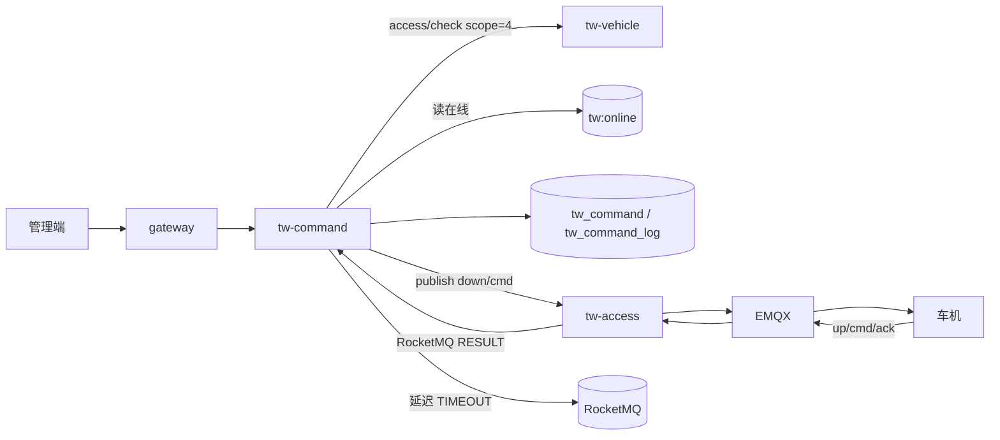
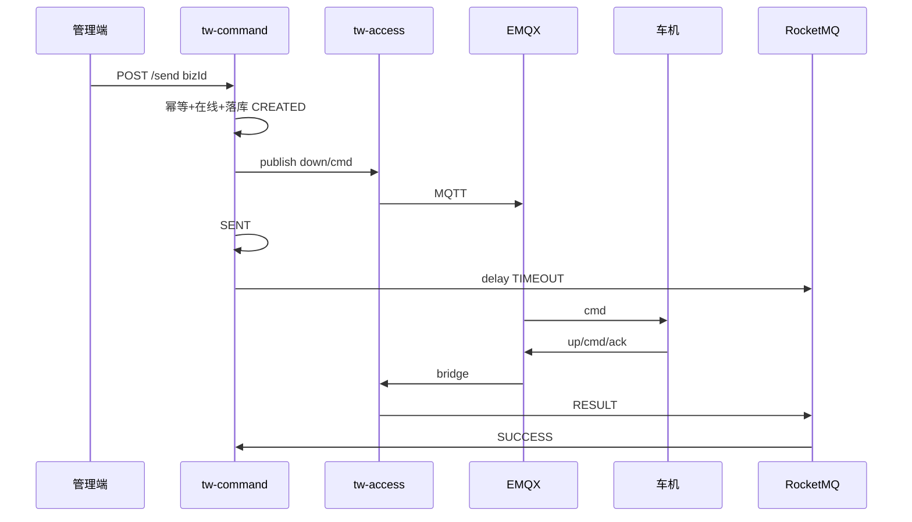
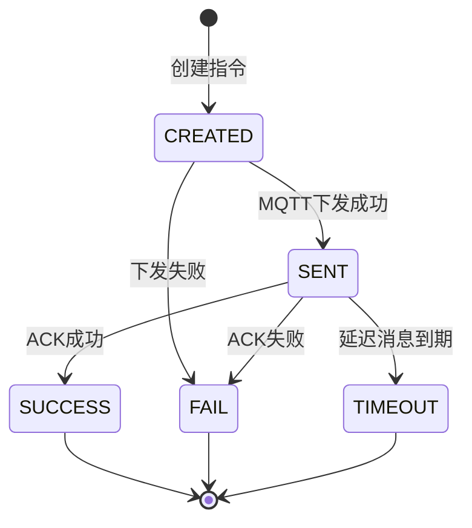

# 功能模块设计-远程控制

> **产品名称**：Titan Watch（泰坦守望）车联网云平台  
> **文档类型**：功能模块设计文档  
> **所属域**：远程控制 / `tw-command`  
> **优先级**：P0（车主 App 下控 P1）  
> **依据**：[功能模块规划.md](./功能模块规划.md) §3.5 · [功能模块设计-车辆档案.md](./功能模块设计-车辆档案.md) · [功能模块设计-终端管理.md](./功能模块设计-终端管理.md) · [系统架构设计.md](./系统架构设计.md) §5～§8 · [开发优先级.md](./开发优先级.md) Step 4  
> **关联前端**：`yz-mall-web-admin-pc` → 菜单「Titan Watch / 远程控制」

---

## 1. 功能实现目标

### 1.1 目标说明

作为新能源车企车联网侧的**远程控车指令编排中心**，接收管理端（及 P1 车主端）控车请求，完成指令落库、幂等、经 `tw-access` 下行 MQTT、接收 ACK 更新结果，并以 RocketMQ 延迟消息处理超时。本模块是 Demo「点解锁 → 成功/超时」的闭环核心。

| 编号 | 目标 | 验收要点 |
|------|------|----------|
| G1 | 下发指令 | 支持字典指令类型：解锁/上锁/寻车/闪灯等；校验车辆在线与权限 |
| G2 | 状态机 | `CREATED → SENT → SUCCESS / FAIL / TIMEOUT` |
| G3 | 幂等 | 同一 `biz_id`（客户端幂等键）不重复下发；Redis + DB 双保险 |
| G4 | 超时 | 发送后投递 RocketMQ 延迟消息；到期仍无终态则置 `TIMEOUT` |
| G5 | ACK 消费 | 消费 `TW_COMMAND` RESULT，更新成功/失败及车端错误码 |
| G6 | 指令查询 | 分页列表、详情、流水日志 |
| G7 | 离线策略（P0） | **拒绝下发**（返回业务错误「车辆离线」）；P1 可扩展排队 |
| G8 | 车主下控（P1） | 校验车主/授权且 `auth_scope` 含控车位 `4` |

### 1.2 非目标（本模块不做）

- 直接持有 MQTT Client 连 EMQX（统一走 `tw-access` 下行代理）
- 车辆/终端主数据、GPS 消费
- 复杂车控安全（地理围栏内才可解锁、双因素等）— 验证项目不做
- 真实车规诊断协议 UDS 等

### 1.3 服务与分层归属

| 项 | 约定 |
|----|------|
| 服务名 | `tw-command`（建议端口 `30105`） |
| 分层 | `interface` / `dao` / `core` / `feign` / `startup` |
| 包名 | `com.yz.mall.tw.command` |
| 类前缀 | `TwCommand` / `TwCommandLog` |
| 统一响应 | `Result` / `ResultTable` + `ApiController` |
| 鉴权 | Gateway + `@SaCheckPermission("api:tw:command:*")` |

### 1.4 与上下游关系



| 能力 | 负责方 |
|------|--------|
| 指令单、状态机、幂等、超时 | `tw-command` |
| MQTT 下行发布 / ACK 桥接 | `tw-access` |
| 人车权限 | `tw-vehicle` access/check |
| 在线判断 | Redis `tw:online:{vin}`（access 维护） |

---

## 2. 涉及角色与权限范围

### 2.1 角色定义

| 角色编码 | 角色名称 | 说明 |
|----------|----------|------|
| `SUPER_ADMIN` | 平台管理员 | 全量下控与查询 |
| `TW_OPERATOR` | 运营人员 | 对任意车下控、查指令（演示主角色） |
| `TW_MONITOR` | 只读监控 | **仅查询**指令记录，**不可下发** |
| `TW_OWNER` | 车主 | P1：仅名下车辆下控 |
| `TW_AUTH_USER` | 授权用户 | P1：仅 `auth_scope` 含 `4` 的车辆可下控 |

### 2.2 功能点 × 角色权限矩阵

| 功能点 | 权限码（建议） | 管理员 | 运营 | 只读监控 | 车主(P1) | 授权(P1) |
|--------|----------------|:------:|:----:|:--------:|:--------:|:--------:|
| 下发指令 | `api:tw:command:send` | ✅ | ✅ | ❌ | ✅（己车） | ✅（scope4） |
| 指令分页 | `api:tw:command:page` | ✅ | ✅ | ✅ | ✅（己车） | ✅（己授权车） |
| 指令详情 | `api:tw:command:detail` | ✅ | ✅ | ✅ | ✅ | ✅ |
| 指令流水 | `api:tw:command:log` | ✅ | ✅ | ✅ | ✅ | ✅ |

### 2.3 数据权限

- 运营/管理员：全量。  
- 车主/授权：`access/check`，下发额外要求 scope 含 `4`；查询列表按名下/授权 VIN 过滤。

### 2.4 菜单建议

```
Titan Watch
└── 远程控制
    ├── 下控面板（选车 + 指令按钮）
    ├── 指令记录（page）
    └── 指令详情（含流水）
```

---

## 3. 数据表设计

### 3.1 设计说明

- **指令单** `tw_command`：一次控车请求一单；含类型、参数、状态、超时时间、幂等键。
- **流水** `tw_command_log`：CREATED/SENT/ACK/TIMEOUT 等事件追加，便于审计与排障。
- 字段：`create_id` / `update_id`。
- Redis：`tw:cmd:idempotent:{bizId}` TTL ≥ 超时时间 + 余量（如 10min）。

### 3.2 表：`tw_command`（指令单）

```sql
CREATE TABLE `tw_command` (
  `id` bigint NOT NULL COMMENT '主键标识',
  `cmd_no` varchar(32) NOT NULL COMMENT '指令单号，业务可读编号',
  `biz_id` varchar(64) NOT NULL COMMENT '客户端幂等键',
  `vin` varchar(32) NOT NULL COMMENT '目标车辆VIN',
  `vehicle_id` bigint DEFAULT NULL COMMENT '车辆ID',
  `device_id` varchar(64) DEFAULT NULL COMMENT '下发时绑定的终端ID',
  `cmd_type` varchar(32) NOT NULL COMMENT '指令类型，字典tw_command_type',
  `cmd_payload` json DEFAULT NULL COMMENT '指令参数JSON',
  `status` tinyint NOT NULL DEFAULT 0 COMMENT '状态：0CREATED 1SENT 2SUCCESS 3FAIL 4TIMEOUT',
  `result_code` varchar(32) DEFAULT NULL COMMENT '车端/平台结果码',
  `result_msg` varchar(255) DEFAULT NULL COMMENT '结果说明',
  `timeout_sec` int NOT NULL DEFAULT 30 COMMENT '超时秒数',
  `expire_time` datetime NOT NULL COMMENT '超时截止时间',
  `sent_time` datetime DEFAULT NULL COMMENT '下行发送成功时间',
  `finish_time` datetime DEFAULT NULL COMMENT '终态时间',
  `request_user_id` bigint DEFAULT NULL COMMENT '发起人用户ID',
  `request_source` tinyint NOT NULL DEFAULT 1 COMMENT '来源：1管理端 2车主端 3系统',
  `create_id` bigint DEFAULT NULL COMMENT '创建人用户ID',
  `update_id` bigint DEFAULT NULL COMMENT '更新人用户ID',
  `create_time` datetime DEFAULT CURRENT_TIMESTAMP COMMENT '创建时间',
  `update_time` datetime DEFAULT CURRENT_TIMESTAMP ON UPDATE CURRENT_TIMESTAMP COMMENT '更新时间',
  `invalid` bigint NOT NULL DEFAULT 0 COMMENT '数据是否有效：0数据有效',
  PRIMARY KEY (`id`),
  UNIQUE KEY `uk_cmd_no` (`cmd_no`),
  UNIQUE KEY `uk_biz_id` (`biz_id`),
  KEY `idx_vin_ctime` (`vin`, `create_time`),
  KEY `idx_status_expire` (`status`, `expire_time`)
) ENGINE=InnoDB DEFAULT CHARSET=utf8mb4 COMMENT='远程控制指令单';
```

**状态枚举**：

| 值 | 编码 | 说明 |
|----|------|------|
| 0 | CREATED | 已落库，待/正在下发 |
| 1 | SENT | MQTT 下行已成功投递 |
| 2 | SUCCESS | 收到 ACK 成功 |
| 3 | FAIL | 收到 ACK 失败或平台校验失败 |
| 4 | TIMEOUT | 超时未 ACK |

### 3.3 表：`tw_command_log`（指令流水）

```sql
CREATE TABLE `tw_command_log` (
  `id` bigint NOT NULL COMMENT '主键标识',
  `command_id` bigint NOT NULL COMMENT '指令单ID',
  `cmd_no` varchar(32) NOT NULL COMMENT '指令单号冗余',
  `event_type` varchar(32) NOT NULL COMMENT '事件：CREATED/SENT/ACK_SUCCESS/ACK_FAIL/TIMEOUT/ERROR',
  `event_time` datetime NOT NULL COMMENT '事件时间',
  `detail` varchar(512) DEFAULT NULL COMMENT '详情/原始ACK摘要',
  `create_id` bigint DEFAULT NULL COMMENT '创建人用户ID',
  `create_time` datetime DEFAULT CURRENT_TIMESTAMP COMMENT '创建时间',
  `invalid` bigint NOT NULL DEFAULT 0 COMMENT '数据是否有效：0数据有效',
  PRIMARY KEY (`id`),
  KEY `idx_command_id` (`command_id`),
  KEY `idx_cmd_no` (`cmd_no`)
) ENGINE=InnoDB DEFAULT CHARSET=utf8mb4 COMMENT='远程控制指令流水';
```

### 3.4 字典 `tw_command_type`

| 编码 | 名称 | 说明 |
|------|------|------|
| `DOOR_UNLOCK` | 解锁 | P0 |
| `DOOR_LOCK` | 上锁 | P0 |
| `FIND_CAR` | 寻车鸣笛 | P0 |
| `FLASH_LIGHT` | 闪灯 | P0 |
| `AC_START` | 开启空调 | 示意，可选 |

### 3.5 MQTT / RocketMQ 约定

**下行 Topic**：`tw/{vin}/down/cmd`  

```json
{
  "cmdNo": "CMD202608040001",
  "bizId": "uuid-...",
  "cmdType": "DOOR_UNLOCK",
  "payload": {},
  "ts": 1722765600000
}
```

**上行 ACK Topic**：`tw/{vin}/up/cmd/ack` → access 桥接 RocketMQ  

```json
{
  "cmdNo": "CMD202608040001",
  "bizId": "uuid-...",
  "success": true,
  "resultCode": "0",
  "resultMsg": "ok",
  "ts": 1722765600500
}
```

| RocketMQ | Tag | 说明 |
|----------|-----|------|
| `TW_COMMAND` | `RESULT` | ACK 结果 |
| `TW_COMMAND` | `TIMEOUT` | 延迟消息到期 |

`cmd_no` 可用 `mall-serial` 生成（如前缀 `CMD`）。

---

## 4. 接口设计

> 前缀：`/tw/command/**`

### 4.1 下发指令

- `POST /tw/command/send`
- 权限：`api:tw:command:send`

**入参** `TwCommandSendDto`：

| 字段 | 类型 | 必填 | 说明 |
|------|------|------|------|
| `vin` / `vehicleId` | — | 是 | 目标车 |
| `cmdType` | string | 是 | 字典编码 |
| `payload` | object | 否 | 扩展参数 |
| `bizId` | string | 是 | 幂等键（前端 UUID） |
| `timeoutSec` | int | 否 | 默认 30，范围 5～120 |

**出参** `Result<TwCommandSendVo>`：`id`、`cmdNo`、`status`（多为 SENT）、`expireTime`。

**处理步骤**：

1. 解析 VIN；`access/check`（运营跳过绑定，车主校验 scope4）。  
2. 读 `tw:online:{vin}`，离线则 FAIL 业务错误。  
3. Redis `SETNX tw:cmd:idempotent:{bizId}`；已存在则查原单返回。  
4. 落库 CREATED + log；生成 `cmd_no`。  
5. Feign `tw-access` 发布 MQTT；成功则 SENT + 写 `sent_time`/`expire_time`。  
6. 投递 RocketMQ 延迟消息 TIMEOUT（延迟 ≈ timeoutSec）。  
7. 发布失败：状态 FAIL，记 log。

### 4.2 指令分页

- `POST /tw/command/page`
- 入参：分页 + `vin` / `cmdType` / `status` / 时间范围  
- 出参：`ResultTable<TwCommandPageVo>`

### 4.3 指令详情

- `GET /tw/command/{id}` 或 `/by-cmd-no/{cmdNo}`  
- 出参：指令单字段 + 可选嵌套 logs

### 4.4 指令流水

- `GET /tw/command/{id}/logs`  
- 出参：`List<TwCommandLogVo>`

### 4.5 内部消费（非 HTTP，说明）

| 消费者 | 行为 |
|--------|------|
| RESULT | 按 cmdNo/bizId 定位；仅当 status∈{CREATED,SENT} 时更新 SUCCESS/FAIL；写 log；幂等忽略重复 ACK |
| TIMEOUT | 若仍为 SENT（或 CREATED），置 TIMEOUT；已终态则忽略 |

**状态流转规则**：终态（SUCCESS/FAIL/TIMEOUT）不可回退；TIMEOUT 与 RESULT 竞态时「先到生效」（用乐观锁 `update ... where status in (0,1)`）。

### 4.6 Extend（可选）

| 接口 | 说明 |
|------|------|
| `GET /extend/tw/command/{cmdNo}` | 他域查询指令状态 |

---

## 5. 核心流程

### 5.1 下发到成功



### 5.2 状态机



---

## 6. 异常与业务码建议

| 场景 | 提示 |
|------|------|
| 车辆离线 | 车辆离线，无法下发指令 |
| 无控车权限 | 无权对该车辆执行远程控制 |
| 重复 bizId | 返回原指令单（幂等成功） |
| 指令类型非法 | 不支持的指令类型 |
| ACK 晚于 TIMEOUT | 保持 TIMEOUT，log 记 LATE_ACK（可选） |
| access 发布失败 | 指令下发失败 |

---

## 7. 实现要点

| 项 | 约定 |
|----|------|
| 单号 | `mall-serial` 或雪花 + `CMD` 前缀 |
| 幂等 | DB `uk_biz_id` + Redis SETNX |
| 超时竞态 | 条件更新 `where status in (0,1)` |
| 不直连 EMQX | 仅 Feign access |
| 审计 | `request_user_id`/`create_id`/`update_id` |
| 安全 | payload 不落敏感明文；日志脱敏 |

**面试可讲**：MQTT QoS1 下行；业务超时用 RocketMQ 延迟而非仅靠客户端；Kafka 不适合做「30 秒后检查是否 ACK」。

---

## 8. 管理端页面要点

| 页面 | 能力 |
|------|------|
| 下控面板 | 选车（展示在线）；按钮：解锁/上锁/寻车/闪灯；提交带 bizId；轮询详情或 WS（P0 轮询即可） |
| 指令记录 | 筛 VIN/类型/状态；进详情看流水时间线 |
| 离线车 | 按钮置灰或提交后明确错误 |

---

## 9. 测试用例

| 编号 | 场景 | 期望 |
|------|------|------|
| T1 | 在线车解锁 | SENT→SUCCESS |
| T2 | 模拟器回失败 ACK | FAIL |
| T3 | 不回 ACK | TIMEOUT |
| T4 | 相同 bizId 连点 | 仅一单 |
| T5 | 离线车 | 拒绝 |
| T6 | 只读角色 send | 无权限 |
| T7 | RESULT 与 TIMEOUT 竞态 | 仅一终态 |
| T8 | 授权无 scope4（P1） | 拒绝 |

---

## 10. 与相邻模块协作

| 模块 | 协作点 |
|------|--------|
| `tw-vehicle` | access/check；列表数据范围 |
| `tw-device` | 下发时冗余 deviceId（可选 Feign 查当前绑定） |
| `tw-access` | publish、ACK→MQ |
| `tw-telemetry` | 无强依赖；监控页可同屏展示位置 |

---

## 11. 交付清单

- [ ] DDL：`tw_command`、`tw_command_log`
- [ ] 字典 `tw_command_type`
- [ ] send / page / detail / logs API
- [ ] RESULT / TIMEOUT 消费者
- [ ] Feign access 下行
- [ ] 管理端下控面板 + 指令记录
- [ ] 与模拟器联调 ACK
- [ ] P1：车主端下控 + scope4

---

*遥测地图见《功能模块设计-遥测与轨迹》；EMQX 下行代理细节见后续 access 模块设计。*
