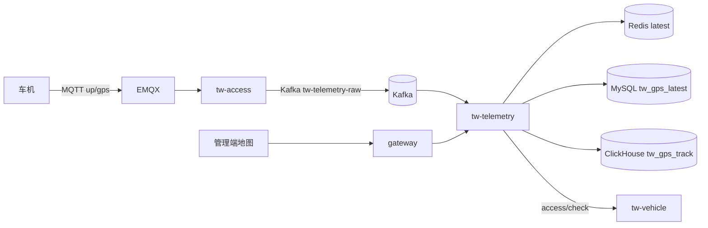
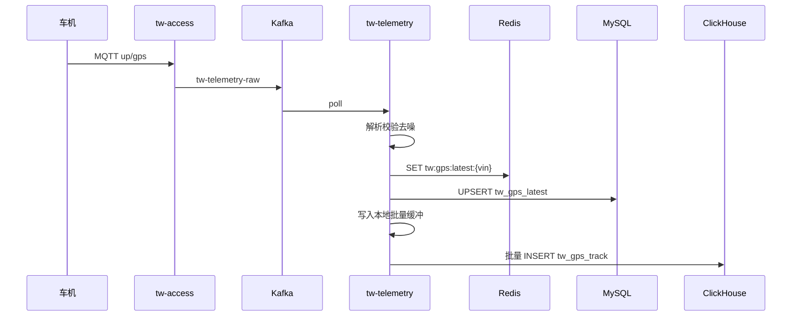
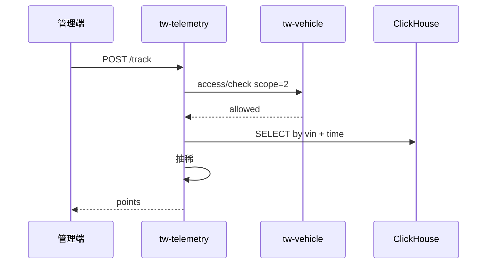

# 功能模块设计-遥测与轨迹

> **产品名称**：Titan Watch（泰坦守望）车联网云平台  
> **文档类型**：功能模块设计文档  
> **所属域**：遥测与位置 / `tw-telemetry`  
> **优先级**：P0（信号/电量 P1）  
> **依据**：[功能模块规划.md](./功能模块规划.md) §3.4 · [功能模块设计-车辆档案.md](./功能模块设计-车辆档案.md) · [系统架构设计.md](./系统架构设计.md) §5～§7 · [开发优先级.md](./开发优先级.md) Step 3  
> **关联前端**：`yz-mall-web-admin-pc` → 菜单「Titan Watch / 实时监控」「轨迹查询」  
> **存储选型**：Redis（最新点热读）+ MySQL（latest 持久兜底）+ ClickHouse（轨迹明细）

---

## 1. 功能实现目标

### 1.1 目标说明

作为新能源车企车联网侧的**位置与轨迹数据平面**，消费车机经 EMQX → Kafka 上报的高频 GPS（及可选信号），维护每车最新位置，将轨迹明细写入 ClickHouse，并向前端提供地图展示所需 API。本模块是 Demo「地图上能动」的关键路径。

| 编号 | 目标 | 验收要点 |
|------|------|----------|
| G1 | 消费原始遥测 | 消费 Kafka `tw-telemetry-raw`（Key=VIN），解析 JSON，校验经纬度合法 |
| G2 | 最新位置 | 写 Redis `tw:gps:latest:{vin}` + MySQL `tw_gps_latest`（UPSERT） |
| G3 | 轨迹落库 | **批量写入 ClickHouse** 表 `tw_gps_track`（append-only） |
| G4 | 最新位置查询 | 按 VIN / vehicleId：优先 Redis，miss 回源 MySQL |
| G5 | 轨迹查询 | 按 VIN + 时间范围查 **ClickHouse**；限制时间窗与点数，防大查询 |
| G6 | 地图展示支撑 | 返回前端折线可用的坐标数组；坐标系约定 WGS84（GCJ02 转换责任在前端） |
| G7 | 简单去噪（P0 轻量） | 过滤非法坐标、可选速度跳变粗过滤 |
| G8 | 信号/电量（P1） | 扩展字段写入 Redis/MySQL latest；监控页展示 |

### 1.2 非目标（本模块不做）

- EMQX 桥接、Kafka 生产（`tw-access`）
- 车辆/终端/指令主数据（`tw-vehicle` / `tw-device` / `tw-command`）
- 在线状态写入（`tw-access`）；查询可只读 `tw:online:{vin}` 一并返回
- 电子围栏判定（`tw-alarm` 二期）
- 用 MySQL 存高频轨迹明细（已明确由 ClickHouse 承担）

### 1.3 存储职责划分（Redis + MySQL + ClickHouse）

| 存储 | 职责 | 读写特征 |
|------|------|----------|
| **Redis** | 每车最新位置快照；监控大屏批量读 | 高频写、极高频读；可丢失后回源 |
| **MySQL** `tw_gps_latest` | 最新位置持久化兜底（Redis miss / 重启） | 每 VIN 一行 UPSERT，行数≈车辆数，压力可控 |
| **ClickHouse** `tw_gps_track` | GPS 轨迹明细（历史点） | 高吞吐追加写；按 `vin + gps_time` 范围查 |

```
Kafka 消费
  ├─→ Redis          SET latest
  ├─→ MySQL          UPSERT tw_gps_latest
  └─→ ClickHouse     批量 INSERT tw_gps_track
```

> **原则**：热读不打轨迹库；轨迹不进 MySQL；业务主数据仍在 MySQL，与遥测明细解耦。

### 1.4 服务与分层归属

| 项 | 约定 |
|----|------|
| 服务名 | `tw-telemetry`（建议端口 `30104`） |
| 分层 | `interface` / `dao` / `core` / `feign` / `startup` |
| 包名 | `com.yz.mall.tw.telemetry` |
| 类前缀 | `TwGps` / `TwTelemetry` |
| 统一响应 | `Result` / `ResultTable` + `ApiController` |
| 鉴权 | Gateway + `@SaCheckPermission("api:tw:telemetry:*")`；数据范围调 `tw-vehicle` `access/check` |
| 客户端 | Redis（已有）+ MyBatis-Plus（MySQL）+ ClickHouse JDBC / 官方客户端（批量写入） |

### 1.5 与上下游关系



| 能力 | 负责方 |
|------|--------|
| GPS 上行桥接到 Kafka | `tw-access` |
| 消费、清洗、三写、查询 API | `tw-telemetry` |
| 车辆访问权限（scope 含位置位 `2`） | `tw-vehicle` Extend |
| 在线状态 | `tw-access` 写 Redis；本模块只读 |

---

## 2. 涉及角色与权限范围

### 2.1 角色定义

| 角色编码 | 角色名称 | 说明 |
|----------|----------|------|
| `SUPER_ADMIN` | 平台管理员 | 全部查询 |
| `TW_OPERATOR` | 运营人员 | 监控与轨迹查询（全量车辆） |
| `TW_MONITOR` | 只读监控 | 仅查位置/轨迹，无写操作（本模块本无写管理接口） |
| `TW_OWNER` | 车主 | 仅名下车辆；需 `auth_scope` 含位置位或车主默认具备 |
| `TW_AUTH_USER` | 授权用户 | 仅被授权车辆且 `auth_scope` 含 `2` |

### 2.2 功能点 × 角色权限矩阵

| 功能点 | 权限码（建议） | 管理员 | 运营 | 只读监控 | 车主 | 授权用户 |
|--------|----------------|:------:|:----:|:--------:|:----:|:--------:|
| 最新位置 | `api:tw:telemetry:latest` | ✅ | ✅ | ✅ | ✅（己车） | ✅（scope≥2） |
| 轨迹查询 | `api:tw:telemetry:track` | ✅ | ✅ | ✅ | ✅（己车） | ✅（scope≥2） |
| 批量最新位置（监控大屏） | `api:tw:telemetry:latest:batch` | ✅ | ✅ | ✅ | ❌ | ❌ |

### 2.3 数据权限

查询前调用 `GET /extend/tw/vehicle/access/check`，所需 scope=`2`（查看位置/轨迹）。运营/管理员跳过绑定校验（全量）。

### 2.4 菜单建议

```
Titan Watch
├── 实时监控（最新位置 / 在线，地图点）
└── 轨迹查询（VIN + 时间范围 + 折线）
```

---

## 3. 数据设计

### 3.1 设计说明

| 层级 | 存储 | 对象 |
|------|------|------|
| 热 | Redis | `tw:gps:latest:{vin}` |
| 温/兜底 | MySQL | `tw_gps_latest`（每 VIN 一行） |
| 冷/明细 | ClickHouse | `tw_gps_track`（海量点） |

Kafka Topic：`tw-telemetry-raw`（Key=VIN）。  
轨迹**不再**使用 MySQL 分表 `tw_gps_track_yyyyMM`。

### 3.2 MySQL：`tw_gps_latest`（最新位置）

```sql
CREATE TABLE `tw_gps_latest` (
  `id` bigint NOT NULL COMMENT '主键标识',
  `vin` varchar(32) NOT NULL COMMENT '车架号VIN',
  `vehicle_id` bigint DEFAULT NULL COMMENT '车辆ID冗余，可空',
  `lng` decimal(10,7) NOT NULL COMMENT '经度',
  `lat` decimal(10,7) NOT NULL COMMENT '纬度',
  `altitude` decimal(10,2) DEFAULT NULL COMMENT '海拔米',
  `speed` decimal(8,2) DEFAULT NULL COMMENT '速度km/h',
  `heading` decimal(6,2) DEFAULT NULL COMMENT '航向角0-360',
  `gps_time` datetime NOT NULL COMMENT 'GPS定位时间（车机侧）',
  `receive_time` datetime NOT NULL COMMENT '云端接收时间',
  `soc` decimal(5,2) DEFAULT NULL COMMENT '电池SOC百分比（P1）',
  `signal_level` tinyint DEFAULT NULL COMMENT '信号强度等级（P1）',
  `raw_ext` json DEFAULT NULL COMMENT '扩展字段JSON',
  `create_id` bigint DEFAULT NULL COMMENT '创建人用户ID',
  `update_id` bigint DEFAULT NULL COMMENT '更新人用户ID',
  `create_time` datetime DEFAULT CURRENT_TIMESTAMP COMMENT '创建时间',
  `update_time` datetime DEFAULT CURRENT_TIMESTAMP ON UPDATE CURRENT_TIMESTAMP COMMENT '更新时间',
  `invalid` bigint NOT NULL DEFAULT 0 COMMENT '数据是否有效：0数据有效',
  PRIMARY KEY (`id`),
  UNIQUE KEY `uk_vin` (`vin`),
  KEY `idx_gps_time` (`gps_time`)
) ENGINE=InnoDB DEFAULT CHARSET=utf8mb4 COMMENT='车辆最新GPS位置';
```

### 3.3 ClickHouse：`tw_gps_track`（轨迹明细）

**引擎建议**：`MergeTree`，按月分区，按 `vin` 排序，利于「单车 + 时间窗」查询。

```sql
CREATE TABLE tw_gps_track
(
    vin String,
    vehicle_id UInt64 DEFAULT 0,
    lng Float64,
    lat Float64,
    altitude Nullable(Float64),
    speed Nullable(Float64),
    heading Nullable(Float64),
    gps_time DateTime64(3, 'Asia/Shanghai'),
    receive_time DateTime64(3, 'Asia/Shanghai'),
    soc Nullable(Float32),
    signal_level Nullable(Int8)
)
ENGINE = MergeTree
PARTITION BY toYYYYMM(gps_time)
ORDER BY (vin, gps_time)
TTL gps_time + INTERVAL 90 DAY
SETTINGS index_granularity = 8192;
```

**说明**：

| 项 | 约定 |
|----|------|
| 写入 | 消费侧本地缓冲，**批量 INSERT**（如 500～2000 条或 1s 刷盘），禁止逐条打 CH |
| 去重 | P0 可接受少量重复点；P1 可用 `ReplacingMergeTree(receive_time)` 或查询侧 `GROUP BY vin, gps_time` |
| 保留 | TTL 90 天（可配）；演示环境可改为 7～30 天 |
| 查询 | `WHERE vin = ? AND gps_time BETWEEN ? AND ? ORDER BY gps_time` |

### 3.4 Kafka 消息体约定（上行 GPS）

```json
{
  "vin": "LXXXXXXXXXXXXXXX",
  "lng": 113.264385,
  "lat": 23.129112,
  "speed": 36.5,
  "heading": 90.0,
  "altitude": 12.0,
  "gpsTime": "2026-08-04T15:00:01.000+08:00",
  "soc": 78.5,
  "signalLevel": 4
}
```

Topic：`tw-telemetry-raw`；Key：`vin`；消费组：`tw-telemetry-gps`。

### 3.5 Redis 快照

Key：`tw:gps:latest:{vin}`  
Value：与 MySQL latest 核心字段一致的 JSON；TTL 可不设或 7 天滑动续期。

---

## 4. 接口设计

> 前缀：`/tw/telemetry/**`

### 4.1 最新位置

- `GET /tw/telemetry/latest?vin=` 或 `?vehicleId=`
- 权限：`api:tw:telemetry:latest`
- **读路径**：Redis → miss 则 MySQL → 回填 Redis

**出参** `TwGpsLatestVo`：`vin`、`lng`、`lat`、`speed`、`heading`、`gpsTime`、`receiveTime`、`online`（可选）、`soc`/`signalLevel`（P1）。

### 4.2 批量最新位置（监控）

- `POST /tw/telemetry/latest/batch`
- 入参：`vins[]` 或空=运营可见范围内（建议 ≤200）
- 出参：`List<TwGpsLatestVo>`
- **读路径**：优先 `MGET` Redis；缺失 VIN 批量回源 MySQL

### 4.3 轨迹查询

- `POST /tw/telemetry/track`
- 权限：`api:tw:telemetry:track`
- **读路径**：**仅查 ClickHouse**（不查 MySQL 轨迹表）

**入参** `TwGpsTrackQueryDto`：

| 字段 | 类型 | 必填 | 说明 |
|------|------|------|------|
| `vin` / `vehicleId` | — | 是 | 二选一 |
| `startTime` | datetime | 是 | 开始（含） |
| `endTime` | datetime | 是 | 结束（含） |
| `maxPoints` | int | 否 | 默认 2000，上限 5000；超限抽稀 |

**约束**：`endTime - startTime` ≤ 24h（P0 可配置）。

**出参** `TwGpsTrackVo`：

| 字段 | 说明 |
|------|------|
| `vin` | VIN |
| `points[]` | `{lng,lat,speed,heading,gpsTime}` 按时间升序 |
| `total` | 原始命中点数（抽稀前） |
| `sampled` | 是否已抽稀 |

### 4.4 Extend（供 vehicle 详情聚合）

| 接口 | 说明 |
|------|------|
| `GET /extend/tw/telemetry/latest/{vin}` | 车辆详情位置摘要（Redis/MySQL） |

---

## 5. 核心流程

### 5.1 上报消费



### 5.2 轨迹查询



### 5.3 容量边界（面试可讲）

| 规模 | Redis+MySQL latest | ClickHouse 轨迹 |
|------|--------------------|-----------------|
| Demo 数十台 | 轻松 | 轻松 |
| 验证千级车 | 可控 | 批量写即可 |
| 量产十万级+ | latest 仍 OK | CH 分区+批量；勿用 MySQL 存明细 |

---

## 6. 异常与业务码建议

| 场景 | 提示 |
|------|------|
| VIN 无权限 | 无权查看该车辆位置 |
| 时间窗过大 | 查询时间范围不能超过 N 小时 |
| 无轨迹数据 | 返回空 points，非错误 |
| 非法坐标消息 | 消费侧丢弃并打 warn |
| Kafka 积压 | 扩分区 / 加消费实例 |
| ClickHouse 写入失败 | 重试批量；失败入本地/死信（P1），避免堵死消费组 |
| Redis 不可用 | latest 读降级 MySQL；写可只写 MySQL（告警） |

---

## 7. 实现要点

| 项 | 约定 |
|----|------|
| 三写顺序 | 建议先 Redis（读友好）→ MySQL → 缓冲进 CH；CH 失败不影响 latest 对外可读 |
| CH 批量 | 时间或条数双触发刷盘；进程关闭 flush |
| 幂等 | latest UPSERT 自然幂等；轨迹 P0 容忍重复 |
| 抽稀 | 等距或按 maxPoints 均匀抽样（应用层或 CH `LIMIT`+采样） |
| 坐标系 | 存储 WGS84；高德地图前端转 GCJ02 |
| 上报频率 | 模拟器 1～5s/点 |
| 依赖 | Docker 增加 ClickHouse；配置走 Nacos，账号密码环境变量 |

---

## 8. 管理端页面要点

| 页面 | 能力 |
|------|------|
| 实时监控 | 车辆列表/地图 Marker；在线着色；点击看最新点（Redis） |
| 轨迹查询 | 选车 + 时间；折线回放（ClickHouse） |

---

## 9. 测试用例

| 编号 | 场景 | 期望 |
|------|------|------|
| T1 | 模拟器持续上报 | Redis + MySQL latest 更新；CH 有明细 |
| T2 | 查最新位置 | 与最后上报一致（Redis 命中） |
| T3 | Redis 清空后查 latest | 回源 MySQL 成功并可回填 |
| T4 | 轨迹时间窗 | CH 点序正确 |
| T5 | 超大时间窗 | 拒绝 |
| T6 | 授权无 scope2 | 拒绝 |
| T7 | 非法 lat/lng | 不写三端 |
| T8 | 批量监控 | ≤上限，主要打 Redis |
| T9 | CH 短暂不可用 | latest 仍可用；恢复后轨迹可追（视缓冲策略） |

---

## 10. 交付清单

- [ ] Docker / 环境：ClickHouse；Nacos 配置数据源
- [ ] MySQL DDL：`tw_gps_latest`
- [ ] ClickHouse DDL：`tw_gps_track`
- [ ] Kafka 消费组：三写（Redis + MySQL + CH 批量）
- [ ] API：latest / track / batch
- [ ] 权限码 + 调 vehicle access/check
- [ ] 管理端监控地图 + 轨迹折线
- [ ] 与 access 联调：上行 Topic → Kafka

---

## 11. 与旧方案差异

| 项 | 旧（Redis + MySQL 轨迹） | 现（Redis + MySQL + ClickHouse） |
|----|--------------------------|----------------------------------|
| 最新点 | Redis + MySQL | 不变 |
| 轨迹明细 | MySQL 单表/按月分表 | **ClickHouse** |
| 适用规模 | Demo / 小流量 | Demo → 验证 → 可演进量产明细 |

---

*「接入与在线」桥接细节见 access 模块设计；远程控车见《功能模块设计-远程控制》。*
