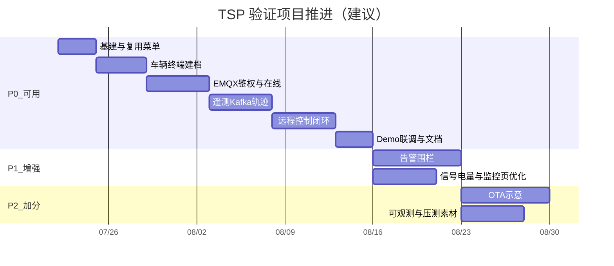

# TSP 车联网云平台 — 开发优先级

> 原则：**先让系统「能用、能演示」**，再补告警/OTA/精致体验。  
> 复用 yz-mall 登录、用户、字典、菜单权限，**不从零做后台壳子**。

---

## 一、总体原则

| 原则 | 做法 |
|------|------|
| 垂直切片 | 每一期都能演示一条完整链路，而不是先堆无界面的底层 |
| 复用优先 | Gateway / Auth / Sys / 管理端框架直接用 |
| 中间件最小集 | P0 必须起：MySQL、Redis、Nacos、EMQX、Kafka、RocketMQ |
| 车机用模拟器 | 不接真车；用 MQTTX / 自写 Java/Python 模拟器即可 |
| 可讲清 | 每期沉淀 1～2 个面试考点（鉴权、双 MQ、指令超时等） |



---

## 二、优先级总览

| 阶段 | 目标（一句话） | 是否「系统可用」 |
|------|----------------|------------------|
| **P0** | 管车、车上线、看位置、能下控 | ✅ 是（MVP） |
| **P1** | 告警围栏、监控体验、指令与权限细化 | 增强可用 |
| **P2** | OTA 示意、可观测、简历包装材料 | 加分项 |

---

## 三、P0 — 最小可用（Must Have）

> **验收标准**：按 [功能模块规划.md](./功能模块规划.md) 第六、七节 Demo 故事线能完整走通。

### 3.1 工作包拆分（建议顺序）

#### Step 0：基建与壳子（0.5～1 天）

- [ ] Docker 增加 **EMQX**、**Kafka**（单节点）
- [ ] 管理端增加「车联网」一级菜单（空页占位）
- [ ] 字典预置：指令类型、车辆状态、终端状态
- [ ] 确认 mall-gateway 路由可指向后续 tsp-* 端口

**产出**：打开后台能看到车联网菜单；中间件健康检查通过。

#### Step 1：车辆 + 终端 CRUD（2～3 天）

- [ ] `tsp-vehicle`：车辆建档、分页、详情
- [ ] `tsp-device`：终端注册、密钥生成（明文仅创建时返回一次）、绑定 VIN
- [ ] 管理端：车辆列表、终端列表、绑定操作

**产出**：不连车也能「管车管设备」。

#### Step 2：接入鉴权与在线（3～4 天）

- [ ] `tsp-access`：EMQX HTTP Auth + ACL
- [ ] 上下线 Webhook → Redis 在线状态
- [ ] 简单心跳刷新最后在线时间
- [ ] 车辆列表展示在线/离线
- [ ] MQTT 模拟器脚本（固定 VIN/密钥）

**产出**：模拟器 CONNECT 成功；断开变离线。  
**面试点**：设备鉴权与 Topic ACL。

#### Step 3：遥测链路（3～4 天）

- [ ] 上行 GPS → 桥接 Kafka `tsp-telemetry-raw`
- [ ] `tsp-telemetry` 消费、写 `gps_latest` + 轨迹表
- [ ] API：最新位置、轨迹查询
- [ ] 管理端：地图点 + 简单折线轨迹

**产出**：地图上能动。  
**面试点**：为何遥测用 Kafka、按 VIN 分区。

#### Step 4：远程控制闭环（3～4 天）

- [ ] `tsp-command`：创建指令、状态机、幂等
- [ ] 经 `tsp-access` 发布 `down/cmd`
- [ ] 模拟器回 `up/cmd/ack` → RocketMQ → 更新结果
- [ ] RocketMQ 延迟消息处理超时
- [ ] 管理端：下控按钮 + 指令记录

**产出**：点解锁 → 成功/超时可演示。  
**面试点**：指令幂等、超时、MQTT QoS。

#### Step 5：联调打磨（1～2 天）

- [ ] 权限按钮：`tsp:vehicle:list`、`tsp:command:send` 等
- [ ] 异常提示（离线不可下控）
- [ ] README：本地启动步骤 + Demo 脚本
- [ ] 架构图与本文档保持一致

**P0 完成标志**：简历可写「基于 Spring Cloud + EMQX + Kafka/RocketMQ 的车联网 TSP MVP」。

---

## 四、P1 — 增强可用（Should Have）

在 P0 稳定后再做，避免范围膨胀。

| 序号 | 项 | 价值 |
|------|----|------|
| 1 | 电子围栏 + 进出告警 | 补齐「事件驱动」故事 |
| 2 | 故障码/事件上报 | 丰富 `up/event` |
| 3 | 电量/车速等信号展示 | 监控页更像真 TSP |
| 4 | 车主数据权限（仅看自己的车） | 体现多角色 |
| 5 | 指令对离线车：拒绝或排队策略 | 体现边界设计 |
| 6 | 轨迹按月分表 / 过期清理任务 | 体现数据生命周期 |

---

## 五、P2 — 简历加分（Nice to Have）

| 序号 | 项 | 价值 |
|------|----|------|
| 1 | OTA 任务示意（文件 + 进度状态机） | 完整「车云」叙事 |
| 2 | SkyWalking / Grafana 面板截图 | 可观测性素材 |
| 3 | 简易压测：模拟 N 辆车上报 | 性能与分区话题 |
| 4 | 设备证书/JWT 短期凭证 | 安全深化 |
| 5 | 车主 App 接口（可无独立前端） | 多端故事 |

---

## 六、明确延后 / 不做（验证项目）

- 真车协议栈、国密、TBOX 产线流程  
- 多机房、EMQX 集群生产参数调优  
- 计费、套餐、经销商门户  
- 与充电桩 / 能源网互联  
- 自动驾驶云控  

---

## 七、人力与模块建议（单人验证）

若只有 **1 人**，P0 合并策略：

| 合并方式 | 说明 |
|----------|------|
| `tsp-device` + `tsp-vehicle` | 可先同库同服务，包名仍按域拆分 |
| `tsp-access` 独立 | **建议保留独立**，突出接入层 |
| `tsp-telemetry` + `tsp-command` | 可暂同进程多模块，面试仍按服务讲 |

推荐最小进程数：

1. 已有：gateway、auth、admin  
2. 新增：`tsp-access`、`tsp-biz`（vehicle+device+telemetry+command 临时聚合）  
3. 稳定后再拆 `tsp-biz`

---

## 八、每阶段交付物清单

| 阶段 | 代码 | 文档/素材 |
|------|------|-----------|
| P0 | 可运行服务 + 模拟器 + 管理端页面 | 启动说明、Demo 录屏/截图、本文档 |
| P1 | 告警模块 | 围栏设计说明 |
| P2 | OTA 示意 | 简历项目描述（STAR）草稿 |

### 简历项目描述模板（可直接改）

> 基于 Spring Boot 3 / Spring Cloud Alibaba 搭建车联网 TSP 技术验证平台：车机经 **EMQX（MQTT）** 接入，高频遥测经 **Kafka** 入库与轨迹查询，远程控车等业务事件经 **RocketMQ** 异步闭环；管理端复用现有权限体系完成车辆/终端管理、实时监控与指令下发。独立完成接入鉴权、在线状态、指令幂等与超时等核心链路。

---

## 九、P0 任务看板（可直接当 To-Do）

```text
[ ] Docker：EMQX + Kafka
[ ] 菜单/字典占位
[ ] tsp-vehicle CRUD + 页面
[ ] tsp-device 注册绑定 + 页面
[ ] tsp-access：Auth / ACL / 上下线
[ ] MQTT 模拟器上线
[ ] GPS → Kafka → 落库 → 地图轨迹
[ ] 远程控制 + ACK + 超时
[ ] 权限点与离线拦截
[ ] Demo 文档与截图
```

完成以上勾选，即达到「系统可以使用起来」的标准。
