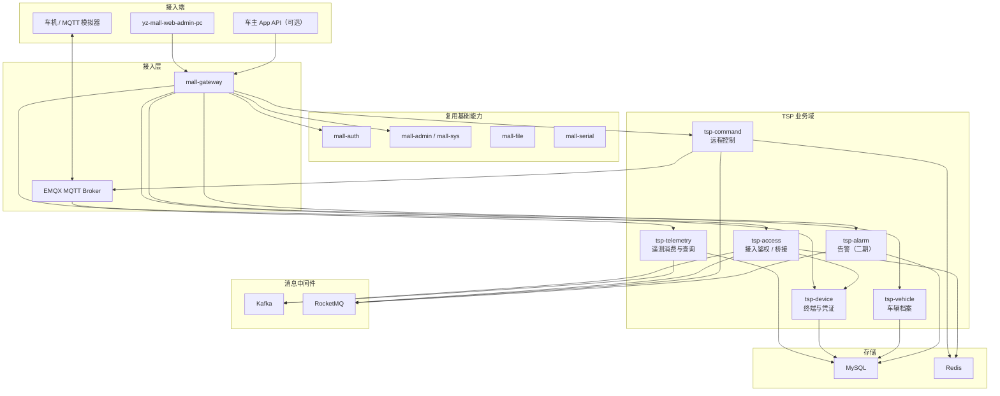
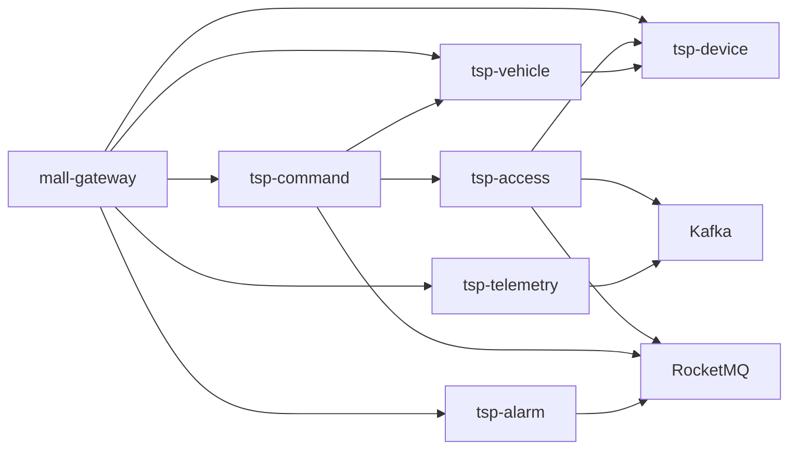
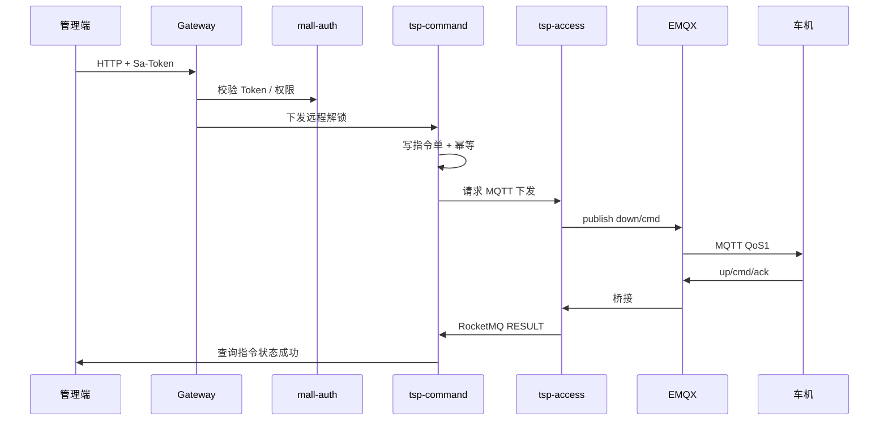

# Titan Watch 车联网云平台 — 系统架构设计

> 技术栈沿用 [系统架构设计.md](../系统架构设计.md)（yz-mall）。本文只描述车联网增量能力与中间件差异。  
> 项目性质：技术验证 / 简历与面试素材，优先「可演示、可讲清」，不做生产级高可用与合规完备。

---

## 一、建设目标与边界

### 1.1 目标

| 目标 | 说明 |
|------|------|
| 车云通信 | 车机（模拟器）经 **EMQX（MQTT）** 与云端双向通信 |
| 遥测链路 | 高频位置/信号数据经 **Kafka** 流式落地，支持轨迹查询 |
| 业务解耦 | 指令结果、上下线、告警等业务事件经 **RocketMQ** 异步处理 |
| 运营管理 | 管理端复用 yz-mall：登录、用户、字典、菜单权限；新增车辆/终端/指令页面 |
| 面试可讲 | 能讲清「MQTT vs HTTP」「Kafka vs RocketMQ」「接入鉴权」「指令幂等与超时」 |

### 1.2 非目标（刻意不做）

- 真实车规 TBOX / 国密证书体系 / 工信部合规
- 多租户 SaaS、百万级车辆压测达标
- 完整 OTA 包分发 CDN、充电桩互联、自动驾驶云控
- 生产级灾备、多活机房

---

## 二、技术栈选型

### 2.1 继承 yz-mall

| 类别 | 技术 | 用途 |
|------|------|------|
| 基础框架 | Spring Boot 3.x / Java 17 | 业务服务 |
| 微服务 | Spring Cloud Alibaba / Nacos | 注册与配置 |
| 网关 | Spring Cloud Gateway | 管理端 / App API 统一入口 |
| 调用 | OpenFeign | 服务间同步调用 |
| 缓存 | Redis + Redisson | 在线状态、指令幂等、限流 |
| 数据库 | MySQL 8 + MyBatis-Plus | 车辆、终端、指令、告警等业务库 |
| 权限 | Sa-Token | 管理端鉴权（复用 mall-auth / mall-sys） |
| 业务 MQ | RocketMQ | 指令结果、上下线、告警等业务事件 |
| 可观测 | 可选 Prometheus / SkyWalking / ELK | 与电商一致，验证阶段可简化 |

### 2.2 车联网增量组件

| 类别 | 技术 | 用途 | 选型理由（面试话术） |
|------|------|------|----------------------|
| 车云接入 | **EMQX** | MQTT Broker：连接、Topic、ACL、桥接 | 车机弱网、长连接、双向推送，MQTT 比 HTTP 轮询合适 |
| 遥测流 | **Kafka** | 位置/CAN/电池等高吞吐写入与回放 | 写多读少、可分区按 VIN、适合轨迹类时序数据 |
| 业务消息 | **RocketMQ** | 指令编排、状态变更、告警通知 | 业务语义清晰、支持延迟消息（指令超时）、与现有商城一致 |
| 时序/轨迹明细 | **ClickHouse** | GPS 轨迹追加写与区间查询 | 写多读少、按 vin+time 查，优于 MySQL 存明细 |
| 最新位置 | Redis + MySQL `tw_gps_latest` | 热读 + 持久兜底 | 监控不打轨迹库 |

### 2.3 双 MQ + EMQX 职责边界（核心设计点）

```
┌──────────────┐     MQTT      ┌─────────┐
│ 车机/模拟器   │◄─────────────►│  EMQX   │  实时双向：上下行 Topic
└──────────────┘               └────┬────┘
                                    │ 桥接 / 规则引擎 / 自研 Bridge
                    ┌───────────────┼───────────────┐
                    ▼               ▼               ▼
              ┌──────────┐   ┌──────────┐   ┌──────────┐
              │  Kafka   │   │ RocketMQ │   │ 业务 HTTP│
              │ 遥测流   │   │ 业务事件 │   │ Feign/API│
              └──────────┘   └──────────┘   └──────────┘
```

| 通道 | 典型消息 | 为何选它 |
|------|----------|----------|
| EMQX | 登录、心跳、位置上报、远程控车下行 | 面向设备的长连接通道 |
| Kafka | `gps.raw`、`signal.raw` 批量点 | 高频、可堆积、按 VIN 分区 |
| RocketMQ | `cmd.result`、`device.online`、`alarm.raised` | 业务驱动、延迟消息、消费语义简单 |

**原则**：设备协议层不直连业务库；业务服务不直接依赖 MQTT 客户端做核心逻辑（由 `tsp-access` 统一对接 EMQX）。

---

## 三、总体逻辑架构



---

## 四、微服务划分

### 4.1 服务清单

| 服务 | 编码建议 | 端口建议 | 核心职责 | 优先级 |
|------|----------|----------|----------|--------|
| 网关 | mall-gateway | 30001 | 管理端/App API 入口 | ✅ 复用 |
| 认证 | mall-auth | 30002 | 登录 Token | ✅ 复用 |
| 系统管理 | mall-admin | 30004 | 用户、角色、菜单、字典 | ✅ 复用 |
| 文件/流水号 | mall-file / mall-serial | 30003 / 30008 | 附件、业务单号 | ✅ 复用 |
| **接入服务** | tsp-access | 30101 | EMQX 鉴权回调、消息桥接 Kafka/RocketMQ、在线状态 | 🔨 P0 |
| **终端服务** | tsp-device | 30102 | 终端注册、证书/密码、Topic ACL 元数据 | 🔨 P0 |
| **车辆服务** | tsp-vehicle | 30103 | 车辆档案、车主绑定、车型 | 🔨 P0 |
| **遥测服务** | tsp-telemetry | 30104 | 消费 Kafka、落库、最新位置/轨迹查询 | 🔨 P0 |
| **指令服务** | tsp-command | 30105 | 远程控车、超时、结果回写 | 🔨 P0 |
| **告警服务** | tsp-alarm | 30106 | 围栏/故障码告警 | ⏸️ P1 |
| **OTA（可选）** | tsp-ota | 30107 | 固件任务（演示级） | ⏸️ P2 |

> 验证阶段若人力紧，可将 `tsp-access` + `tsp-device` 合并为单模块启动；面试时仍按领域拆分讲解。

### 4.2 分层（与 yz-mall 一致）

```
tsp-{domain}-startup   # 启动 +（部分）Controller
tsp-{domain}-core      # Service
tsp-{domain}-dao       # Entity / Mapper / Dto / Vo
tsp-{domain}-interface # 跨服务契约
tsp-{domain}-feign     # Feign 实现
```

调用链：

```
HTTP → Gateway → Controller → Service → Mapper → MySQL
MQTT → EMQX → tsp-access → Kafka / RocketMQ → 业务服务消费
```

### 4.3 服务依赖关系



---

## 五、车云通信设计（EMQX）

### 5.1 Topic 约定（建议）

以 `tsp/{vin}/...` 为命名空间（也可用 `deviceId`，验证阶段二选一固定即可）：

| 方向 | Topic 示例 | QoS | 说明 |
|------|------------|-----|------|
| 上行 | `tsp/{vin}/up/heartbeat` | 0/1 | 心跳 |
| 上行 | `tsp/{vin}/up/gps` | 0 | 位置点（高频） |
| 上行 | `tsp/{vin}/up/signal` | 0 | 信号/电量等 |
| 上行 | `tsp/{vin}/up/cmd/ack` | 1 | 指令应答 |
| 上行 | `tsp/{vin}/up/event` | 1 | 上下线、告警事件 |
| 下行 | `tsp/{vin}/down/cmd` | 1 | 远程控制指令 |
| 下行 | `tsp/{vin}/down/config` | 1 | 配置下发（二期） |

### 5.2 连接鉴权

```
车机 CONNECT
   → EMQX HTTP Auth（回调 tsp-access）
   → 校验 clientId / username / password（或 JWT）
   → 查询 tsp-device 终端是否有效、是否绑定 VIN
   → 返回 allow + ACL（仅可订阅/发布本车 Topic）
```

验证阶段可用「设备号 + 预置密钥」；面试可扩展讲 X.509 / 国密 / Token 短时凭证。

### 5.3 在线状态

- EMQX 连接/断开 Webhook → `tsp-access` → Redis `tw:online:{vin}` + RocketMQ `device.online/offline`
- 管理端车辆列表展示在线/离线、最后心跳时间

### 5.4 消息桥接

| 来源 Topic | 目标 | 消费方 |
|------------|------|--------|
| `.../up/gps`、`.../up/signal` | Kafka topic `tsp-telemetry-raw` | tsp-telemetry |
| `.../up/cmd/ack`、`.../up/event` | RocketMQ | tsp-command / tsp-alarm |
| 管理端下发指令 | EMQX `.../down/cmd` | 车机 |

---

## 六、消息架构（Kafka + RocketMQ）

### 6.1 Kafka Topic

| Topic | Key | 说明 |
|-------|-----|------|
| `tsp-telemetry-raw` | VIN | 原始遥测（JSON） |
| `tsp-telemetry-gps`（可选） | VIN | 清洗后的 GPS 点 |

分区策略：按 VIN hash，保证同车有序，便于轨迹拼接。

### 6.2 RocketMQ Topic / Tag

| Topic | Tag 示例 | 说明 |
|-------|----------|------|
| `TSP_DEVICE` | ONLINE / OFFLINE | 上下线 |
| `TSP_COMMAND` | CREATE / RESULT / TIMEOUT | 指令生命周期 |
| `TSP_ALARM` | RAISE / CLEAR | 告警（二期） |

指令超时：发延迟消息（如 15s/30s），超时未 ACK 则置失败。

### 6.3 为何两个 MQ 都要（面试标准答）

| 维度 | Kafka | RocketMQ |
|------|-------|----------|
| 吞吐 | 高，适合遥测洪峰 | 中高，适合业务事件 |
| 语义 | 日志流、可回溯 | 业务消息、延迟/事务消息更顺手 |
| 消费 | 按分区位移 | 按消费组 + Tag 过滤 |
| 本项目 | 位置流 | 指令结果、上下线、告警 |

---

## 七、数据架构

### 7.1 设计原则

- 第一阶段：**单库**（可独立 schema `tw`），单表，预留分表字段
- 高频 GPS：**ClickHouse** 存明细；**Redis + MySQL** 存最新点；Kafka 削峰
- 业务表统一基础字段：`id`、`create_time`、`update_time`、`invalid`

### 7.2 核心表（概要）

| 域 | 表 | 说明 |
|----|-----|------|
| 车辆 | `tw_vehicle` | VIN、车型、车牌、状态 |
| 车辆 | `tw_vehicle_owner` | 车辆与车主绑定 |
| 车辆 | `tw_vehicle_auth` | 车主授权其他用户 |
| 终端 | `tw_device` | 终端号、密钥摘要、状态 |
| 终端 | `tw_device_vehicle` | 终端与车辆绑定 |
| 遥测 | `tw_gps_latest`（MySQL） | 每车最新位置（持久兜底） |
| 遥测 | `tw_gps_track`（ClickHouse） | 轨迹明细（冷数据，按月分区） |
| 指令 | `tw_command` | 指令单：类型、参数、状态、超时 |
| 指令 | `tw_command_log` | 下发/应答流水 |
| 告警 | `tw_alarm` / `tw_geofence` | 二期 |

### 7.3 缓存 Key 约定

| Key | 用途 |
|-----|------|
| `tw:online:{vin}` | 在线标记 + 最后心跳 |
| `tw:gps:latest:{vin}` | 最新位置快照 |
| `tw:cmd:idempotent:{bizId}` | 指令幂等 |
| `tw:device:cred:{clientId}` | 鉴权缓存（短 TTL） |

---

## 八、安全架构（验证级）



要点：

1. **人侧**：Gateway + Sa-Token + `@SaCheckPermission`（复用现有体系）
2. **车侧**：EMQX 连接鉴权 + Topic ACL，禁止跨车订阅
3. **指令**：幂等键、超时、状态机（CREATED → SENT → SUCCESS/FAIL/TIMEOUT）
4. **敏感**：设备密钥只存摘要；配置用环境变量，不入库明文

---

## 九、部署架构（本地验证）

与 yz-mall 共用 Docker Compose 思路，增量容器：

| 组件 | 说明 |
|------|------|
| MySQL / Redis / Nacos / RocketMQ | 已有 |
| **EMQX** | 新增，开放 1883 / 8083(WS) / 18083(Dashboard) |
| **Kafka + ZK/KRaft** | 新增，单节点即可 |
| 业务服务 | IDE 或 jar 启动 tsp-* |

```
[模拟车机] --MQTT:1883--> [EMQX]
[Admin PC] --HTTP--> [Gateway:30001] --> [tsp-*]
[tsp-access] <--Webhook/HTTP Auth-- [EMQX]
[tsp-access] --> [Kafka] --> [tsp-telemetry]
[tsp-command] --> [RocketMQ] / [EMQX publish]
```

---

## 十、模块落位建议（仓库）

推荐在 `yz-mall` 下新增父模块或平级领域模块（与 `mall-pms` 同级风格）：

```
yz-mall/
├── mall-gateway / mall-auth / mall-admin ...   # 复用
├── tsp-access/
├── tsp-device/
├── tsp-vehicle/
├── tsp-telemetry/
├── tsp-command/
└── tsp-alarm/          # 二期
```

公共协议 DTO（MQTT JSON Schema、指令枚举）可放 `tsp-common`（轻量 jar，类似 mall-utils 的域内公共包），**禁止**把车联网业务塞进 `mall-utils`。

---

## 十一、面试讲解提纲（可选）

1. 为什么车云用 MQTT 而不是纯 HTTP？  
2. 遥测为什么进 Kafka，指令结果为什么进 RocketMQ？  
3. 远程控车如何做超时与幂等？  
4. EMQX 鉴权如何防止一车订阅另一车 Topic？  
5. 最新位置用 Redis+MySQL，轨迹用 ClickHouse，冷热如何分？  

对应实现优先级见 [开发优先级.md](./开发优先级.md)。
