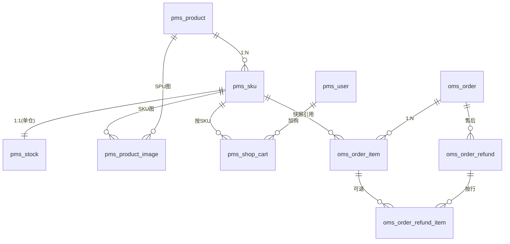

# 商品 / SKU / 订单 / 购物车表结构设计建议

> 基于当前 yz-mall 存量表（`pms_*` / `oms_*`）与真实电商平台（淘宝/京东/拼多多类）常见模型对比，给出可演进的改造建议。  
> 本文侧重「问题 → 为什么要改 → 目标模型 → 落地优先级」，不要求一次全量重构。

---

## 1. 现状速览

| 表 | 职责 | 核心字段（摘要） |
|---|---|---|
| `pms_product` | 商品主档 | 名称、原价、上下架/审核、`album_pics`（逗号 ID）、分类 |
| `pms_sku` | SKU | `product_id`、编码、名称、售价/市场价（**分**）、`album_pics` |
| `pms_attr` | 规格属性 EAV | `related_id` + `attr_type`（商品/SKU） |
| `pms_stock` | 库存 | `product_id` / `sku_id`、可售、锁定 |
| `pms_shop_cart` | 购物车 | `user_id` + `product_id` + `sku_id` + 数量 |
| `oms_order` | 订单主表 | 状态、金额、收货人快照、支付信息 |
| `oms_order_relation_product` | 订单行 | `order_id` + `product_id` + 数量/金额/名称快照 |
| `oms_order_refund` | 退款单 | 整单退款申请与审核 |

当前业务分层大致是：**商品（偏 SPU）→ SKU → 库存 → 购物车 → 订单行**，方向正确，但「计价单位、销售属性、订单行粒度、快照完整性」尚未对齐真实电商的交易闭环。

---

## 2. 真实电商里的标准心智模型

```text
SPU（标准产品单元 / 商品）
  ├─ 基础信息：标题、类目、品牌、主图、详情、运费模板…
  ├─ 销售属性定义：颜色、尺码…（决定 SKU 怎么拆）
  └─ SKU（库存保有单元）
        ├─ 属性组合：红+XL
        ├─ 售价 / 划线价
        ├─ 库存（可售、锁定、仓库）
        └─ SKU 图（可覆盖 SPU 主图）

购物车：用户 + SKU + 数量（+ 勾选态）
下单：订单头 + 订单行（每行一个 SKU，强快照）
售后：退款/退货单 → 可挂到订单行（SKU 级）
```

关键原则：

1. **交易以 SKU 为最小单位**（加购、锁库存、计价、售后都按 SKU）。
2. **订单行必须做快照**（改价、下架、改名后历史订单仍可展示）。
3. **金额单位全局统一**（建议全链路「分」或全链路 `decimal` 元，二选一）。
4. **图片/属性用关系表或 JSON，避免逗号拼接长串**。

---

## 3. 当前设计的主要问题

### 3.1 商品与 SKU：职责边界不清

| 问题 | 现状 | 真实平台做法 | 影响 |
|---|---|---|---|
| 双重价格源 | `pms_product.product_price`（元）与 `pms_sku.price_fee`（分）并存 | 展示价取 SKU（或 SKU 最低价区间）；SPU 不存「唯一售价」 | 列表价、购物车价、下单价容易不一致 |
| 金额单位混用 | 商品元 / SKU 分 / 订单元 | 全链路统一 | 换算遗漏、精度与展示错误 |
| 图片逗号拼接 | `album_pics = 'id1,id2,…'` | 图片关系表或有序 JSON 数组 | 难维护顺序、难约束数量、难做封面标记 |
| 销售属性弱 | `pms_attr` EAV，`related_id` 混挂商品/SKU | SPU 定义「可选销售属性」；SKU 存属性组合键或关联表 | 难生成规格选择器、难唯一约束「同属性组合」 |
| 缺少运营字段 | 无品牌、销量、排序权重、运费模板、详情正文 | SPU 承载运营与展示 | 列表排序、搜索、详情页能力受限 |
| 状态语义重叠 | SKU `status=-1` 与 `invalid` 并存 | 启用/禁用与逻辑删除分离 | 查询条件易写错 |

### 3.2 库存

| 问题 | 现状 | 建议 |
|---|---|---|
| `sku_id` 无唯一约束 | 同一 SKU 可能多行库存 | `UNIQUE(sku_id)`（单仓模型）或 `UNIQUE(sku_id, warehouse_id)` |
| `product_id` 冗余且可空 | 与 SKU 可能不一致 | 以 `sku_id` 为准；`product_id` 作冗余查询字段且由 SKU 回填 |
| 缺仓库维度 | 单库存池 | 若暂不做多仓，文档约定「默认仓」；预留 `warehouse_id` |
| 锁库与订单弱关联 | 仅有 `locked_quantity` | 建议增加库存流水 / 锁库单（下单锁、支付扣、取消释放） |

### 3.3 购物车（高优先级）

| 问题 | 现状 | 真实平台做法 |
|---|---|---|
| 唯一键不合理 | `UNIQUE(user_id, product_id, sku_id, invalid)` | 有效行唯一：`UNIQUE(user_id, sku_id)`（逻辑删除用独立策略） |
| `sku_id` 可空 | 历史数据大量 `NULL` | **强制非空**；加购必须选规格 |
| `product_id` 与唯一键耦合 | 同 SKU 不应因 product 变化产生多行 | `product_id` 冗余展示即可，唯一性只看 SKU |
| 缺勾选态 | 无 `checked` | 结算勾选、全选依赖该字段 |
| 缺失效标记 | 依赖联表商品状态实时算 | 可保留实时算；可选冗余 `valid_status` 加速列表 |

> MySQL 唯一索引中 `NULL` 不参与冲突：`sku_id` 为 NULL 时，同一用户可插入多行「无规格」购物车，这是当前脏数据的根因之一。

### 3.4 订单与订单行（最高优先级缺陷）

| 问题 | 现状 | 后果 |
|---|---|---|
| **订单行无 `sku_id`** | `oms_order_relation_product` 只有 `product_id` | 无法区分同商品不同规格；库存按 SKU 扣减时对账困难 |
| **唯一键错误** | `UNIQUE(order_id, product_id, invalid)` | **同一订单无法购买同一商品的两个 SKU**（红/蓝各一件会冲突） |
| 快照不完整 | 有名称/价/图 ID，无 `sku_code`/`sku_name`/规格文案结构化 | 售后、对账、客服展示吃力 |
| 订单状态过载 | 待付/发货/收货与退款状态混在一个枚举 | 真实平台常拆「履约状态」与「售后状态」 |
| 缺运费/优惠明细 | 仅总优惠金额 | 难支撑券、满减、运费险拆分 |
| 退款仅整单 | `oms_order_refund` 按订单金额 | 不支持「只退其中一个 SKU」 |

### 3.5 其它一致性问题

- 字符集混用：`utf8mb3` / `utf8mb4` 并存，建议统一 `utf8mb4`。
- 逻辑删除字段类型：`invalid` 有的表 `int`、有的 `bigint`，建议统一 `bigint`（与项目规范一致）或统一 `tinyint`。
- `update_time`：部分表缺少 `ON UPDATE CURRENT_TIMESTAMP`。

---

## 4. 目标表结构建议（演进版）

下列为「目标形态」字段建议，可按优先级分批落地；命名尽量贴近现有风格。

### 4.1 商品 SPU：`pms_product`（瘦身 + 补运营字段）

**建议保留/调整：**

| 字段 | 建议 | 说明 |
|---|---|---|
| `product_name` | 加长到 128+ | 电商标题普遍较长 |
| `product_price` | **逐步废弃** | 改为「展示用最低价缓存」`min_price_fee`（分）或完全由 SKU 聚合 |
| `album_pics` | 迁出到图片表 | 见 4.5 |
| `category_id` | 保留，建议非空 | 类目必选 |
| `publish_status` / `verify_status` | 保留 | 上下架与审核分离合理 |
| 新增 `brand_id` | 可选 | 品牌 |
| 新增 `detail_html` / `detail_json` | 可选 | 详情（大字段可独立表） |
| 新增 `sale_count` | 可选 | 销量缓存 |
| 新增 `sort_weight` | 可选 | 人工排序 |

### 4.2 SKU：`pms_sku`（交易主数据）

| 字段 | 建议 | 说明 |
|---|---|---|
| `product_id` | NOT NULL + 索引 | 已有 |
| `sku_code` | 唯一 | 已有 |
| `sku_name` | 保留 | 可由属性拼接生成 |
| `price_fee` / `market_price_fee` | **全链路以分为准** | 订单、购物车展示统一换算 |
| `attrs_json` | 新增（推荐） | 例：`[{"name":"颜色","value":"红"},{"name":"尺码","value":"XL"}]` |
| `attrs_key` | 新增（推荐） | 例：`颜色:红;尺码:XL`，配合 `UNIQUE(product_id, attrs_key, invalid)` |
| `album_pics` | 迁图片表或保留首图 ID `main_pic_id` | SKU 主图用于规格切换 |
| `status` | 仅启用/禁用 | 删除走 `invalid` |

### 4.3 销售属性（替代/收敛 `pms_attr`）

真实平台通常拆两层：

1. **SPU 销售属性定义**（前端规格选择器用）  
   - `pms_spu_sale_attr`：`product_id, attr_name, sort`  
   - `pms_spu_sale_attr_value`：`sale_attr_id, attr_value, sort, pic_file_id?`
2. **SKU 属性值绑定**  
   - `pms_sku_sale_attr`：`sku_id, sale_attr_id, attr_value_id`  
   - 或直接用 SKU 上的 `attrs_json` + `attrs_key`（中小体量更简单）

当前 `pms_attr` EAV 可保留作「参数属性」（材质、产地），**不要再承担 SKU 规格组合的唯一性**。

### 4.4 库存：`pms_stock`

```text
建议约束：
- sku_id NOT NULL
- UNIQUE KEY uk_stock_sku (sku_id)                 -- 单仓
-- 或多仓：UNIQUE KEY uk_stock_sku_wh (sku_id, warehouse_id)

建议字段：
- available_qty / locked_qty（或沿用 quantity / locked_quantity）
- warehouse_id（默认 0）
```

并建议增加 **库存流水表**（强烈建议）：

| 表 | 用途 |
|---|---|
| `pms_stock_log` | 变更流水：业务单号、变更类型（入库/锁库/扣减/释放）、前后数量 |

真实平台扣库存几乎都是「订单驱动 + 可追溯流水」，而不是只改一个数字。

### 4.5 图片：建议新建 `pms_product_image`

| 字段 | 说明 |
|---|---|
| `id` | 主键 |
| `biz_type` | 0=SPU，1=SKU |
| `biz_id` | product_id 或 sku_id |
| `file_id` | 文件服务 ID |
| `sort` | 排序 |
| `is_main` | 是否主图 |

替代 `album_pics` 逗号串后，封面、SKU 图切换、数量限制都更好做。

### 4.6 购物车：`pms_shop_cart`

**目标形态：**

| 字段 | 建议 |
|---|---|
| `user_id` | NOT NULL |
| `sku_id` | **NOT NULL** |
| `product_id` | NOT NULL（冗余，由 SKU 写入） |
| `quantity` | NOT NULL，>0 |
| `checked` | tinyint，默认 1 |
| 唯一约束 | `UNIQUE(user_id, sku_id)`（见下方删除策略） |

**逻辑删除与唯一约束的推荐做法（二选一）：**

1. **物理删除购物车行**（电商常见）：加购合并数量，删光即 DELETE；唯一键干净。  
2. 继续逻辑删除：不要把 `invalid` 放进唯一键；改为 `UNIQUE(user_id, sku_id)` + 删除时真正 DELETE，或使用「删除时间戳/随机后缀」方案（更绕，不推荐）。

### 4.7 订单头：`oms_order`

现有收货人快照字段合理，建议补充：

| 字段 | 说明 |
|---|---|
| `freight_amount` | 运费 |
| `coupon_amount` | 券优惠（可再拆券表） |
| `pay_channel_trade_no` | 第三方支付流水号 |
| `buyer_remark` / `seller_remark` | 买卖家备注拆分 |
| `close_time` / `cancel_reason` | 关闭信息 |
| `order_status` | 建议收敛为履约主状态 |
| `refund_status` | 新增：0无售后/1售后中/2部分退/3全退 |

### 4.8 订单行：`oms_order_item`（建议演进自 `oms_order_relation_product`）

**这是本轮最该优先改的表。**

| 字段 | 必须 |
|---|---|
| `order_id` | 是 |
| `product_id` | 是（快照关联） |
| `sku_id` | **是** |
| `sku_code` / `sku_name` | 是（快照） |
| `product_name` | 是（快照） |
| `product_attrs` | 是（规格文案快照，JSON 或字符串） |
| `pic_file_id` / `pic_url` | 是（下单时首图） |
| `unit_price` | 是（下单单价） |
| `quantity` | 是 |
| `discount_amount` / `real_amount` | 是 |
| `refund_quantity` | 建议有（已退数量） |

**唯一约束建议：**

```text
-- 同一订单同一 SKU 合并为一行（常见）
UNIQUE(order_id, sku_id)

-- 若允许拆行（少见），则去掉该唯一，改用自增行号
```

**严禁再使用 `UNIQUE(order_id, product_id)`。**

### 4.9 售后：从「整单退」演进到「按行退」

短期可保留 `oms_order_refund` 整单能力；中期建议：

| 表 | 说明 |
|---|---|
| `oms_order_refund` | 退款单头：金额、状态、审核 |
| `oms_order_refund_item` | 退款行：`refund_id, order_item_id, sku_id, quantity, amount` |

---

## 5. 目标关系示意



---

## 6. 改造优先级（建议落地顺序）

按「业务风险 × 改动成本」排序：

### P0（尽快做，否则交易模型不正）

1. **订单行增加 `sku_id`（及 sku 快照字段）**，唯一键改为 `(order_id, sku_id)`。  
2. **购物车 `sku_id` NOT NULL**，唯一键改为用户+SKU；清理历史 `sku_id IS NULL` 数据。  
3. **统一金额单位**（推荐：库存/SKU/订单内部统一「分」，接口层再转元；或全部 `decimal(15,2)` 元——需选一条路走完）。

### P1（体验与一致性）

4. 下单、购物车列表、商品详情全部以 SKU 价/图为准；SPU 价仅作区间展示缓存。  
5. 库存表 `sku_id` 唯一约束；下单锁库/取消释放补齐流水。  
6. `album_pics` 迁移到图片表（可先双写，再停读逗号串）。

### P2（增强能力）

7. 销售属性结构化（规格选择器、SKU 唯一属性组合）。  
8. 订单状态拆分履约/售后；退款支持按行。  
9. 运费、优惠明细表；支付流水表。

---

## 7. 迁移注意点（避免停服翻车）

1. **先扩列、双写，再切读，最后删旧字段**（尤其 `album_pics`、订单行唯一键）。  
2. 改 `oms_order_relation_product` 唯一键前：  
   - 扫描是否存在「同单同商品多行」诉求；  
   - 历史数据按「无 sku」行做一次回填（能匹配则补 `sku_id`，不能则标记脏数据）。  
3. 购物车清理脚本：删除或合并 `sku_id IS NULL` 行。  
4. 金额单位改造要同时改：实体、DTO、前端展示、支付扣款，禁止只改库表。  
5. 所有新建/改造表仍遵循项目基础字段：`id` / `create_time` / `update_time` / `invalid`。

---

## 8. 与当前代码的对应关系（便于评审）

| 领域 | 现状代码触点 | 表改后需同步点 |
|---|---|---|
| 加购 | `PmsShopCartServiceImpl#save` 已强制 `skuId` | DB 约束与历史脏数据 |
| 购物车列表 | 联表 SKU/商品补图补价 | 唯一键与 `checked` |
| 下单 | OMS 写 `oms_order_relation_product` | **必须落 sku_id 快照** |
| 库存 | `pms_stock` + 出入库明细 | 锁库流水、sku 唯一 |
| 退款 | `oms_order_refund` 整单 | 后续按行退 |

---

## 9. 结论（一句话）

当前模型已经具备 SPU/SKU/库存/购物车/订单的雏形，但 **订单行未以 SKU 为粒度、购物车唯一键与可空 SKU、金额单位与图片存储方式** 与真实电商交易模型不一致；建议以 **「交易最小单位 = SKU + 订单行强快照」** 为轴心，按 P0→P2 分批演进，而不是推倒重来。

---

## 10. 落地记录（2026-07-20）

已按本文 P0/P1 完成首轮改造，产物如下：

| 项 | 说明 |
|---|---|
| DDL | `docs/sql/p0_product_sku_order_cart_refactor.sql`（需人工执行） |
| 订单行 | 实体/VO/Mapper 增加 `skuId/skuCode/skuName/refundQuantity`；下单按 SKU 计价落库 |
| 下单 | `OmsOrderServiceImpl.generateOrder` 强制 SKU，金额取 `priceFee/100`；取消/退款按行 `skuId` 回补 |
| 跨服务 | 新增 `ExtendPmsSkuService`（interface/core/feign/controller） |
| 购物车 | 实体增加 `checked`；加购默认勾选；DDL 强制 `sku_id NOT NULL` |
| 库存 | 实体增加 `warehouseId`；批量扣减/回补写 `pms_stock_log` |
| 新建表实体 | `PmsProductImage`、`PmsStockLog`、`OmsOrderRefundItem` |
| 订单头 | `freightAmount`、`refundStatus`；退款申请/审核同步售后状态 |
| 金额策略 | **已落地**：全链路「分」；DDL 见 `amount_unify_to_fen.sql`；前端 `fenToYuan` 展示 |

**上线前必须**：在目标库执行上述 SQL；核对 `oms_order_relation_product.sku_id IS NULL` 无残留后再做应用发布。

---

### 金额单位（已落地）

- **存储与计算**：全链路使用「分」`bigint`/`Long`（含商品价、SKU 价、订单金额、退款金额、用户余额）
- **前端展示**：统一用 `fenToYuan`（`src/utils/money.ts`）换算为元
- **管理端录入**：表单按「元」输入，提交前 `yuanToFen` / `Math.round(x*100)`
- DDL：`docs/sql/amount_unify_to_fen.sql`

---

## 附录 A：P0 字段变更清单（评审用）

### A1. `oms_order_relation_product`（或更名 `oms_order_item`）

```text
+ sku_id           bigint NOT NULL COMMENT '下单SKU Id（快照关联）'
+ sku_code         varchar(64) NULL COMMENT 'SKU编码快照'
+ sku_name         varchar(255) NULL COMMENT 'SKU名称快照'
+ product_attrs    varchar(512) NULL COMMENT '规格快照'
- 删除唯一键 uk_oms_order_product(order_id, product_id, invalid)
+ 新增唯一键 uk_oms_order_sku(order_id, sku_id, invalid)  -- 若继续用 invalid 方案需评估
```

### A2. `pms_shop_cart`

```text
MODIFY sku_id bigint NOT NULL
- 删除 uk_oms_cart_user_sku(user_id, product_id, sku_id, invalid)
+ UNIQUE uk_cart_user_sku(user_id, sku_id)   -- 推荐配合物理删除
+ checked tinyint NOT NULL DEFAULT 1 COMMENT '是否勾选结算：0否；1是'
```

### A3. 金额单位（决策项，需产品/研发共同确认）

- 方案甲：SKU/库存/订单全部用「分」`bigint`，展示层 `/100`。  
- 方案乙：全部用 `decimal(15,2)` 元，禁止再出现 `price_fee`。  

**不要长期维持「商品元 + SKU 分 + 订单元」三套并行。**

---

## 附录 B：参考查询（改造前自检）

```sql
-- 购物车无 SKU 脏数据
SELECT COUNT(*) FROM pms_shop_cart WHERE invalid = 0 AND sku_id IS NULL;

-- 同一用户重复加购风险（sku 可空时）
SELECT user_id, product_id, COUNT(*) cnt
FROM pms_shop_cart WHERE invalid = 0
GROUP BY user_id, product_id HAVING cnt > 1;

-- 库存是否一对多（应为一对一）
SELECT sku_id, COUNT(*) cnt FROM pms_stock WHERE invalid = 0 AND sku_id IS NOT NULL
GROUP BY sku_id HAVING cnt > 1;

-- 订单行是否缺少规格维度（改造前结构固有限制）
SHOW CREATE TABLE oms_order_relation_product;
```
