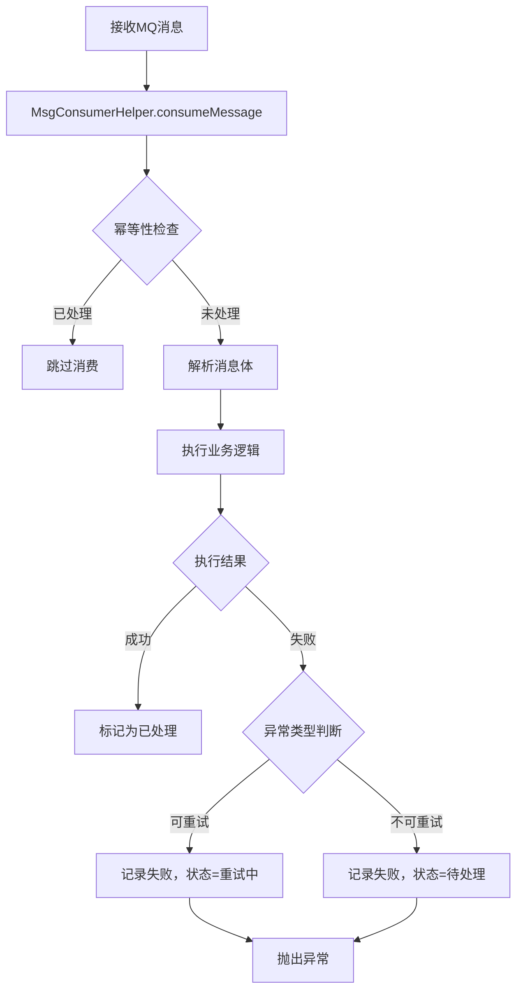
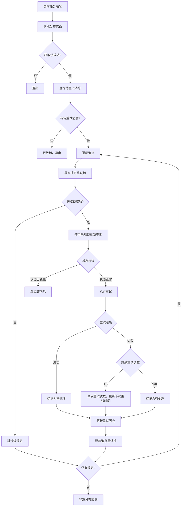

# MQ消息消费失败处理方案技术说明文档

## 一、方案概述

### 1.1 背景
在分布式系统中，MQ消息消费可能因各种原因失败（网络异常、数据库连接超时、业务逻辑异常等）。为了确保消息的可靠处理，需要一套完善的消息重试机制。

### 1.2 方案目标
- **可靠性**：确保消息不丢失，失败消息可追溯
- **自动化**：自动重试可恢复的异常，减少人工干预
- **幂等性**：防止重复消费导致的数据问题
- **可观测性**：记录完整的重试历史，便于问题排查
- **人工介入**：重试次数用尽后，提供人工处理入口

### 1.3 核心特性
- ✅ 自动记录消费失败的消息
- ✅ 智能判断异常是否可重试
- ✅ 指数退避重试策略
- ✅ 分布式锁防止并发重试
- ✅ 乐观锁防止数据冲突
- ✅ 完整的重试历史记录
- ✅ 定时任务自动重试
- ✅ 幂等性保证

## 二、数据库设计

### 2.1 表结构

**表名：`sys_msg_retry`**

| 字段名 | 类型 | 说明 | 约束 |
|--------|------|------|------|
| id | BIGINT | 主键ID | PRIMARY KEY |
| business_id | VARCHAR(100) | 业务数据ID，业务里唯一 | |
| msg_id | VARCHAR(100) | 消息ID，MQ消息里唯一 | UNIQUE KEY |
| topic | VARCHAR(100) | 原始Topic | NOT NULL |
| tags | VARCHAR(100) | 消息标签 | |
| body | TEXT | 消息内容 | |
| exception | TEXT | 异常信息 | |
| retry_count | INT | 剩余重试次数，默认5 | NOT NULL, DEFAULT 5 |
| retry_history | JSON | 重试历史，JSON格式 | |
| status | INT | 状态: 0重试中/1待处理/2已处理/3忽略 | NOT NULL, DEFAULT 0 |
| consumer_group | VARCHAR(100) | 消费者组 | |
| next_retry_time | DATETIME | 下次重试时间 | |
| version | INT | 乐观锁版本号 | NOT NULL, DEFAULT 0 |
| create_time | DATETIME | 创建时间 | NOT NULL |
| update_time | DATETIME | 更新时间 | NOT NULL |

### 2.2 索引设计

```sql
-- 主键索引
PRIMARY KEY (`id`)

-- 唯一索引：防止重复记录
UNIQUE KEY `uk_msg_id` (`msg_id`)

-- 复合索引：用于查询待重试消息
KEY `idx_status_retry_next` (`status`, `retry_count`, `next_retry_time`)

-- 业务ID索引：用于业务查询
KEY `idx_business_id` (`business_id`)

-- 创建时间索引：用于时间范围查询
KEY `idx_create_time` (`create_time`)

-- 消费者组索引：用于按消费者组查询
KEY `idx_consumer_group` (`consumer_group`)
```

### 2.3 状态枚举

| 状态码 | 状态名称 | 说明 |
|--------|---------|------|
| 0 | RETRYING | 重试中，系统会自动重试 |
| 1 | PENDING | 待处理，需要人工介入 |
| 2 | PROCESSED | 已处理，消费成功 |
| 3 | IGNORED | 忽略，不再处理 |

### 2.4 重试历史JSON格式

```json
[
  {
    "attempt": 1,
    "operation_time": "2023-01-01 10:00:00",
    "exception_type": "SQLException",
    "error_code": "CONNECTION_TIMEOUT",
    "error_message": "数据库连接超时，超过3000ms",
    "consumer_ip": "192.168.1.100",
    "stack_trace": "...",
    "retry_delay": 1000,
    "result": "FAILED"
  },
  {
    "attempt": 2,
    "operation_time": "2023-01-01 10:00:03",
    "exception_type": "BusinessException",
    "error_code": "INSUFFICIENT_BALANCE",
    "error_message": "用户余额不足，订单金额：100.00，余额：50.00",
    "consumer_ip": "192.168.1.101",
    "retry_delay": 5000,
    "result": "FAILED",
    "custom_data": {
      "user_id": "12345",
      "order_amount": 100.00
    }
  }
]
```

## 三、核心组件

### 3.1 模块架构

```
mall-utils/mall-rocketmq          # RocketMQ工具模块
  └── MsgConsumerHelper            # 消息消费辅助工具类

mall-admin/mall-sys-interface     # 系统接口模块
  ├── MsgRetryRecordDto            # 消息重试记录DTO
  ├── MsgRetryStatusEnum           # 状态枚举
  ├── ExceptionRetryUtil           # 异常重试判断工具
  └── ExtendSysMsgRetryService     # 消息重试服务接口

mall-admin/mall-sys-core           # 系统核心模块
  ├── SysMsgRetryService           # 消息重试服务接口
  ├── SysMsgRetryServiceImpl       # 消息重试服务实现
  ├── ExtendSysMsgRetryServiceImpl # 扩展服务实现
  └── MsgRetryScheduler            # 消息重试定时任务

mall-admin/mall-sys-feign          # Feign客户端模块
  ├── ExtendSysMsgRetryFeign       # Feign接口
  └── ExtendSysMsgRetryServiceImpl # Feign服务实现

mall-admin/mall-sys-startup         # 启动模块
  └── ExtendSysMsgRetryController  # HTTP接口控制器
```

### 3.2 核心类说明

#### 3.2.1 MsgConsumerHelper
**位置**：`mall-utils/mall-rocketmq`

**功能**：消息消费辅助工具类，封装消息消费的通用逻辑

**主要方法**：
- `consumeMessage()` - 执行消息消费，自动处理幂等性检查和异常记录

**使用示例**：
```java
MsgConsumerHelper.consumeMessage(
    messageExt,
    "consumer-mall-sys",
    extendSysMsgRetryService,
    ExtendSysPendingTasksAddDto.class,
    dto -> {
        // 业务处理逻辑
        Long id = sysPendingTasksService.save(dto);
        return dto.getBusinessId();
    }
);
```

#### 3.2.2 SysMsgRetryService
**位置**：`mall-admin/mall-sys-core`

**功能**：消息重试核心服务

**主要方法**：
- `recordFailure()` - 记录消息消费失败
- `queryRetryableMessages()` - 查询待重试的消息
- `retryMessage()` - 执行消息重试
- `getByMsgId()` - 根据消息ID查询记录
- `markAsProcessed()` - 标记消息为已处理
- `markAsIgnored()` - 标记消息为忽略

#### 3.2.3 ExceptionRetryUtil
**位置**：`mall-admin/mall-sys-interface`

**功能**：判断异常是否可重试

**可重试异常类型**：
- 网络连接异常（ConnectException、SocketTimeoutException）
- 数据库连接超时（SQLException，SQL状态码以08开头）
- 数据库超时异常（SQLTimeoutException）
- 包含特定关键词的运行时异常（timeout、connection、network等）

**不可重试异常类型**：
- 业务异常（BusinessException）
- 其他非临时性异常

#### 3.2.4 MsgRetryScheduler
**位置**：`mall-admin/mall-sys-core`

**功能**：定时扫描并重试消息

**执行策略**：
- 执行频率：每30秒执行一次
- 批处理大小：每次处理100条消息
- 分布式锁：使用Redisson确保多实例部署时只有一个实例执行

## 四、工作流程

### 4.1 消息消费流程



### 4.2 消息重试流程



### 4.3 状态流转

```
初始状态（消费失败）
    ↓
[可重试异常] → 状态：RETRYING（重试中）
    ↓
定时任务扫描
    ↓
执行重试
    ↓
[重试成功] → 状态：PROCESSED（已处理）
    ↓
[重试失败] → 减少重试次数
    ↓
[还有重试次数] → 继续 RETRYING
    ↓
[重试次数用完] → 状态：PENDING（待处理）
    ↓
人工介入处理
    ↓
[处理成功] → 状态：PROCESSED（已处理）
[忽略消息] → 状态：IGNORED（忽略）
```

## 五、重试策略

### 5.1 指数退避算法

重试延迟时间计算公式：
```
delay = 2^(MAX_RETRY_COUNT - current_retry_count) * BASE_DELAY
```

**参数说明**：
- `MAX_RETRY_COUNT`：最大重试次数，默认5次
- `current_retry_count`：当前剩余重试次数
- `BASE_DELAY`：基础延迟时间，默认1000ms（1秒）

**重试时间表**：

| 重试次数 | 剩余次数 | 延迟时间 |
|---------|---------|---------|
| 第1次 | 5 | 1秒 |
| 第2次 | 4 | 2秒 |
| 第3次 | 3 | 4秒 |
| 第4次 | 2 | 8秒 |
| 第5次 | 1 | 16秒 |

### 5.2 并发控制

#### 5.2.1 分布式锁
- **定时任务锁**：使用 `RedissonLockKey.keyMsgRetryScheduler()` 确保多实例部署时只有一个实例执行定时任务
- **消息重试锁**：使用 `RedissonLockKey.keyMsgRetry(msgRetryId)` 防止同一条消息被并发重试

#### 5.2.2 乐观锁
- 使用 `version` 字段实现乐观锁
- 更新操作时检查版本号，防止并发更新导致的数据丢失

### 5.3 幂等性保证

1. **消息ID唯一性**：通过 `msg_id` 唯一索引保证
2. **状态检查**：消费前检查消息状态，已处理的消息直接跳过
3. **记录去重**：`recordFailure()` 方法会检查是否已存在记录

## 六、使用指南

### 6.1 在消费者中使用

#### 6.1.1 基本用法

```java
@Slf4j
@Component
@RocketMQMessageListener(
    topic = "your-topic",
    consumerGroup = "your-consumer-group",
    selectorType = SelectorType.TAG,
    selectorExpression = "your-tag",
    messageModel = MessageModel.CLUSTERING
)
public class YourConsumer implements RocketMQListener<MessageExt> {

    private final YourService yourService;
    private final ExtendSysMsgRetryService extendSysMsgRetryService;

    public YourConsumer(YourService yourService, 
                       ExtendSysMsgRetryService extendSysMsgRetryService) {
        this.yourService = yourService;
        this.extendSysMsgRetryService = extendSysMsgRetryService;
    }

    @Override
    public void onMessage(MessageExt messageExt) {
        MsgConsumerHelper.consumeMessage(
            messageExt,
            "your-consumer-group",
            extendSysMsgRetryService,
            YourDto.class,
            dto -> {
                // 业务处理逻辑
                String businessId = yourService.process(dto);
                log.info("消费消息成功，businessId: {}", businessId);
                return businessId;
            }
        );
    }
}
```

#### 6.1.2 依赖配置

在 `pom.xml` 中添加依赖：

```xml
<dependency>
    <groupId>com.yz</groupId>
    <artifactId>mall-rocketmq</artifactId>
</dependency>

<dependency>
    <groupId>com.yz</groupId>
    <artifactId>mall-sys-interface</artifactId>
</dependency>
```

### 6.2 手动处理待处理消息

#### 6.2.1 通过Feign接口

```java
@Autowired
private ExtendSysMsgRetryService extendSysMsgRetryService;

// 查询消息状态
Integer status = extendSysMsgRetryService.getStatusByMsgId("msg-id-123");

// 标记为已处理
boolean success = extendSysMsgRetryService.markAsProcessedByMsgId("msg-id-123");
```

#### 6.2.2 通过HTTP接口

```bash
# 查询消息状态
GET /extend/sys/msg/retry/getStatusByMsgId/{msgId}

# 标记为已处理
POST /extend/sys/msg/retry/markAsProcessedByMsgId/{msgId}
```

### 6.3 自定义重试逻辑

如果需要自定义重试逻辑，可以：

1. **扩展 `ExceptionRetryUtil`**：添加自定义异常判断规则
2. **实现自定义重试服务**：继承 `SysMsgRetryService` 并重写 `doRetry()` 方法
3. **自定义重试策略**：修改 `SysMsgRetryServiceImpl` 中的重试延迟计算逻辑

## 七、监控与运维

### 7.1 关键指标

- **待重试消息数量**：`SELECT COUNT(*) FROM sys_msg_retry WHERE status = 0`
- **待处理消息数量**：`SELECT COUNT(*) FROM sys_msg_retry WHERE status = 1`
- **重试成功率**：通过日志统计
- **平均重试次数**：通过 `retry_history` 分析

### 7.2 日志监控

关键日志位置：
- 消息消费失败：`消费消息异常，msgId: {}`
- 消息重试开始：`开始重试消息，数量: {}`
- 消息重试结果：`消息重试完成，成功: {}, 失败: {}`
- 重试次数用完：`消息重试次数已用完，标记为待处理`

### 7.3 告警建议

建议设置以下告警：
1. **待处理消息数量告警**：当 `status=1` 的消息数量超过阈值时告警
2. **重试失败率告警**：当重试失败率超过阈值时告警
3. **定时任务异常告警**：当定时任务执行异常时告警

### 7.4 数据清理

建议定期清理已处理的消息记录：

```sql
-- 清理30天前已处理的消息
DELETE FROM sys_msg_retry 
WHERE status = 2 
  AND update_time < DATE_SUB(NOW(), INTERVAL 30 DAY);

-- 清理90天前已忽略的消息
DELETE FROM sys_msg_retry 
WHERE status = 3 
  AND update_time < DATE_SUB(NOW(), INTERVAL 90 DAY);
```

## 八、常见问题

### 8.1 消息一直处于重试中状态

**可能原因**：
- 定时任务未启动或执行异常
- 分布式锁获取失败
- 重试逻辑执行异常

**排查步骤**：
1. 检查定时任务日志
2. 检查Redis连接是否正常
3. 检查重试逻辑是否有异常

### 8.2 消息重复消费

**可能原因**：
- 幂等性检查失效
- 消息状态更新失败

**解决方案**：
1. 检查 `msg_id` 唯一索引是否正常
2. 检查业务逻辑的幂等性实现
3. 检查数据库事务是否正常提交

### 8.3 重试次数过快

**解决方案**：
调整 `RETRY_DELAY_BASE_MS` 参数，增加基础延迟时间

### 8.4 重试逻辑不匹配业务

**解决方案**：
1. 扩展 `ExceptionRetryUtil` 添加业务异常判断
2. 实现自定义重试服务
3. 修改 `doRetry()` 方法实现业务特定的重试逻辑

## 九、最佳实践

### 9.1 异常处理
- 业务异常应明确标识是否可重试
- 使用 `BusinessException` 时，确保异常信息清晰
- 对于不可重试的异常，应提供明确的错误信息

### 9.2 幂等性设计
- 业务逻辑应保证幂等性
- 使用业务ID进行幂等性检查
- 避免在重试逻辑中产生副作用

### 9.3 性能优化
- 合理设置批处理大小
- 避免在重试逻辑中执行耗时操作
- 定期清理历史数据

### 9.4 监控告警
- 设置关键指标监控
- 及时处理待处理消息
- 定期分析重试失败原因

## 十、版本历史

| 版本 | 日期 | 说明 |
|------|------|------|
| 1.0.0 | 2025-01-20 | 初始版本，实现基础消息重试功能 |

## 十一、参考资料

- RocketMQ官方文档：https://rocketmq.apache.org/
- Redisson文档：https://github.com/redisson/redisson
- MyBatis-Plus文档：https://baomidou.com/

---

**文档维护者**：yunze  
**最后更新**：2025-01-20

