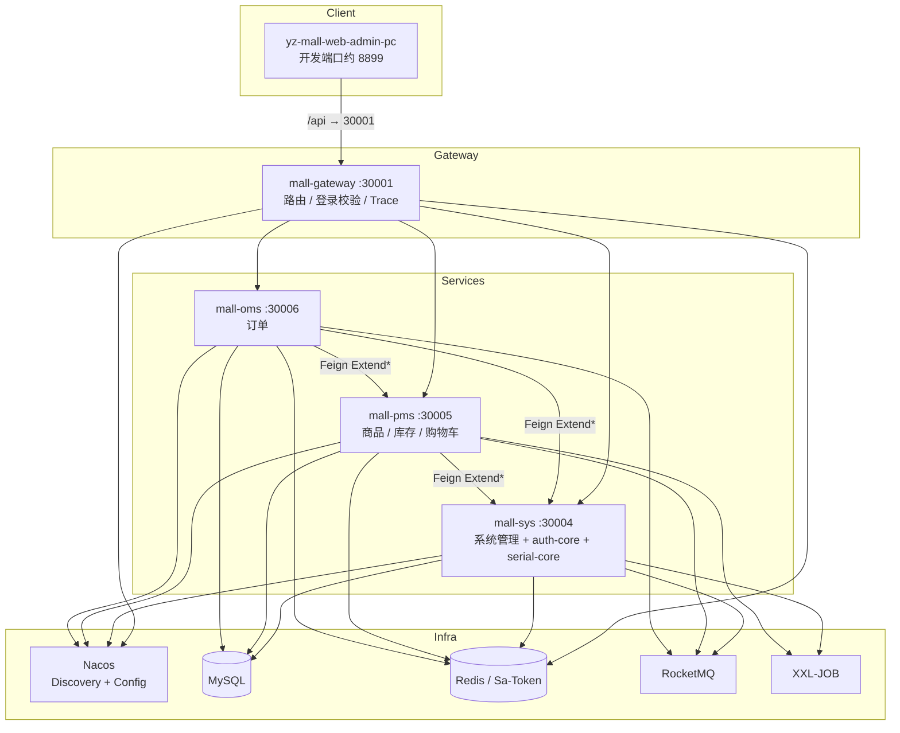
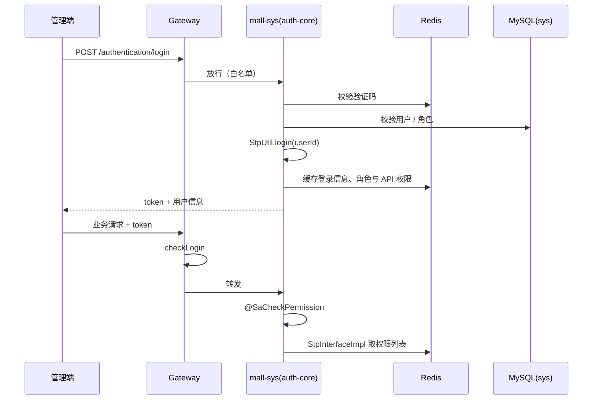

# yz-mall 系统架构文档

> 基于仓库源码梳理的**现状架构**说明。版本以根 `pom.xml` 为准；规划类内容见 [系统架构设计.md](./系统架构设计.md)。

---

## 1. 概述

yz-mall 是一套基于 Spring Cloud Alibaba 的电商微服务后端，采用领域划分 + 统一五层模块结构。当前生产可运行服务包括：网关、系统管理（内嵌认证与流水号）、商品库存、订单；前端管理端为独立仓库 `yz-mall-web-admin-pc`。

### 1.1 技术栈（现状）

| 类别 | 技术 | 版本（根 POM） | 用途 |
|------|------|----------------|------|
| 语言 / 运行时 | Java | 17 | 应用运行 |
| 基础框架 | Spring Boot | 3.4.7 | 应用框架 |
| 微服务 | Spring Cloud | 2024.0.2 | 微服务组件 |
| 微服务（阿里） | Spring Cloud Alibaba | 2022.0.0.2 | Nacos 等 |
| 网关 | Spring Cloud Gateway | 随 Cloud | 统一入口、路由 |
| 服务调用 | OpenFeign | 随 Cloud | 声明式跨服务调用 |
| 注册 / 配置 | Nacos | 配置中心部署 | 服务发现 + 动态配置 |
| ORM | MyBatis-Plus | 3.5.12 | 数据访问 |
| 数据源 | Druid + dynamic-datasource | 1.2.25 / 4.3.1 | 连接池 / 多数据源 |
| 数据库 | MySQL | connector 8.4.0 | 业务持久化 |
| 缓存 | Redis + Redisson | Redisson 3.50.0 | 会话、缓存、分布式锁 |
| 认证授权 | Sa-Token | 1.43.0 | 登录态 + 权限注解 |
| 消息队列 | RocketMQ | starter 2.3.4 / client 5.3.3 | 异步解耦 |
| 任务调度 | XXL-JOB | 3.1.1 | 定时 / 分布式任务 |
| 韧性 | Resilience4j | 2.2.0 | 熔断 / 重试 / 限流（OMS 等） |
| 工具 | Hutool | 5.8.39 | 通用工具 |

> Seata、Canal、Kafka 等主要出现在 `mall-demo` POC，**未接入生产业务服务**。

### 1.2 仓库与工程边界

| 工程 | 路径 | 说明 |
|------|------|------|
| 后端 | `yz-mall/` | Maven 多模块微服务 |
| 管理端前端 | `yz-mall-web-admin-pc/` | Vue3 + Vite + Element Plus（vue-pure-admin） |
| 本地中间件 | `yz-mall/docs/docker/docker-compose.yml` | Redis / ES / Nacos / RocketMQ / XXL-JOB 等 |

---

## 2. 总体架构

可视化架构图：

- Style 10（Cloud Fabric，含设计稿规划服务）：[yz-mall-架构图-风格10.svg](./yz-mall-架构图-风格10.svg)
- Style 8（Dark Luxury，现状精简版）：[yz-mall-架构图-风格8.svg](./yz-mall-架构图-风格8.svg)



### 请求链路（简化）

1. 浏览器 / 管理端请求经 Vite 代理到网关 `30001`
2. 网关：Trace 注入 → Token 参数归一 → Sa-Token 登录校验 → 按 Nacos 路由转发
3. 业务服务：Sa-Token 注解鉴权（`@SaCheckPermission`）→ Service → MyBatis-Plus → MySQL
4. 跨域调用：依赖对方 `*-feign`，通过 `Extend*` 接口 + `@FeignClient` 访问对方 `extend/**` HTTP API

---

## 3. 模块划分

### 3.1 顶层 Maven 模块

根工程：`com.yz:yz-mall:0.0.6-SNAPSHOT`

| 模块 | 职责 | 形态 |
|------|------|------|
| `mall-gateway` | API 网关 | 独立进程 |
| `mall-admin`（内部 `mall-sys-*`） | 系统管理、字典、菜单、用户角色、文件、待办等 | 独立进程 `mall-sys` |
| `mall-auth` | 登录 / 登出 / 权限校验能力 | **库模块**，无独立端口；core 嵌入 sys |
| `mall-pms` | 商品、SKU、库存、购物车 | 独立进程 |
| `mall-oms` | 订单 | 独立进程 |
| `mall-utils` | 公共能力（响应、Redis、MyBatis、Web/Feign、RocketMQ、流水号） | 库模块，禁止塞业务逻辑 |
| `mall-demo` | Seata / RocketMQ / Kafka / Canal 等 POC | 禁止被生产模块依赖 |

### 3.2 服务端口与启动类

| spring.application.name | 模块路径 | 端口 | 启动类 |
|-------------------------|----------|------|--------|
| `mall-gateway` | `mall-gateway` | 30001 | `com.yz.mall.gateway.GatewayApplication` |
| `mall-sys` | `mall-admin/mall-sys-startup` | 30004 | `com.yz.mall.sys.SysApplication` |
| `mall-pms` | `mall-pms/mall-pms-startup` | 30005 | `com.yz.mall.pms.PmsApplication` |
| `mall-oms` | `mall-oms/mall-oms-startup` | 30006 | `com.yz.mall.oms.OmsApplication` |

相关端口（非本仓库主服务）：

| 服务 | 端口 | 说明 |
|------|------|------|
| 管理端前端 | 8899（开发） | `VITE_PORT`；文档 README 中曾记 30000 |
| XXL-JOB Admin | 约 30009 | 调度中心（Docker / 独立部署） |
| PMS XXL Executor | 20005 | bootstrap 中 executor 端口 |
| SYS XXL Executor | 31004 | application 中 executor 端口 |

### 3.3 包名与类前缀约定

| 域 | 包名 | 类前缀 |
|----|------|--------|
| 系统 | `com.yz.mall.sys` | `Sys` |
| 商品 | `com.yz.mall.pms` | `Pms` |
| 订单 | `com.yz.mall.oms` | `Oms` |
| 认证 | `com.yz.mall.auth` | `Auth` / `Authentication` |
| 网关 | `com.yz.mall.gateway` | — |
| 公共 | `com.yz.mall.base` 等 | — |

---

## 4. 业务域五层分层

业务域（sys / pms / oms）统一采用五层 Maven 子模块：

```
{domain}-interface  → Extend* 接口与跨服务 DTO/VO
{domain}-dao        → Entity / Mapper（常含本域 DTO/VO）
{domain}-core       → Service / 本地 Extend*ServiceImpl
{domain}-feign      → @FeignClient + 远程 Extend*ServiceImpl
{domain}-startup    → Controller / ExtendController / Application
```

### 4.1 依赖方向

```
startup ──► core
core    ──► dao + interface（+ 他域 interface，仅接口契约）
feign   ──► interface（实现为 HTTP 调用）
dao     ──► mall-mybatis / mall-base
```

规则：

- **本域部署**：startup 依赖本域 core；可按需依赖他域 `*-feign`、`mall-auth-feign`、`mall-serial-feign`
- **跨服务调用**：只依赖对方 `*-interface`（编译期）+ `*-feign`（运行期远程实现），不直接依赖对方 dao/core
- **sys 特例**：`mall-sys-startup` 同时依赖 `mall-auth-core`、`mall-serial-core`，将认证与流水号**同进程部署**

### 4.2 以 mall-pms 为例

```
mall-pms-startup
  └── mall-pms-core
        ├── mall-pms-dao
        └── mall-pms-interface
mall-pms-feign
  └── mall-pms-interface   （供 oms 等远程依赖）
```

`mall-oms-startup` 额外依赖 `mall-pms-feign`；`mall-oms-core` 依赖 `mall-pms-interface`，下单链路可扣库存、查商品。

### 4.3 分层职责对照

| 层 | 典型内容 | 禁止 / 注意 |
|----|----------|-------------|
| interface | `ExtendXxxService`、跨服务 DTO/VO | 不依赖 Spring Web / 不写实现 |
| dao | Entity、Mapper、本域查询对象 | 不写跨服务调用 |
| core | 业务 Service、本地 Extend 实现 | 依赖他域仅限 interface |
| feign | `@FeignClient`、远程 Extend 实现、`@EnableFeignClients` | 失败转业务异常 |
| startup | REST Controller、`Extend*Controller`、启动类、bootstrap | 薄层，业务下沉 core |

---

## 5. 跨服务调用（Extend + Feign）

### 5.1 标准模式

以库存扣减为例：

| 层 | 类 | 模块 |
|----|-----|------|
| 接口 | `ExtendPmsStockService` | `mall-pms-interface` |
| DTO/VO | `ExtendPmsStockDto` / `ExtendPmsStockDeductVo` | `mall-pms-interface` |
| 本域实现 | `ExtendPmsStockServiceImpl` | `mall-pms-core` |
| HTTP 暴露 | `ExtendPmsStockController`（`extend/pms/stock`） | `mall-pms-startup` |
| Feign API | `ExtendPmsStockFeign`（`@FeignClient(name="mall-pms", path="extend/pms/stock")`） | `mall-pms-feign` |
| 远程实现 | `ExtendPmsStockServiceImpl`（委托 Feign） | `mall-pms-feign` |

调用方（如 OMS）注入 `ExtendPmsStockService`：同进程走本地实现，跨进程走 feign 模块实现。

### 5.2 生产环境 Feign 客户端（摘要）

| Feign | 目标服务 | path |
|-------|----------|------|
| `ExtendPmsStockFeign` | mall-pms | `extend/pms/stock` |
| `ExtendPmsProductFeign` | mall-pms | `extend/pms/product` |
| `ExtendPmsShopCartFeign` | mall-pms | `extend/pms/cart` |
| `ExtendSysUserFeign` 等 | mall-sys | `extend/sys/**`、`extend/files`、`extend/area` 等 |
| `ExtendPermissionFeign` | mall-sys | `extend/permission` |
| `ExtendSerialFeign` | mall-sys | `extend/serial/v3` |

Header 透传（Authorization、Cookie、Trace、真实 IP 等）由 `mall-web` 中 `OpenFeignConfig` / `RequestHeaderInterceptor` 统一处理。

---

## 6. 网关

### 6.1 职责

- 统一对外入口（30001）
- 登录态校验（Sa-Token Reactor）
- 请求追踪（`x-trace-id`）、真实 IP（`x-real-ip`）
- Token 查询参数归一为 `Authorization: Bearer`
- 文件直链防护（禁止裸访 `/file/*`）

### 6.2 关键类

| 类 | 说明 |
|----|------|
| `SaTokenConfigure` | `SaReactorFilter`：拦截 `/**`，放行 `/authentication/login|logout|captcha`，`StpUtil.checkLogin` |
| `TokenParameterFilter` | URL `?token=` → Bearer Header |
| `TraceGatewayFilter` | GlobalFilter，写入 Trace / IP 与 MDC |
| `QofFileAccessFilter` | 限制文件访问路径 |

### 6.3 路由配置

路由定义在 Nacos **`gateway.yaml`**（仓库内无完整副本），由 `bootstrap.yaml` 的 `extension-configs` 与 `spring.config.import` 拉取。

按 Controller 前缀与 HTTP 样例推断的 Path 风格：

| Path 前缀 | 目标服务 |
|-----------|----------|
| `/authentication/**` | mall-sys（auth） |
| `/sys/**` | mall-sys |
| `/pms/**` | mall-pms |
| `/oms/**` | mall-oms |

> 精确 predicates / filters 需从配置中心导出 `gateway.yaml` 后补充进文档。

---

## 7. 认证与授权

### 7.1 部署模型

`mall-auth` **不是独立微服务**：

| 子模块 | 用途 |
|--------|------|
| `mall-auth-interface` | `StpInterfaceImpl`、MVC `SaTokenConfigure`、权限扩展接口；被业务服务引入 |
| `mall-auth-core` | 登录控制器与认证服务；依赖 `mall-sys-dao`；由 **mall-sys-startup** 引入 |
| `mall-auth-feign` | 远程权限扩展实现；其他服务选 feign 时使用 |

认证 HTTP API 实际运行在 **mall-sys:30004**，经网关暴露为 `/authentication/**`。

### 7.2 登录与权限链路



关键能力：

- 验证码、登录、刷新 token、登出、用户信息、权限校验 — `AuthenticationController`
- 会话存 Redis（`sa-token-redis-jackson`）
- 方法级权限：`@SaCheckPermission("api:{域}:{资源}:{动作}")`，例如 `api:pms:product:edit`
- 网关只做**是否登录**；细粒度权限在业务服务注解层完成

### 7.3 与 sys 数据关系

用户、角色、菜单、按钮/API 权限数据在 **sys 域表**；auth-core 直接使用 sys Mapper。流水号 `mall-serial` 同样内嵌于 sys 进程，对外 Feign 的 `name` 仍为 `mall-sys`。

---

## 8. 公共能力 mall-utils

| 子模块 | 职责 | 关键类型 |
|--------|------|----------|
| `mall-base` | 统一响应、异常、校验、分页、Controller 基类 | `Result` / `ResultTable` / `ApiController` / `CodeEnum` / `OverallExceptionHandle` |
| `mall-json` | Jackson 封装 | — |
| `mall-mybatis` | MyBatis-Plus、Druid | `MybatisPlusConfig` |
| `mall-redis` | Redis、Redisson、缓存 Key | `RedisUtils` / `RedisCacheKey` / `RedissonConfig` |
| `mall-web` | Web AOP、Feign 配置、防重复提交 | `OpenFeignConfig` / `RepeatSubmitAspect` |
| `mall-rocketmq` | MQ 消费辅助 | `MsgConsumerHelper` |
| `mall-serial` | 流水号（interface / core / feign） | `ExtendSerialService` / `ExtendSerialFeign` |

约定：utils **仅公共技术能力**，业务逻辑进入对应域模块。

---

## 9. 统一响应、异常与权限约定

### 9.1 响应模型

- `com.yz.mall.base.Result<T>`：`code` / `msg` / `data`
- `com.yz.mall.base.ResultTable<T>`：分页 `total` / `items`
- Controller 继承 `ApiController`，使用 `success` / `failed` / `error`

### 9.2 状态码

`CodeEnum`：成功 200；业务错误 1 / 3xxxx；权限 5xxxx；数据库 6xxxx；其他 99999。

### 9.3 全局异常

`OverallExceptionHandle`（`@RestControllerAdvice`）统一处理业务异常、认证异常、参数校验、Feign 异常、防重复提交异常等。

### 9.4 权限分层

| 层次 | 机制 |
|------|------|
| 网关 | `SaReactorFilter` 登录校验 |
| 业务服务 | `SaInterceptor` + `@SaCheckPermission` |
| 放行 | `@SaIgnore` 或网关白名单（登录 / 验证码等） |

---

## 10. 配置与基础设施

### 10.1 Nacos

各服务 `bootstrap.yaml` 约定：

- `server-addr: ${NACOS_HOST}:8848`
- 账号：`nacos` / `${NACOS_PASSWORD}`
- namespace（config + discovery）：`ff6944dd-b11f-4403-8245-6c621b2f54c8`

主要 data-id：

| 服务 | 拉取配置 |
|------|----------|
| gateway | `gateway.yaml`、`datasource.yaml`、`sa-token.yaml` |
| sys | `datasource.yaml`、`sa-token.yaml`、`file.yaml`、`xxl-job-admin.yaml` |
| pms | `datasource.yaml`、`sa-token.yaml`、`xxl-job-admin.yaml` |
| oms | `datasource.yaml`、`sa-token.yaml`、`rabbitmq.yaml`（遗留占位，业务主用 RocketMQ） |

密钥、数据源、Sa-Token 细节放在配置中心 / 环境变量，**禁止硬编码入库进仓**。

### 10.2 中间件使用现状

| 组件 | 生产服务使用 | 说明 |
|------|--------------|------|
| Nacos | 全部 | 注册 + 配置 |
| MySQL | sys / pms / oms | 动态数据源 `@DS` 等 |
| Redis / Redisson | 网关 + 业务 | 会话、验证码、权限缓存、锁、防重 |
| RocketMQ | sys / pms / oms | 生产者 / 消费者配置在本地 yaml |
| XXL-JOB | sys / pms | 执行器注册到调度中心 |
| Elasticsearch + Logstash | 日志链路 | docker 编排；应用侧 logstash encoder |
| Seata | 无 | 仅 `mall-demo/mall-seata` |
| Canal / Kafka | 无 | 仅 demo |

本地开发中间件参考：`docs/docker/docker-compose.yml`。

### 10.3 数据与备份（运维）

- 建表脚本：`docs/sql/table-script.sql`
- 备份 / 还原：`docs/script/mysql-backup-schema-data.sh` 等
- 服务启停：`docs/script/startup.sh` / `shutdown.sh`

---

## 11. 前端对接

工程：`yz-mall-web-admin-pc`

| 项 | 说明 |
|----|------|
| 技术 | Vue 3 + Vite + TypeScript + Element Plus + Pinia |
| 开发代理 | `/api` → `http://127.0.0.1:30001`（网关） |
| 认证接口 | `/authentication/captcha`、`login`、`logout`、`refreshToken` |

前后端契约以网关 Path 为准，管理端不直连各微服务端口。

---

## 12. 扩展与约束

### 12.1 新增业务域检查清单

1. 按五层建模块：`interface / dao / core / feign / startup`
2. 包名 `com.yz.mall.{域}`，类前缀与域一致
3. 跨服务能力放 `Extend*` + `extend/{域}/...` Controller
4. startup 注册 Nacos；权限注解与网关路由同步配置
5. 公共能力优先复用 `mall-utils`，不复制底座代码
6. 不依赖 `mall-demo`

### 12.2 与规划文档的差异（现状 vs 设计稿）

| 项 | 现状 | 设计稿 `系统架构设计.md` |
|----|------|--------------------------|
| Spring Boot | 3.4.7 | 曾写 3.2.x |
| mall-auth | 嵌入 mall-sys，无独立端口 | 曾规划 30002 独立服务 |
| mall-ums / cart / pay 等 | 未建独立服务（购物车在 pms） | 规划中 |
| Seata | 仅 demo | 规划为生产能力 |

写实现方案时以**本文 + 源码**为准；规划路线图继续维护在设计稿中。

---

## 13. 关键源码索引

| 主题 | 路径 |
|------|------|
| 版本与模块 | `yz-mall/pom.xml` |
| 网关鉴权 | `mall-gateway/.../SaTokenConfigure.java` |
| 认证说明 | `mall-auth/README.md` |
| 登录入口 | `mall-auth-core/.../AuthenticationController` |
| Feign 样板 | `mall-pms` 下 `ExtendPmsStock*` |
| 统一响应 | `mall-utils/mall-base/.../Result.java` |
| 全局异常 | `mall-utils/mall-base/.../OverallExceptionHandle.java` |
| Docker 基建 | `docs/docker/docker-compose.yml` |
| 前端代理 | `yz-mall-web-admin-pc/vite.config.ts` |

---

*文档生成依据：仓库源码与配置（Java 17 / Boot 3.4.7 / Cloud 2024.0.2）。若 Nacos 路由表有变更，请同步更新第 6.3 节。*
