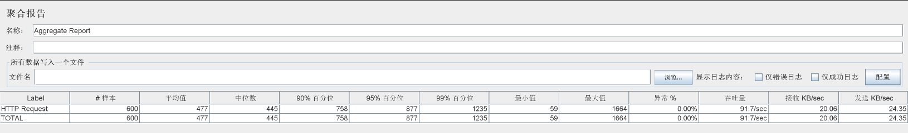
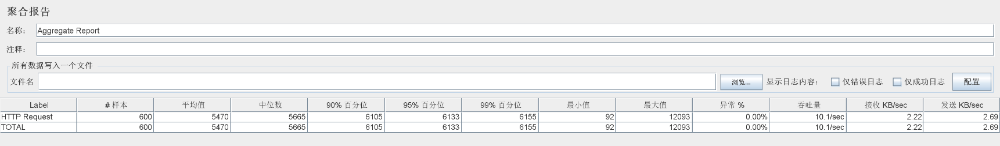
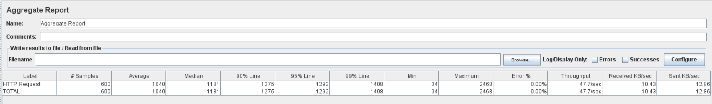
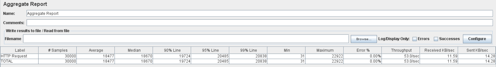
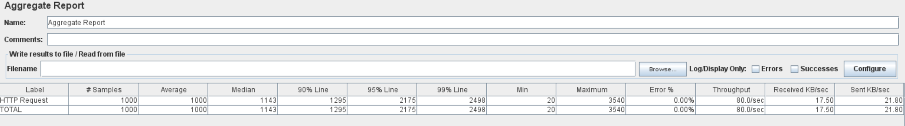

# 序列号生成功能

序列号生成规则：序号前缀+流水号（可以指定流水号位数，流水号是有序的从1开始递增）

模式一：使用mysql记录流水号


```shell
nohup /usr/local/tools/jdk1.8.0_301/bin/java -jar yz-unqid-startup-0.0.1-SNAPSHOT.jar >> console.log 2>&1 &
```


本地环境不加锁



本地环境加锁



生产环境加锁


生产环境加锁，减少数据库访问量，不用 `super.saveOrUpdate` , 明确使用`baseMapper.updateById` 或 `baseMapper.insert` ，因为 `saveOrUpdate` 在执行更新和插入之前还会去select一下指定数据是否存在。






生产环境加锁，减少数据库访问量，不用 `super.saveOrUpdate` ，使用redis存储序列号的流水号记录数据西悉尼，不用每次获取序列号都需要去数据库查询该序列号前缀对应的流水号用到了哪里




> Label:请求的名称，就是我们在进行测试的httprequest sampler的名称
>
> Samples:总共发给服务器的请求数量，如果模拟10个用户，每个用户迭代10次，那么总的请求数为：10*10 =100次；
>
> Average:默认情况下是单个 Request 的平均响应时间，当使用了 Transaction Controller 时，以Transaction 为单位显示平均响应时间 ，单位是毫秒
>
> Median: 50%用户的请求的响应时间，中位数
>
> 90%Line:90%的请求的响应时间
>
> 95%Line:95%的请求的响应时间
>
> 99%Line:99%的请求的响应时间
>
> Min:最小的响应时间
>
> Max:最大的响应时间
>
> Error%:错误率=错误的请求的数量/请求的总数
>
> Throughput: 默认情况下表示每秒完成的请求数（Request per Second），当使用了 Transaction Controller 时，也可以表示类似 LoadRunner 的 Transaction per Second 数 
>
> KB/sec: 每秒从服务器端接收到的数据量

